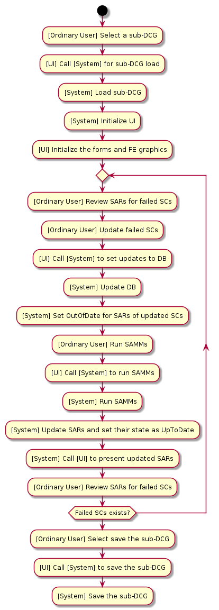
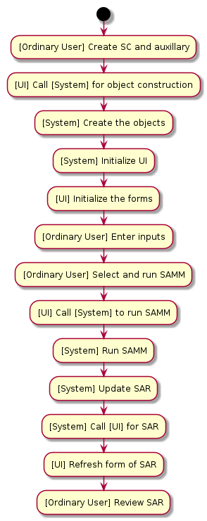

**Contents**
1.   [About The Project](#sec1)
2.   [Problem Definition: Stress Analysis of the Structural Components](#sec2)
3.   [Software Architecture](#sec3)\
3.1. [An Overview of the Problem](#sec31)\
3.2. [The Target Market](#sec32)\
3.3. [The Architecture: The 1st Overview](#sec33)\
3.4. [The Frontend](#sec34)\
3.5. [Data Types & Data Structures](#sec35)\
3.6. [Use Case Diagrams](#sec36)\
3.7. [The Architecture: Summary](#sec37)
4.   [Software Design](#sec4)

**Nomenclature**
- **SC:** Structural Component
- **SCL:** Structural Component Loading
- **SA:** Structural Analysis
- **SAD:** Structural Analysis Dataset
- **SAA:** Structural Analysis Application
- **SAE:** Structural Analysis Engineer (i.e. the user of the application)
- **SAMM:** Structural Analysis Method & Module
- **SAR:** Structural Analysis Result
- **FE:** Finite Element
- **FEM:** Finite Element Model
- **FEA:** Finite Element Analysis
- **CAE:** Computer Aided Engineering
- **FM:** Failure Mode
- **LC:** LoadCase
- **RF:** Reserve Factor
- **R&L:** Requirements and Limitations
- **CS:** Core System
- **SP:** Solver Pack
- **OETV:** Object Explorer Tree View
- **OETVN:** Object Explorer Tree View Node

## 1. About The Project <a id='sec1'></a>

This project is a part of the repositories to illustrate my software engineering experience.
This repository especially demonstrates my skills about the software architecture and design.

In the first section, I will start by describing the problem without diving into too much detail.
Then, I will discuss about the architecture and design of an application to serve as a solution to the given problem.

## 2. Problem Definition: Stress Analysis of the Structural Components <a id='sec2'></a>

The design of structural components (SCs) includes various aspects:
- Manufacturing R&L
- Cost analysis
- Effectivity issues
- Repairability R&L
- Ergonomy
- etc.

In addition to the above list, the structural analysis (SA) is another part of the design process
which is crucial as it validates the safety requirements.
The SA inspects a SC loaded by a LoadCase (LC) in order to validate if the SC can withstand the loading.
In other words, the SA can be abstracted as an engine which runs on a given SC-LC combination and returns a measure of safety.
Formally, the parameters of this abstraction are:
- **Reserve Factor (RF):** A unitless value to measure the structural analysis result (SAR): the current stiffness / the critical stiffness
- **Inspection:** The procedure to find the RF value of an SC for a given failure mode (FM)
- **Sizing:** The procedure to determine the required properties of an SC to have an acceptable RF

There exist mainly two approaches to handle an SA:
1. The analytical approach is mainly based on the principles of *the strength of materials*, *fracture mechanics*, etc.
2. The finite element (FE) approach is based on the numerical methods

The former relies on the theoretical and experimental rules and data while 
the later performs numerical calculations based on some primitive physical laws.
In other words, the FE approach relies on the power of the computers
in order to replace the complex formulation of the analytical analysis with simple definitions.
Having a simple formulation, the FE analysis can be applied on any problem **uniformly**.
However, the cost of the uniform analysis interface is the requirement for a large computation power.
In other words, an inspection handled in a few miliseconds by the analytical approach may take hours by an FE solver.
Nevertheless, the FE approach contains some inevitable assumptions which results with the loss of the accuracy.

**The aim of the project is to design the core framework of a *closed form stand-alone* solution for the analytical approach**.

## 3. Software Architecture <a id='sec3'></a>

I will try to generate a set of initial customer requirements by examining the following two:
1. An overview of the problem
2. The target market

### 3.1. An Overview of the Problem <a id='sec31'></a>

SAA is an engine measuring the safety of SCs.
This definition yields three components of an SAA: the SC, the structural analysis (SA) and the structural analysis result (SAR).
The structural industry involves many types of SCs: panels, beams, stiffeners, trusses, brackets, etc.
**The size of the list may go up to hundreds even thousands.**
**The type of an SC determines its' failure modes (FMs) which yield to the 2nd and 3rd components, the SA and the SAR respectively.**

The SCs withstand various kinds of loading to ensure the safety of a structure.
For example a truss element carries only axial loading while a beam carries combined loading
although they may have the same geometrical properies.
Hence, the geometry is not the only parameter to define an SC.
The 2nd parameter is **the role** of the component.
For example, the role of a beam is to carry combined loading while the role of a stiffener is to support a panel by carring the axial loading.
Hence, the definition of an SC would contain the followings:
1. The geometry
2. The material
3. The role
4. The FMs
5. The structural analysis methods and modules (SAMMs)
6. The SARs

**The SAA must involve a definition for each SC type (e.g. panel).**
Some abstractions can be defined to improve these definitions based on the properties, roles and FMs.
For example, a plate type would support the definitions of the panels, joints and stiffener segments.

A very important point about the SCs is that **the SCs are related to each other by definition**.
A panel is defined as a rectangular plate **supported by the side stiffeners**.
A stiffener is defined as a cross-sectional element **supported by two side panels**.
A joint is formed by **at least two plates and a fastener**.

In order to perform an SA on an SC, the applied loading must be given.
The determination of the load distribution within a complex structural assembly **cannot be performed analytically**.
Hence, **the SAA needs an interface with the FE softwares** in order to obtain the loading on each SC together with the geometry and material.
The interface must contain both the input and output routines.
Additional to the IO routines, **the SAA may contain an FE display for the visual purposes**.

### 3.2. The Target Market <a id='sec32'></a>

The SAs are performed on the SCs against a number of the FMs.
The variaty of the SCs and the FMs depends on the industry.
In the history, the SAs have been performed using simple tools like excel which was satisfactory for small business.
Excel provides an efficient computation capability and traceability in such a case.
However, excel becomes useless when the variaty and the number of the data gets large.
Besides, the size of the engineering team is another parameter due to the role definitions.
This application is the candidate to take place of excel in such conditions.
In other words, the target customers are the large companies:
- managing projects with a large variaty of types,
- having a large team of SAEs.

Considering the customers, there is one more important point.
The large companies in the industry have their own algorithms for the SAMMs and they dont want this data to be public.
Hence, they would like to embed their methods into the application themselves.
This requires a plugin based software where the development of the SAMMs is left to the customer.
Additionally, the companies may assign a team of SAEs instead of the software engineers for the plugin development.
This is quite common in the industry as the SAEs are equipped with some level of software development skills.

### 3.3. The Architecture: The 1st Overview <a id='sec33'></a>

Firstly, I will summarize the previous two sections as a requirement list:
- [An overview of the problem](#sec31) yields to the following requirements:
1. The types required by the SAA are mainly classified as SCs, FMs, SAs and SARs.
2. In addition to the above types, the SAA needs some auxilary data (e.g. material, geometry and loading).
3. Each group may contain hundreds of types.
4. There exist *dependency relationships* between the types.
5. The SAA needs an interface with the FE software.
- [The target market](#sec32) analysis yields to the following requirements:
1. The company would provide sufficient resources of processors and servers.
2. The SAA will manage and process large data.
3. The SAA will have DBs.
4. The SAA will define a UI form for each type.
5. The SAA will contain a graphics display for the FE model.
6. The SAA will manage the configuration issues.
7. The SAA will provide a plugin style extensibility in terms of SCs, SAs, SARs and SAMMs.
8. The plugins could be developed by the customer.

I will review the following major aspects of the software architecture to make some decisions:
- Deployment model
- User model
- Data & Persistency
- Performance
- Concurrency

#### 3.3.1. Deployment Model

1. Options:
- Desktop (native)
- Web-based (cloud)
- Hybrid
2. Questions:
- How are the installation, the maintanance and the security managed?
- How is the configuration of the SAA managed?
- Do SAMMs run heavy computations?
- Can the SAMMs be handled locally, or do they require scalable cloud CPUs/GPUs, or is a hybrid solution required?
- Does the customer have HPCs?
- Does the customer have a powerful server to satisfy the latency and bandwidth constraints?

#### 3.3.2. User Model

1. Options:
- Single user (standalone)
- Multi-user (shared data, roles, collaboration)
2. Questions:
- Will multiple analysts ever work on the same dataset concurrently?
- Is there a need to define user credentials (e.g. role)?
- Is central data sharing or report distribution a requirement?

#### 3.3.3. Data & Persistency

1. Options:
- Filesystem (JSON, XML, binary)
- Embedded DB (e.g. SQLite)
- Client-Server DB (e.g. MySQL, NoSQL)
2. Questions:
- How large will the datasets grow?
- How is it planed to store the data in the REM (discussion if a DOD approach is needed)?
- How is it planed to save the data (on local disk or DB or PLM)?
- Is there a need for transactions or roll-backs if a computation fails?
- Is cross-platform file portability important?
- Are the available resources sufficient to manage efficient transactions from/to a DB?

#### 3.3.4. Performance

1. Options:
- Local CPU and GPU
- An HPC solver distributed by a server
2. Questions:
- Are analyses instantaneous or long-running (minutes/hours)?
- Does the UI (together with the graphics display if needed) keep processing large data?
- Does the graphics display need to be interactive?
- Is there a need to scale out to handle many simultaneous jobs?
- Is there a need for multithreading or multi-processing or both?

#### 3.3.5. Concurrency

The application woulld obviously need the concurrent execution in terms of:
- Separation of responsibility (e.g. core framework and UI)
- Parallel computation
- Concurrent access by multiple user

Previous sections already listed some arguments related to the concurrency.
Later, I will discuss about this important issue in detail.

#### 3.3.6. Summary of the 1st Overview

Considering the discussions held in the previous sections, the first overview of the architecture would be:
- A web-based (cloud) application supported by a local company server
- Multi-user model considering the following issues: shared data, roles and collaboration
- A client-Server DB: MySQL
- An HPC solver distributed by a powerful server

The first two decissions above serve for the requirements coming from the target market analysis.
The third one is to support an efficient multi-user concurrent access on the large data.
A NoSQL DB could be prefered to deal with the graph data more efficiently.
However, the SAA is not a low-latency application and it needs to employ the graph algorithms itself.
The last one is to perform the heavy computations of structural analysis.
The GPU resources need to be spared for the FE graphics display.

### 3.4. The Frontend <a id='sec34'></a>

**This project excludes the details of the frontend development.**
However, the architecture and design need some solid definitions about the UI in order to have a clear interface.
Following two were the initial requirements related to the UI:
- The SAA will define a UI form for each type.
- The SAA will contain a graphics display for the FE model.

Based on these requirements, I will continue with **javascript/react as the frontend language** in order to make use of:
- the great library,
- high-performance interactive 3D visualization (e.g. vtk),
- best start-up and runtime performance.

Additionally, the separation of responsibility between the main framework and the UI is satisfied
as react executes asynchronously with the core framework.

### 3.5. Data Types & Data Structures <a id='sec35'></a>

We had three requirements related to the extensibility from [the overview of the problem](#sec31):
- The SAA will provide a plugin style extensibility in terms of SCs, SAs, SARs and SAMMs.
- The plugins could be developed by the customer.
- There may exist hundreds even thousands of types and correspondingly too many objects may need to be managed.

The SCs, SAs and SARs are the objects of the application which need type definitions
while SAMMs present the behaviours of these types.
**The SAA will be used by the SAEs among whom Python is the most popular choice (even can be considered as de-facto).**

A plugin style architecture for the SCs, SAs and SARs needs a type registration.
**Hence, the core framework shall provide the type registration.**
Additionally, each new type would need a UI form.
**Hence, if required a plugin may involve a UI form implementation with js as well.**

The requirements arised from [the overview of the problem](#sec31) underline that the application
would need to construct a type/class hierarchy which requires a careful design study based on:
- object oriented design (OOD),
- function oriented design (FOD),
- data oriented design (DOD),
- test driven design (TDD),
- etc.

The type definitions and the class hierarchy (i.e. the design) have a significant workload.
Besides, the software design needs qualified software engineers.
A plugin approach assuming an empty framework to be extended by the client plugins
would fail as it pushes too much pressure on the client.
Thus, the SAA should provide a generic design with some abstractions, interfaces, transformations, etc.
Additionally, the SAA should be shipped with the plugins of the fundamental types (e.g. panel, beam, ISection, LC, isotropic material, etc.).
In this approach, the client is mainly considered to develop the SAMMs.
The SAA would still be extensible with introducing new plugins on top of the compiled core plugins.

A plugin shall include the following items:
- Plugin descriptor json file
- Type module with type registry (e.g. panel.py including register_panel function)
- SAMM module with analysis registry (e.g. panel_buckling.py including register_panel_buckling function)
- Type UI form js file with UI form registry (e.g. panel_ui.js including register_panel_ui function)
- **Core API shall provide the registry routines which shall be executed by the registry functions of the plugins.**

[The overview of the problem](#sec31) explained the dependencies within the data.
The dependencies/relations in the data require a link-based (i.e. pointer-based) data structure for the memory managemant.
The relations are not linear such that the data contains both the one-to-many and many-to-one relations.
Semantically, there also exist ancestor/descendant relations such that a material is an ancestor of the SCs using that material.
For example, when a material is updated, all the descendants of the material shall be visited.
In other words, an action on an element shall be propogated through the descendants of the element.
This could be performed using a proxy design pattern.
However, a better/compact solution is to use a **directed graph** data structure for the memory management.
The graph in the case of the SAA **is not acyclic** as the types have mutual dependencies by definition (e.g. panel and stiffener).
Hence, the core data structure of the SAA is a **directed cyclic graph (DCG)**.

Consider a geometry application (e.g. Dassault's Catia).
The application would be simulated with a directed acyclic graph (DAG).
The DAG can be very deep in case of a geometry application
as each geometrical element (e.g. points, curves, surfaces) would be defined using other elements.
The DAG is acyclic as a point cannot be created from a curve which has a relation with the point somewhere in the history.
The application may allow cycled nodes (e.g. Catia) and continue in an **invalid state**.
A background thread would inspect the cycled nodes asynchronously as the cycles would be terminated by the user actions.
Catia also allows removing an element without removing the decendants which requires a background thread as well.
[My persistent DAG repository](https://github.com/BarisAlbayrakIEEE/PersistentDAG.git) examines the background thread in detail.
Please see the Readme file for a detailed discussion.

We have different requirements and usage in case of the SAA:
- The depth of the DCG in case of the SAA is very small: Ex: material -> panel -> panel buckling -> buckling RF.
- No need to have background processes for the cycled or deleted nodes.

**The above two points show that the DCG shall be single-threaded.**

The memory management is crucial in case of the SAA as it may contain large data caused by hundreds of the user types.
The memory management is related to the efficiency of the memory access patterns affecting both the read and write operations.
The memory management policy of Python is based on the heap memory excluding the contiguous arrays.
NumPy library provides this facility for the raw types only.
This is an important opportunity and deserves attention.
Consider designing the CS based on the np.ndarray of raw types following the DOD approach.
A container can be defined for each type (e.g. Panel) which separates the fields using np.ndarray:

```
import numpy as np

class Panel_Container:
  def __init__():
    self.ts = np.zeros(dtype=np.float32)
    self.side_stiffeners_1 = np.zeros(dtype=np.uint32)
    self.side_stiffeners_2 = np.zeros(dtype=np.uint32)
    ...
```

The above approach would serve very well for the memory management performed by the CS.
The solver pack (SP), on the other hand, would need the actual type definitions in order to make use of the OOP capabilities.
The SP would need to define the types based on many aspects of the software design: structure, behaviour, construction, etc.
Hence, it would create the class hierarchies as well.
A prototype for the Panel type of the SP would be:

```
class Panel(SC):
  def __init__(t, _side_stiffener_1, _side_stiffener_2):
    self.t = t
    self._side_stiffener_1 = _side_stiffener_1
    self._side_stiffener_2 = _side_stiffener_2
    ...
  
  def calculate_buckling_coefficient():
    ...
  
  def inspect_side_stiffener_restraint():
    ...
  
  def run_analysis():
    ...
```

In summary, this approach distributes the memory management and the design to the CS and SP respectively
by assuming that the CS can work with the raw data and would not need to know about the design (i.e. the class hierarchy).
However, the assumption actually is not correct.
Below list presents a couple of the reasons why the assumption fails:
1. The DCG requires an interface: Ex: get_ancestors(), update_state(), inspect_invariant(), etc.
2. Write operations would need temporary SP object creation in order to inspect the type invariants.
3. The UI would need an interface for the FE: import_FE() and export_FE()
4. The UI would need an interface for the mutability and sizeability: the state management and size()
5. Extensibility fails for the user operations as designing new behaviours is cumbersome: Ex: get_all_materials() function would envolve too many branches.

I will discuss on these issues later in [the software design](#sec4) section.
The 1st reason is especially important as it means that
a traversal through the DCG would require the construction of temporary objects (e.g. Mat1, Panel)
if the CS involves only the raw data.
Actually, all of the operations may require the temporary objects.
Another solution is to apply the FOD approach to every problem but
it will cause an explosion in the type tags and the boilerplate code which will kill the traceability.

**Hence, a design with the CS handling DOD style raw data and the SP defining the whole class hierarchy is not reasonable.**
**The CS shall be responsible from the memory while defining a class hierarchy.**
In that case, Python would allocate the heap memory in order to store the user defined types.
In summary, we have three choices for the CS:
1. use Python with the heap memory or
2. use Cython for the CS type definitions or
3. use one of C++, rust and java.

The 1st solution is not a choice due to the reasons already been discussed but I want to add one more point.
Later I will review the DCG in detail and select functionally persistent DCG to manage the memory.
The persistent solution would require frequent copy operations for which the heap memory usage is a significant problem.
Every action of the user may take considarable time for large DCGs if the data is spread out of the heap memory.

I will eliminate the 2nd solution as its no better than the 3rd one.
I also eliminate the rust solution as I dont have any experience with the rust development.
Hence, there remains only C++ and java solutions.

In order for the DCG to manage the memory it must store the whole data.
The objects need to be contained by the DCG in contiguous allocations.
C++ provides variadic templates for varying type lists.
Java handles the problem applying the type erasure which loses the compile-time static definition capability.

C++ solution for the DCG would look like:

```
template<typename... Ts>
class DCG {
  private:
    std::tuple<std::vector<Ts>...> _type_containers;
  ...
```

C++ provides a powerful type traits library in order to handle type transformations statically.
For example, the Nth type T within the typelist Ts would anyway be required by the CS:

```
// The base template to extract the Nth type from a type list
template<std::size_t N, typename TList>
struct TypeAt;

// The 1st template specialization of TypeAt defining the variadic parameters
template<std::size_t N, typename T, typename... Ts>
struct TypeAt<N, TypeList<T, Ts...>> : TypeAt<N - 1, TypeList<Ts...>> {};

// The 2nd template specialization of TypeAt which is the boundary of the recursion
template<typename T, typename... Ts>
struct TypeAt<0, TypeList<T, Ts...>> {
  using type = T;
};

// Define a type list
template<typename... Ts>
struct Types{};
struct Foo{};
struct Bar{};
using TypeList = Types<Foo, Bar>;

// Get and use the 0th type from the type list
static constexpr TypeAt<0, TypeList> obj{};
```

On the other hand, with java, the type containers of the DCG must be defined manually:

```
import java.util.ArrayList;

class DCG{
  private ArrayList<Panel> panels;
  private ArrayList<Stiffener> stiffeners;
  ...
};
```

However, the SAA is designed to be extensible by adding new plugins defining new types.
Hence, for each new plugin, the CS (i.e. the DCG and maybe some others) needs to be updated manually in case of java.
Making the client responsible from the CS is not a good design practice.

**The discussions up to here concludes that C++ is the best choice for the CS side.**

The SP can still be implemented using python.
Actually, it should be.
**A wrapper class (i.e. cython, boost.Python, swig, pybind11) for each type forms a bridge between C++ and python.**
**I would prefer pybind11 as it is very elegant in sharing C++ objects considering the reference counting.**
This approach requires an additional wrapper class definition for each new type.
However, the SP is a library for the behaviours rather than the types.
Consider, for example, the panel type.
A panel has many FMs and corresponding SAMMs:
- the panel pressure analysis,
- the panel buckling analysis,
- the snap-through buckling analysis,
- the fracture analyses (contains more than 2 FMs),
- etc.

A company may have many other FMs defined for a panel element.
In summary, corresponding to a CS type, there may exist many SAMMs in the SP side.
In other words, the additional wrapper class would be defined once and only for the types, not for the SAMMs.
Hence, this approach adds boilerplate code into the CS which the client is mostly not involved.

Later, I will explain that I will use React for the frontend development.
The C++ backend needs to communicate with the React frontend.
The REST API would serve very well in case of the SAA.
If required, WebSocket would be utilized later to allow bacckend pushes or enhance the real-time communication.

There is one last point under this heading.
The LC and SC data multiplies in case of the SAA as on an SC a load data (i.e. the SCL) is defined for each LC.
Hence, considering that M is the number of SCs and N is the number of LCs:
- The number of SCLs = M * N
- The number of SARs = M * N

The SCLs and SARs dominate the SAA in terms of the memory which may cause memory problems.
Hence, **the SCLs and the SARs shall be stored in the MySQL DB.**

### 3.6. Use Case Diagrams <a id='sec36'></a>

I will examine three use case scenarios:
1. [Master User] | Import an FEM, create a DCG and insert it into the client-server MySQL DB
2. [Ordinary User] | Check-out a DCG node from MySQL DB, inspect/size the SCs within the DCG node and save the updates to MySQL DB
3. [Ordinary User] | Perform offline tradeoff

There exist other scenarios as well.
For example a scenario when a master user creates another version of an SAMM.
This requires an *applicability* field to be defined for the structural configuration.
All SARs having the same *applicability* as the new version of SAMM becomes **OutOfDate**
and shall be revisited by the ordinary users.

I expect that these three scenarios are sufficient to have an understanding about the SAA.
Later, I will discuss on these scenarios in terms of the architecture.

#### 3.6.1 Use Case scenario #1

In this scenario, a master user imports an FEM.
The core framework has IO routines for the FE data.
The importer reads the material, load, node and element data from the FE file (e.g. a bdf file)
and create the DCG by constructing the objects of SAA (e.g. panel and stiffener) based on this FE data.
This process would require additional input such as a text file listing the IDs of the elements for each SC (e.g. panel_11: elements 1,2,3,4).
With the import process:
- the importer loads the FE data to be displayed by the FE graphics window
- the importer creates a DCG involving the SAA objects (e.g. panel_11)

The importer, constructs the SAA objects without the dependencies.
In other words, the ancestor and descendant data blocks of the DCG is empty.
For example, the side stiffeners of a panel object are not set yet.
The master user needs to set these relations between the SAA objects from the UI.
Each UI action of the master user is transfered to the core system (CS) to update the ancestor/descendant relations of the DCG.
Finally, the master user inserts the new DCG into the MySQL DB assigning a structural configuration ID related to the imported FEM.

- **Primary Actor:** Master user
- **Scope:** SAA
- **Level:** User goal

**Stakeholders and Interests**
- **Master user**: wants to create a new DCG based on an FE data.
- **Ordinary users**: need the new DCG to inspect/size.

**Preconditions**
- an existing FE data pack with a predefined format including the geometry, material and loading exists.

**Main Flow**
1. **Master user** clicks **import an FE data**.
2. **UI** emits an event to activate the CS for the FE data extraction.
3. **System** imports the FE file to create a new DCG linked to the input FE file.
4. **System** emits an event to initialize the user forms and the graphics.
5. **UI** initializes the user forms and the graphics.
6. **Master user** updates the elements of the DCG for the relations.
7. **Master user** clicks **save new DCG**.
8. **UI** emits an event to save the new DCG.
9. **System** inserts the new DCG into the MySQL DB.
10. **MySQL** inserts the new DCG.

**Alternate Flows (Errors) - 1: Error during FE import**
- **3. System** terminates the FE Import.
- **4. System** logs an error and sets the status to **Error**.
- **5. System** emits an event to activate the UI to display the error message.
- **6. UI** displays the error message for the import failure.

**Alternate Flows (Errors) - 2: Error during MySQL insert**
- **10. MySQL** returns insert error.
- **11. System** emits an event to activate the UI to display the error message.
- **12. Master user** reports the DB error to the server IT.

**Postconditions**
- MySQL DB contains the new DCG.

**UML Diagram**\


#### 3.6.2 Use Case scenario #2

In this scenario, an ordinary user checks out a sub-DCG from MySQL DB for inspection or sizing.
The CS loads the sub-DCG and the FEM attached to the DCG.
Then, the CS initializes the UI.
The analysis results (i.e. the SARs and RFs) may have values if the sub-DCG has been studied before.
In this case, the SARs may have **UpToDate** state.
Otherwise, SARs have null values and the states are **OutOfDate**.
The ordinary user has two options: inspection or sizing.
The ordinary user runs the SAMMs for each SC in case of an inspection process.
Otherwise, the ordinary user updates the properties of the SCs (e.g. material and geometry)
and run the SAMMs in order to get the acceptable SARs (i.e. RFs).
After completing the inspection/sizing, the ordinary user saves the sub-DCG with the updated SARs to MySQL DB.

In this scenario, I will skip the inspection process.
Although the SAA shall implement an optimization routine to automate the sizing,
I will prepare the scenario for a manual procedure.

- **Primary Actor:** Ordinary user
- **Scope:** SAA
- **Level:** User goal

**Stakeholders and Interests**
- **Ordinary user**: wants to update a sub-DCG for the SARs.
- **Project Manager**: needs quick feedback on the analysis status of the sub-DCG.

**Preconditions**
- the sub-DCG shall already be loaded to MySQL DB by the master user.

**The Flow (skip the error conditions for simplicity)**
1. **Ordinary User** selects to load a sub-DCG from MySQL DB.
2. **UI** emits an event to activate the CS for the DCG loading.
3. **System** loads the sub-DCG from MySQL DB and the attached FEM.
4. **System** emits an event to initialize the user forms and the FE graphics.
5. **UI** initializes the user forms and the FE graphics.
6. **Ordinary User** reviews the SARs to detect the SCs that need sizing.
7. **Ordinary User** updates the properties (e.g. material and geometry) of the SCs that needs sizing.
8. **UI** emits an event to activate the CS for each update.
9. **System** reflects each update to the sub-DCG and sets the state of the SARs corresponding to each updated SC as **OutOfDate**.
10. **Ordinary User** runs SAMMs for the updated SCs.
11. **UI** emits an event to activate the CS to run SAMMs for the updated SCs.
12. **System** runs SAMMs for the updated SCs.
13. **System** updates the SARs and sets their state as **UpToDate**.
14. **System** emits an event to activate the UI for the states and SARs.
15. **UI** refreshes the SARs for the state and values.
16. Repeat Steps 6 to 15 to finish sizing all SCs.
17. **Ordinary User** selects to save the sub-DCG to MySQL DB.
18. **UI** emits an event to activate the CS for the sub-DCG save.
19. **System** saves the sub-DCG to MySQL DB.

**Postconditions**
- The SARs are **UpToDate** and safe.

**UML Diagram**\


#### 3.6.3 Use Case scenario #3

In this scenario, an ordinary user performs tradeoff analysis offline.
The SAs involves complex strength analysis where the engineer would not make predictions without performing the calculations.
For example, the effect of the panel thickness may not be linear on the result of panel buckling analysis.
Hence, the engineer usualy needs to perform a quick analysis to see the effect of an action.
**The SAA shall offer this utility as well.**
In this case, the engineer works offline (independent of MySQL DB).
She needs to define the SC to be examined (e.g. panel) and the auxilary objects (e.g. material, load).
Then, she plays with the properties which she wants to examine (e.g. thickness) and runs the corresponding SAMM.
The user neither imports an FE data nor connects to the MySQL DB for a DCG.
The constructed objects will be destructed when the user finishes her session.

- **Primary Actor:** Ordinary user
- **Scope:** SAA
- **Level:** User goal

**Stakeholders and Interests**
- **Ordinary user**: wants to perform offline tradeoffs.

**Preconditions**
- none

**The Flow (skip the error conditions for simplicity)**
1. **Ordinary User** selects to create a SC and auxilary items required by the SC (e.g. material and load) and SAMM.
2. **UI** emits an event to activate the CS to create the requested objects.
3. **System** creates the requested objects.
4. **System** emits an event to initialize the user forms.
5. **UI** initializes the user forms.
6. **Ordinary User** fills the fields of the objects.
7. **Ordinary User** selects to run the requested SAMMs.
8. **UI** emits an event to activate the CS to run the requested SAMMs.
9. **System** runs the requested SAMMs.
10. **System** updates the SARs.
11. **System** emits an event to activate the UI for the SARs.
12. **UI** refreshes the SARs for the values.
13. **Ordinary User** reviews the SARs.

**Postconditions**
- none

**UML Diagram**\


#### 3.6.4 A Quick Review on the Use Case scenarios

Below are some observations I realized by examining the UML diagrams of the use case scenarios:
- FE data is managed by the UI component (i.e. js) while the DCG data is managed by the CS.
- There is a frequent request traffic between the backend and the frontend.
- Large data may be transfered betweeen the backend and the frontend.
- **The DCG shall follow DOD approach to store the data.**
- **The DCG shall define and manage a state (e.g. UpToDate) for each node in the DCG.**
- The routines of the DCG related to the node states would be based on the ancestor/descendant relations.
- **The OETV and the FE display components of the UI shall reflect the current node states (i.e. SCs and SARs).**
- The CS needs a temporary DCG to manage the lifetime of the objects constructed in an offline process.
- The SAA needs role definitions such as: System User, Admin User, Master User and Ordinary User.
- System Users would manage the plugins and SAMMs.
- Admin Users would manage the standard parts (e.g. material and fastener).
- Master Users would manage the configuration.
- Ordinary users would perform the analysis.
- **The SP shall run asynchrously.**
- **While the solver is running, the UI shall switch to read-only mode allowing requests for new runs.**
- **The SP shall be defined to list the SAMMs together with the versions.**
- **The SPs shall define the applicability (e.g. DCG type version) as well.**
- **The DCGs shall define a configuration which contains: company policies, DCG type version and the SP version.**

I tested Crow for the large data transfer from C++ to js.
The results are satisfactory (i.e. some miliseconds for MBs of data).

The node state management becomes quite complex in some conditions especialy for the undo/redo operations.
Consider SC1 is a SC and SAR1 and SAR2 are the two SARs related to this SC.
In other words, the SC has two FMs.
Assume that, currently, SAR1 is UpToDate but SAR2 is OutOfDate.
Assume also that an ordinary user updated a property (e.g. a thickness) of SC1.
System would make both SAR1 and SAR2 OutOfDate due to this update.
When the user wants to undo the update operation, SAR1 should go to UpToDate but SAR2 should remain OutOfDate.
This is a very simple case.
In some cases, the update may effect many nodes even recursively due to the descendant relations.
The command design pattern would be too complicated and need many branches to cover different conditions.
Hence, for undo/redo functionality, **I will continue with a functionally persistent DCG data structure** instead of the command pattern.
The DCG would make use of **the structural sharing** for the memory and performance.

**The CS shall define two arrays of DCGs:**
1. The 1st array stores the functionally persistent DCGs for the online process connected to the MySQL DB.
2. The 2nd array stores the functionally persistent DCGs for the offline process.

**The SAA shall define a user profile with a role definition.**
**The DCGs shall manage the roles by a field defined by the DCG nodes.**

**The SAA shall assign MySQL DBs for the standard items (e.g. material and fastener).**

### 3.7. The Architecture: Summary <a id='sec37'></a>

In this chapter, I discussed on some aspects of the software architecture to build an initial view of the SAA.
In the next chapter, I will continue with the design of the SAA which may affect the decissions made in this chapter.
Below are the current features of the SAA based on the previous sections:
- A web-based (cloud) application supported by a local company server
- Multi-user model considering the following issues: shared data, roles and collaboration
- A client-Server DB: MySQL
- An HPC solver distributed by a powerful server
- A three component application: the CS, the SP and the frontend
- The CS language: C++
- The SP language: Python
- The frontend language: js/react
- UI contains three interactive components: OETV, user forms and FE display
- Backend/frontend communication | backend: Crow
- Backend/frontend communication | frontend: HTTP or WebSocket
- The CS base types (i.e. current interfaces): SC, LC, SCL, SAR
- Create a wrapper for each CS type to support the SP
- Plugin style extensibility
- The core plugins for the fundamental types (e.g. panel) are shipped with the installation
- The core framework provides the type registration
- Follow TDD approach for the core plugins
- The CS data structure: Functionally persistent DCG with structural sharing
- Core manages two DCGs: online and offline
- The DCG manages the state for each node which is visualized by the frontend
- DCG_Node_Handle undo/redo operations making use of the persistency of the DCG
- DCG configuration field: the FE version (e.g. fe-v0.1), the DCG version (e.g. dcg-v0.1) and the SP version (e.g. sp-v0.1)
- The SP keeps the SAMMs and their versions
- The SP version: sp-v0.1
- The SP applicability: DCG type version (e.g. dcg-v0.1)
- User profile with the role definition
- DBs for the standard items like material and fastener (per project)
- DBs for the SCL and SAR data (per DCG)

## 4. Software Design <a id='sec4'></a>

The architecture section defines three components for the SAA: the UI, the CS and the SP:
1. The UI is composed of three sub-components: the tree, the forms and the FE display.
2. The CS is responsible from the memory and state management, the MySQL DB interactions, the frontend interactions and the SP interactions.
3. The SP handles the structural analyses computations.

### 4.1. The UI <a id='sec41'></a>

[Use Case Diagrams](#sec36) section inspects three scenarios from which we can deduce the expected functionality for the UI:
- Present the current shape of the DCG via the OETV.
- Present the data stored in the DCG via the user forms.
- Present the node state data stored in the DCG via the OETV, user forms and the FE display.
- Present the FE data stored by the UI via the FE display.
- Modify the shape of the DCG via the user forms.
- Modify the data stored in the DCG via the user forms.
- Modify the FE mapping stored in the DCG (e.g. elements of a SC) via the FE display.
- Run SAs.

First of all, the frontend shall define a user form for each type of the SAA (e.g. panel or stiffener).
**These user forms need to be registered:**

```
// ~/src/system/UI_registry.js

export class UIRegistry {
  constructor() {
    this.formSchemas = new Map();
  }

  /**
   * @param {string} typeName   e.g. "Panel", "Stiffener"
   * @param {object} schema     JSON/schema describing fields, labels, types
   */
  registerFormSchema(typeName, schema) {
    if (this.formSchemas.has(typeName)) {
      console.warn(`Overwriting form schema for ${typeName}`);
    }
    this.formSchemas.set(typeName, schema);
  }

  /**
   * Look up the schema for a given type
   * @param {string} typeName
   * @returns {object|undefined}
   */
  getFormSchema(typeName) {
    return this.formSchemas.get(typeName);
  }
}

// singleton instance
export const uiRegistry = new UIRegistry();


// ~/src/bootstrap.js
import { uiRegistry } from "./system/UIRegistry";

// create a context for every form.js in plugins/**/
const pluginForms = require.context(
  "./plugins",    // directory
  true,           // recursive
  /form\.js$/     // match files named form.js
);

pluginForms.keys().forEach((modulePath) => {
  const { registerForm } = pluginForms(modulePath);
  if (typeof registerForm === "function") {
    registerForm(uiRegistry);
    console.log(`[UI] Registered form from ${modulePath}`);
  }
});


// ~/src/plugins/panel/form.js
export function registerForm(uiRegistry) {
  uiRegistry.registerFormSchema("Panel", {
    title: "Panel Properties",
    fields: [
      { name: "name",       label: "Name",       type: "text"   },
      { name: "width",      label: "Width",      type: "number" },
      { name: "height",     label: "Height",     type: "number" },
      { name: "thickness",  label: "Thickness",  type: "number" }
    ]
  });
}
```

The SAA manages all data via the DCG and the MySQL DB accept for the FE data which is stored by the UI.
Hence, almost every action of the user is handled by the following flow:
- the user makes a request,
- the UI emits a corresponding CS request,
- the CS executes the action,
- the CS returns the outputs (if exists) to the UI,
- the UI presents the outputs (if exists).

The UI needs to store the DCG node indices within the OETVNs.
When, for example, the user clicks on an OETVN, the frontend:
- gets the DCG node index from the OETVN,
- emits a request from the CS to retrieve the type (e.g. panel) and data (e.g. thickness and width) belonging to the DCG node and
- presents the retreived data via the user form corresponding to the retreived type.

**The CS and the DCG shall define the below interface in order to handle the UI requests:**
- create_DCG_node(data_type, json)
- get__type_containers(DCG_node_index)
- set__type_containers(DCG_node_index, json)
- remove_DCG_node(DCG_node_index)
- run_analysis(DCG_node_index)
- get_DCG_node_indices_for_data_type(data_type)
- calculate_properties(DCG_node_index)

All items in the above list are obvious or have already been discussed accept for the last two functions.
The 6th function is required during the 1st scenario inspected before when
the master user constructs the DCG by importing an FEM.
The core importer algorithm imports the FE data and constructs the SCs without
setting the node relation data (e.g. side stiffeners of a panel).
The master user needs to define the relations manually.
She has the panels and stiffeners generated by the importer.
She would click on a panel from the OETV and set the side stiffeners.
At this point, two combobox widgets shall exist allowing her to select the side stiffeners.
Each combobox widget shall list all of the stiffeners generated by the importer.
Hence, the UI requests the list of the stiffeners from the CS.

The last function, calculate_properties, applies to some of the SCs those having a behaviour.
In other words, this function represents a behavioural design pattern.
Other similar functions would be considered later for other behaviours.
The current one, calculate_properties, would calculate some properties such as:
- section properties of a stiffener,
- ABD matrix of a composite laminate,
- buckling coefficient of a panel, etc.

**Below, I will present the pseudocode of the backend/frontend interface at the CS side based on the three fundamental functions: create, get and set.**
Other functions such as remove can easily be defined similarly.

Firstly, I will start with type traits metafunctions to support static type definitions.
The type traits involve the following functionality:
1. **This is the most important part of the CS: Defining the types (e.g. EO_Panel, EO_Mat1, etc.).** Extending the SAA by adding plugins require an update in this file. **This is the only location that the client needs to modify the core code while defining new plugins.**
2. Some metafunctions to handle type list operations: Ex: Getting the Nth type in a type list.
3. Two metafunctions to apply the template parameters of a type list to classes and functions respectively.

```
// ~/src/system/core_type_traits.h

#ifndef _core_type_traits_h
#define _core_type_traits_h

#include <string>
#include <concepts>
#include <type_traits>
#include <nlohmann/json.hpp>

// Generic type list
template <typename... Ts>
struct TypeList {};

// CAUTION:
//   Each new type needs to be added to this type list.
//   This is the only CS modification the client has to perform to add a new type via a plugin!!!
using SAA_Types_t = TypeList<
  EO_Panel,
  EO_Stiffener,
  EO_Mat1,
  EO_Mat2,
  EO_Mat8,
  EO_Mat9,
  EO_PanelLoading,
  EO_StiffenerLoading,
  SC_Panel,
  SC_Stiffener,
  SA_PanelBuckling,
  SA_PanelPressure,
  SA_StiffenerInstability,
  SA_StiffenerStrength>;

// -----------------------------------------------------------------------

// The base template to extract the Nth type from a type list
template<std::size_t N, typename TList>
struct TypeAt;

// The 1st template specialization of TypeAt defining the variadic parameters
template<std::size_t N, typename T, typename... Ts>
struct TypeAt<N, TypeList<T, Ts...>> : TypeAt<N - 1, TypeList<Ts...>> {};

// The 2nd template specialization of TypeAt which is the boundary of the recursion
template<typename T, typename... Ts>
struct TypeAt<0, TypeList<T, Ts...>> {
  using type = T;
};

// The base template to extract the order of type T within a type list
template <typename T, typename TList>
struct IndexOf;

// Specialization for non-empty list
template <typename T, typename Head, typename... Tail>
struct IndexOf<T, TypeList<Head, Tail...>> {
private:
  static constexpr std::size_t next = IndexOf<T, TypeList<Tail...>>::value;

public:
  static constexpr std::size_t value = std::is_same<T, Head>::value ? 0 : 1 + next;
};

// Base case: T not found — triggers error
template <typename T>
struct IndexOf<T, TypeList<>>; // no definition: compile-time error if T not found

// -----------------------------------------------------------------------

// Unpacking a type list for class definitions
template <typename TypeListT>
struct UnpackTypeList;

template <template <typename...> class List, typename... Ts>
struct UnpackTypeList<List<Ts...>> {
    template <template <typename...> class Target>
    using apply = Target<Ts...>;
};

// Unpacking a type list for function definitions
template <typename TypeListT, typename F>
void for_each_type(F&& func);

template <typename... Ts, typename F>
void for_each_type(TypeList<Ts...>, F&& func) {
    (func.template operator()<Ts>(), ...);
}

// -----------------------------------------------------------------------

using json = nlohmann::json;

// Concept for json constructibillity - Single template parameter
template <typename T>
concept Json_Constructible = std::constructible_from<T, const json&>;

// Concept for json constructibillity - Variadic template parameters
template <typename... Ts>
concept All_Json_Constructible = (Json_Constructible<Ts> && ...);

#endif
```

The type traits provide static constraints for the CS types.
The CS also needs to define an interface in order to allow the CS objects to interact with the UI efficiently:

```
// ~/src/system/IUI.h

#ifndef _IUI_h
#define _IUI_h

#include <string>
#include <nlohmann/json.hpp>

using json = nlohmann::json;

struct IUI {
  std::string get_type_name() const;
  void get_from_json(json);
  json set_to_json() const;
};

#endif
```

The next pseudocode represents the DCG.
The DCG makes use of the structural sharing by utilizing the [vector tree](https://github.com/BarisAlbayrakIEEE/VectorTree.git) data structure.
As mentioned above, the pseudocode represents only the backend/frontend interface at the CS side including only three functions: create, get and set.

```
// ~/src/system/DCG.h

/*
 * CAUTION:
 *   Excludes the node relations and the functions unrelated with the UI interface!!!
 */

#ifndef _DCG_h
#define _DCG_h

#include <memory>
#include "core_type_traits.h"
#include "VectorTree.h"

using json = nlohmann::json;

template<typename... Ts>
  requires (All_Json_Constructible<Ts...>)
class DCG {
  std::shared_ptr<VectorTree<TODO>> _object_positions{}; // TODO: needs some type traits work
  std::shared_ptr<VectorTree<std::vector<std::size_t>>> _descendant_DCG_node_indices{};
  std::tuple<std::shared_ptr<VectorTree<Ts>>...> _type_containers{};
  ...

public:

  DCG() = default;
  DCG(
    std::shared_ptr<VectorTree<TODO>> object_positions,
    std::shared_ptr<VectorTree<std::vector<std::size_t>>> descendant_DCG_node_indices,
    std::tuple<std::shared_ptr<VectorTree<Ts>>...> type_containers,
    ...
  )
  :
  _object_positions(object_positions),
  _descendant_DCG_node_indices(descendant_DCG_node_indices),
  _type_containers(type_containers) {};

  // create
  template<typename T>
  auto emplace(const json& json_) const ->  DCG<Ts...>
  {
    // get the containet for type T
    const auto container_T = _type_containers.get<std::shared_ptr<VectorTree<T>>>();
    if (!container_T) {
      _type_containers.get<std::shared_ptr<VectorTree<T>>>() = std::make_shared<VectorTree<T>>
      container_T = _type_containers.get<std::shared_ptr<VectorTree<T>>>();
    }

    // create a new container by updating the node
    // Json_Constructible concept guarantees the constructor with the json input.
    auto new_container_T = container_T->emplace_back(json_);

    // TODO: update node positions, ancestors/descendants, etc.
    
    return DCG<Ts...>(new_object_positions, new_descendant_DCG_node_indices, new_container_T, ...);
  };
  
  // get
  template<typename T>
  auto get(std::size_t DCG_node_index) const -> json
  {
    const auto container_T = _type_containers.get<std::shared_ptr<VectorTree<T>>>();
    if (!container_T) {
      throw std::exception("DCG does not contain requested type.");
    }

    const auto& obj{ container_T[DCG_node_index] };
    return obj.set_to_json();
  };
  
  // set
  template<typename T>
  void set(std::size_t DCG_node_index, const json& json_) const -> DCG<Ts...>
  {
    const auto container_T = _type_containers.get<std::shared_ptr<VectorTree<T>>>();
    if (!container_T) {
      throw std::exception("DCG does not contain requested type.");
    }

    // create a new container by updating the node
    auto new_container_T = container_T.apply(
      DCG_node_index,
      [&json_](auto& obj) { obj.get_from_json(json_); });

    // TODO: update node positions, ancestors/descendants, etc.
    
    return DCG<Ts...>(new_object_positions, new_descendant_DCG_node_indices, new_container_T, ...);
  };
};

#endif
```

The next pseudocode represents the CS.
As mentioned above, the pseudocode represents only the backend/frontend interface at the CS side including only three functions: create, get and set.

```
// ~/src/system/CS.h

#ifndef _CS_h
#define _CS_h

#include <stack>
#include "DCG.h"

// Define the type of the DCG
using DCG_t = typename UnpackTypeList<SAA_Types_t>::apply<DCG>;

// Store the DCGs for undo/redo
std::stack<DCG_t> _DCGs();
constexpr unsigned char undo_count = 10;

// UI synch
std::mutex _mutex;
using _lg = std::lock_guard<std::mutex>;

// create
template <Json_Compatible T>
std::size_t create(const json& json_) {
  _lg lock(_mutex);
  const auto& DCG_ = _DCGs.top();
  _DCGs.push_back(std::move(DCG_.emplace<T>(json_)));
  if (_DCGs.size() > undo_count) _DCGs.pop_front();

  return _DCGs.top().size() - 1;
};

// get
template <Json_Compatible T>
json get(std::size_t DCG_node_index) {
  _lg lock(_mutex);
  if (_DCGs.empty())
    return json{{"error", "No DCGs found"}};

  const auto& DCG_ = _DCGs.top();
  return DCG_.get<T>(DCG_node_index);
};

// set
template <Json_Compatible T>
void set(std::size_t DCG_node_index, const json& json_) {
  _lg lock(_mutex);
  if (_DCGs.empty())
    return json{{"error", "No DCGs found"}};

  const auto& DCG_ = _DCGs.top();
  _DCGs.push_back(std::move(DCG_.set<T>(DCG_node_index, json_)));
  if (_DCGs.size() > undo_count) _DCGs.pop_front();
};

// store creaters, getters and setters to maps in order to respond the UI requests.
std::unordered_map<std::string, std::size_t (*)(const json&)> creaters;
std::unordered_map<std::string, json (*)(std::size_t)> getters;
std::unordered_map<std::string, (*)(std::size_t, const json&)> setters;

// register creater, getter and setter for each type statically
template <typename T>
  requires (Has_Static_Type_Name<T> && Json_Compatible<T>)
void register_CS_type() {
  creaters[T::type_name] = create<T>;
  getters[T::type_name] = get<T>;
  setters[T::type_name] = set<T>;
}

// register creater, getter and setter for each type statically by calling register_CS_type recursively.
// this is a static procedure which improves the SAA runtime performance.
void register_CS_types() {
  for_each_type(SAA_Types_t{}, []<typename T>() {
    register_type<T>();
  });
}

#endif
```

The next pseudocode represents the main involving the Crow routines.
As mentioned above, the pseudocode represents only the backend/frontend interface at the CS side including only three functions: create, get and set.

```
// ~/src/main.cpp

/*
 * CAUTION:
 *   CROW ROUTINES ARE IMPLEMENTED WITH THE HELP OF CHATGPT
 */

include "./system/CS.h"

int main() {
  crow::SimpleApp app;

  // Register the types
  register_CS_types();

  // create
  CROW_ROUTE(app, "/create/<string>").methods("POST"_method)(
    [](const crow::request& req, const std::string& type) {
      auto it = creaters.find(type);
      if (it == creaters.end())
        return crow::response(400, "Unknown type");

      auto json_ = json::parse(req.json_, nullptr, false);
      if (json_.is_discarded())
        return crow::response(400, "Invalid JSON");

      std::size_t DCG_node_index = it->second(json_);
      json res = {{"status", "created"}, {"DCG_node_index", DCG_node_index}};
      return crow::response{res.dump()};
    });

  // get
  CROW_ROUTE(app, "/get/<string>/<size_t>").methods("GET"_method)(
    [](const std::string& type, std::size_t DCG_node_index) {
      auto it = getters.find(type);
      if (it == getters.end())
        return crow::response(400, "Unknown type");

      json res = it->second(DCG_node_index);
      return crow::response{res.dump()};
    });

  // set
  CROW_ROUTE(app, "/set/<string>/<size_t>").methods("POST"_method)(
    [](const crow::request& req, const std::string& type, std::size_t DCG_node_index) {
      auto it = setters.find(type);
      if (it == setters.end())
        return crow::response(400, "Unknown type");

      auto json_ = json::parse(req.json_, nullptr, false);
      if (json_.is_discarded())
        return crow::response(400, "Invalid JSON");

      it->second(DCG_node_index, json_);
      return crow::response{R"({"status":"updated"})"};
    });

  app.port(18080).multithreaded().run();
};
```

The final pseudocode represents a sample SAA type: EO_Panel.
As mentioned above, the pseudocode represents only the backend/frontend interface at the CS side including only three functions: create, get and set.

```
// ~/src/plugins/core/panel/EO_Panel.h

#ifndef _EO_Panel_h
#define _EO_Panel_h

/*
 * CAUTION:
 *   This is a sample EO_Panel definition related to the UI interface.
 *   EO_Panel would be involved in the class hierarcy (e.g. as an EO) from other aspects as well.
 */

#include <nlohmann/json.hpp>

using json = nlohmann::json;

struct EO_Panel : public IUI {
  double thickness;
  double width;
  double height;
  std::size_t _side_stiffener_1;
  std::size_t _side_stiffener_2;

  // Notice that EO_Panel satisfies Json_Constructible!!!
  EO_Panel(const json& json_) {
    if (
        !json_.contains("thickness") ||
        !json_.contains("width") ||
        !json_.contains("height") ||
        !json_.contains("_side_stiffener_1") ||
        !json_.contains("_side_stiffener_2"))
      throw std::exception("Wrong inputs for EO_Panel type.");
    
    thickness = json_["thickness"];
    width = json_["width"];
    height = json_["height"];
    _side_stiffener_1 = json_["_side_stiffener_1"];
    _side_stiffener_2 = json_["_side_stiffener_2"];
  };

  // IUI interface function: get_type_name
  inline std::string get_type_name() const { return "EO_Panel"; };

  // IUI interface function: get_from_json
  void get_from_json(const json& json_) {
    if (json_.contains("thickness")) thickness = json_["thickness"];
    if (json_.contains("width")) width = json_["width"];
    if (json_.contains("height")) height = json_["height"];
    if (json_.contains("_side_stiffener_1")) _side_stiffener_1 = json_["_side_stiffener_1"];
    if (json_.contains("_side_stiffener_2")) _side_stiffener_2 = json_["_side_stiffener_2"];
  }

  // IUI interface function: set_to_json
  json set_to_json() const {
    return {
      {"thickness", thickness},
      {"width", width},
      {"height", height},
      {"_side_stiffener_1", _side_stiffener_1},
      {"_side_stiffener_2", _side_stiffener_2}
    };
  }
};

#endif
```

A final point about the UI is related with the standard items.
The SAA contains many standard items such as material and fastener.
The UI representation of the standard items can be handled by simple forms listing the values.
For example, an isotropic material has a number of members/properties such as E1, E2, etc.
Similarly, the SCL 2D data where the loading (e.g. Fxx, Fyy, etc.) is defined per LC.
The frontend library shall provvide simple solutions for the UI form representation of these standard items.
Actually, many SAA types can be visualized by standard UI forms.
In some cases, an additional picture can be added to support the table view.

### 4.2. The Functionally Persistent DCG <a id='sec42'></a>

The architecture chapter underlined that we need two DCG definitions which are online and offline respectively.
**I will skip the offline DCG in order for the simplicity of the project.**

The DCG would additionally need some auxilary data in order to perform some actions more efficiently (e.g. traversal).

Lets recall the discussions in the previous section.
The UI stores the data type as it contains a unique form for each type.
The CS/DCG also knows the data types as it does not utilize type erasure while storing the data.
Hence, both the UI and CS have the type information.
The SP works with its own types and class hierarchy which will be explained later.
However, the SP types will be wrapper classes for the CS types and the SP procedure works with a factory
which means that the SP also keeps the type information.

Additionally, I stated earlier that the DCG will follow the DOD approach to define the relations/dependencies.
In other words, the DCG and so the CS keeps the indices instead of the pointers/references.
All of this discussion is related with how the indices are stored and used.
Up to this point, I keep talking about the DCG node indices.
However, working with DCG node indices is not reasonable
while storing the data in type containers and holding the type information all over the application.
**Hence, instead of the DCG node indices, I will use the indices within the type containers.**
Even further, instead of working with indices of std::size_t, I will define a templated class which stores both the type and index information.
This approach will add significant efficiency into the design while working on:
- the ancestor/descendant relations,
- the factories for the SP interface,
- the data transfer to UI,
- etc.

The current definition of the class is very simple where some functionalities will be added later to support the functions in the above list:

```
// ~/src/system/DCG_node.h

#ifndef _DCG_node_h
#define _DCG_node_h

#include "core_type_traits.h"

// This class defines the index of an object within the DCG type container.
// This class can work statically with zero overhead over the DCG containers as it holds the type information.
template <typename T>
class DCG_Node {
  std::size_t _index{}; // The index of the object within the type container
};

// A simple struct to convert a type list to the variant of a wrapper class over the type list.
template <typename... Ts, template <typename...> class Wrapper>
struct type_list_to_variant {
  using type = std::variant<Wrapper<Ts>...>;
};

// Create an alias to set DCG_Node as the wrapper class
template <typename... Ts>
using type_list_to_variant_for_DCG_node = typename type_list_to_variant<Ts..., DCG_Node>::type;

// This type holds the variants of DCG_Node.
// This type can be used to deal with the objects of DCG_Node where the stored value is not known statically:
using DCG_node_variant = UnpackTypeList<SAA_Types_t>::apply<type_list_to_variant_for_DCG_node>;

#endif
```

**From now on, i will stop using the term DCG node index and switch to type container index.**

**Initial Member List**\
Lets start by recalling the data that should be stored by the DCG:
1. ancestor and descendant relations,
2. DCG node states,
3. the structural data and
4. the FE data (e.g. FE elements linked to a Panel instance).

A corresponding member list definition for the DCG would be:
1. _ancestors: Stores the ancestor DCG node indices for all DCG nodes.
2. _descendants: Stores the descendant DCG node indices for all DCG nodes.
3. _states: Stores the states for all DCG nodes.
4. _type_containers: Stores the data for all DCG nodes.
5. _FE_link: A descriptor for the linked FEM.

**Ancestor Relations**\
The above list contains both the ancestor and the descendant node relations.
There exists a problem with the ancestor relations.
The type definitions would (have to) contain that information.
For example, a panel type would be:

```
...

class Panel {
  DCG_Node<Stiffener> _side_stiffener_1;
  DCG_Node<Stiffener> _side_stiffener_2;
  ...
};
```

**Defining the ancestor relations within the DCG would duplicate the data which breaks the design rules.**
The DCG shall request the ancestor relations from the stored data.
Hence, the DCG members become:
1. _descendants: Stores the descendant indices.
2. _states: Stores the states.
3. _type_containers: Stores the data.
4. _FE_link: A descriptor for the linked FEM.

**An interface is required in order for the DCG to get the ancestors from the types.**

```
// ~/src/system/IDCG.h

#ifndef _IDCG_h
#define _IDCG_h

#include <vector>

class IDCG {
  std::vector<IDCG const*> get_ancestors(DCG_t const* DCG_) const;
};

#endif
```

Correspondingly, the source file defined before for the sample EO_Panel class becomes:

```
// ~/src/plugins/core/panel/EO_Panel.h

#ifndef _EO_Panel_h
#define _EO_Panel_h

/*
 * CAUTION:
 *   This is a sample EO_Panel definition related to the UI interface.
 *   EO_Panel would be involved in the class hierarcy (e.g. as an EO) from other aspects as well.
 */

#include <nlohmann/json.hpp>
#include "~/src/system/IUI.h"
#include "~/src/system/IDCG.h"
#include "~/src/system/DCG_node.h"

using json = nlohmann::json;

struct EO_Panel : public IUI, IDCG {
  double thickness;
  double width;
  double height;
  DCG_Node<Stiffener> _side_stiffener_1;
  DCG_Node<Stiffener> _side_stiffener_2;

  // Notice that EO_Panel satisfies Has_Static_Type_Name!!!
  static inline std::string type_name = "EO_Panel";

  // Notice that EO_Panel satisfies Json_Constructible!!!
  EO_Panel(const json& json_) {
    if (
        !json_.contains("thickness") ||
        !json_.contains("width") ||
        !json_.contains("height") ||
        !json_.contains("_side_stiffener_1") ||
        !json_.contains("_side_stiffener_2"))
      throw std::exception("Wrong inputs for EO_Panel type.");
    
    thickness = json_["thickness"];
    width = json_["width"];
    height = json_["height"];
    _side_stiffener_1 = DCG_Node<Stiffener>(json_["_side_stiffener_1"]);
    _side_stiffener_2 = DCG_Node<Stiffener>(json_["_side_stiffener_2"]);
  };

  // Notice that EO_Panel satisfies Json_Serializable!!!
  void get_from_json(const json& json_) {
    if (json_.contains("thickness")) thickness = json_["thickness"];
    if (json_.contains("width")) width = json_["width"];
    if (json_.contains("height")) height = json_["height"];
    if (json_.contains("_side_stiffener_1")) _side_stiffener_1 = DCG_Node<Stiffener>(json_["_side_stiffener_1"]);
    if (json_.contains("_side_stiffener_2")) _side_stiffener_2 = DCG_Node<Stiffener>(json_["_side_stiffener_2"]);
  }

  // Notice that EO_Panel satisfies Json_Serializable!!!
  json set_to_json() const {
    return {
      {"thickness", thickness},
      {"width", width},
      {"height", height},
      {"_side_stiffener_1", ["Stiffener", _side_stiffener_1._index]},
      {"_side_stiffener_1", ["Stiffener", _side_stiffener_2._index]}
    };
  }

  // IDCG interface function: get_ancestors
  std::vector<IDCG const*> get_ancestors(DCG_t const* DCG_) const {
    std::vector<IDCG const*> ancestors{};
    ancestors.push_back(_side_stiffener_1.get_object(DCG_));
    ancestors.push_back(_side_stiffener_2.get_object(DCG_));
    return ancestors;
  };
};

#endif
```

DCG_Node class needs to define get_object method.

```
// ~/src/system/DCG_node.h

#ifndef _DCG_node_h
#define _DCG_node_h

#include "core_type_traits.h"
#include "IDCG.h"

// This class defines the index of an object within the DCG type container.
// This class can work statically with zero overhead over the DCG containers as it holds the type information.
template <typename T>
class DCG_Node {
  std::size_t _index{};
  IDCG const* get_object(DCG_t const* DCG_) const {
    const auto type_container = std::get<std::shared_ptr<VectorTree<T>>>(DCG_->_type_containers);
    return &(type_container->operator[](_index));
  };
};

// A simple struct to convert a type list to the variant of a wrapper class over the type list.
// this will be moved to core_type_traits
template <typename... Ts, template <typename...> class Wrapper>
struct type_list_to_variant {
  using type = std::variant<Wrapper<Ts>...>;
};

// Create an alias to set DCG_Node as the wrapper class
template <typename... Ts>
using type_list_to_variant_for_DCG_node = typename type_list_to_variant<Ts..., DCG_Node>::type;

// This type holds the variants of DCG_Node.
// This type can be used to deal with the objects of DCG_Node where the stored value is not known statically:
using DCG_node_variant = UnpackTypeList<SAA_Types_t>::apply<type_list_to_variant_for_DCG_node>;

#endif
```

**The Dynamism**\
The static definition of the DCG is problematic in case of the dynamically dominated behaviours.
As edge case examples, the descendants of the root node or the ancestors of the tail node cannot be defined statically.
Another example would be Material class such that too many objects of too many types would depend on material objects.
In such cases, an algorithm is required to access statically defined data (e.g. _type_containers) with the runtime information.
The efficiency of this algorithm is crucial as it would help central algorithms used frequently (e.g. the descendant traversal for the state propogation).
**I will create a function hierarchy to apply the FP solutions to the problem.**
A higher level templated function is defined where each specialization would bind to the corresponding type container (e.g. container for Panel objects).
Then, the functions of the DCG (e.g. DFS traversal) would be routed by this templated higher level function.
The two functions in the below pseudocode serve for this purpose: with_type_object and with_type_container.

```
#include <tuple>
#include <vector>
#include <array>
#include <utility>
#include <type_traits>
#include <cstdint>

// ~/src/system/DCG.h

/*
 * CAUTION:
 *   Excludes the node relations and the functions unrelated with the UI interface!!!
 */

#ifndef _DCG_h
#define _DCG_h

#include <memory>
#include "core_type_traits.h"
#include "VectorTree.h"

using json = nlohmann::json;

template<typename... Ts>
  requires (All_Json_Constructible<Ts...>)
class DCG {
  // Type utilities
  using _a_DCG = DCG<Ts...>;
  using _a_type_tuple = std::tuple<Ts...>;
  using _a_type_containers = std::tuple<std::shared_ptr<VectorTree<Ts>>...>;
  using _a_DCG_node_handles__obj = std::vector<DCG_Node_Handle>;
  using _a_DCG_node_handles__type = std::shared_ptr<VectorTree<_a_DCG_node_handles__obj>>;
  using _a_DCG_node_handles__DCG = std::vector<_a_DCG_node_handles__type>;
  using _a_DCG_node_states__type = std::shared_ptr<VectorTree<enum_DCG_node_states>>;
  using _a_DCG_node_states__DCG = std::vector<_a_DCG_node_states__type>;
  static constexpr std::size_t _type_list_size = sizeof...(Ts);

  // The DCG node handle defines the position of an object:
  //   type: represents the index of the type within SAA_Types_t.
  //   index: represents the index of the object within the corresponding type container.
  struct DCG_Node_Handle { std::uint32_t type; std::uint32_t index; };

  // Members
  // Invariant: Keep the ordering for all outermost containers: std::get<N>(_type_containers) corresponds to _descendants[N] and _states[N]
  _a_type_containers _type_containers;   // SoA: Type indexing is same as the other members
  _a_DCG_node_handles__DCG _descendants; // [type][index] -> children
  _a_DCG_node_states__DCG _states;       // The ordering of the outer most std::vector is the same as the SAA_Types_t
  std::string _FE_link;
  ...


  // Returns the type id corresponding to the index of the type parameter T.
  template<class T>
  static consteval std::size_t get_type_id() {
    return []<std::size_t... Is(std::index_sequence<Is..>) {
      std::size_t id = _type_list_size;
      ((std::is_same_v<T, std::tuple_element_t<Is _a_type_tuple>> ? id = Is: 0), ...);
      return id;
    }(std::make_index_sequence<_type_list_size>{});
  }

  // FP: Transforms the input function to be applicable to the type container corresponding to the input type id.
  // std::size_t type_id corresponds to the index of a type within SAA_Types_t.
  template<class F>
  decltype(auto) with_type_container(std::size_t type_id, F&& f) {
    using R = std::common_type_t<std::invoke_result_t<F, std::vector<Ts>&>...>;
    using Fn = R(*)(DCG&, F&&);

    static constexpr std::array<Fn, _type_list_size> function_array{
      +[](DCG& DCG_, F&& f)->R { return std::forward<F>(f)(
        std::get<std::shared_ptr<VectorTree<Ts>>>(DCG_._type_containers)); }...
    };

    return function_array[type_id](*this, std::forward<F>(f));
  }

  // FP: Transforms the input function to be applicable to the object corresponding to the input DCG_Node_Handle.
  template<class F>
  decltype(auto) with_type_object(DCG_Node_Handle h, F&& f) {
    return with_type_container(h.type, [&](auto type_container) -> decltype(auto) {
      return std::forward<F>(f)(type_container->operator[](h.index));
    });
  }

public:

  DCG() : _descendants(_type_list_size) {}  // TODO: prepare outer dimensions

  // TODO: Sample emplace function to demonstrate the solution for the the dynamic type selection.
  // TODO: Shall be updated for functional persistency.
  template<class T, class... Args>
  auto emplace(Args&&... args) const -> _a_DCG
  {
    auto& type_container = std::get<std::shared_ptr<VectorTree<T>>>(_type_containers);
    type_container = std::make_shared<VectorTree<T>(type_container->emplace_back(std::forward<Args>(args)...));
    const std::uint32_t idx  = static_cast<std::uint32_t>(type_container->size() - 1);
    const std::uint32_t tid  = static_cast<std::uint32_t>(get_type_id<T>());

    auto& descendant_DCG_nodes__T = _descendants[tid];
    if (descendant_DCG_nodes__T.size() <= idx) descendant_DCG_nodes__T.resize(type_container->size());

    // TODO: update node positions, ancestors/descendants, etc.

    return _a_DCG(new_type_containers, new_states, new_descendants, ...);
  }
  
  // get
  template<typename T>
  auto get(std::size_t DCG_node_index) const -> json
  {
    const auto container_T = _type_containers.get<std::shared_ptr<VectorTree<T>>>();
    if (!container_T) {
      throw std::exception("DCG does not contain requested type.");
    }

    const auto& obj{ container_T[DCG_node_index] };
    return obj.set_to_json();
  };
  
  // set
  template<typename T>
  void set(std::size_t DCG_node_index, const json& json_) const -> _a_DCG
  {
    const auto container_T = _type_containers.get<std::shared_ptr<VectorTree<T>>>();
    if (!container_T) {
      throw std::exception("DCG does not contain requested type.");
    }

    // create a new container by updating the node
    auto new_container_T = container_T.apply(
      DCG_node_index,
      [&json_](auto& obj) { obj.get_from_json(json_); });

    // TODO: update node positions, ancestors/descendants, etc.
    
    return _a_DCG(new_type_containers, new_states, new_descendants, ...);
  };

  // TODO: The DCG will have inner Iterator and ConstIterator classes, this function is to demonstrate the solution for the the dynamic type selection.
  // TODO: The iteration needs a visited node definition as the DCG is a cyclic graph.
  template<class F>
  void dfs(DCG_Node_Handle root, F&& visit) {
    std::vector<DCG_Node_Handle> stack{root};
    while (!stack.empty()) {
      DCG_Node_Handle h = stack.back(); stack.pop_back();
      with_type_object(h, [&](auto& obj) { visit(obj, h); });
      auto& kids = _descendants[h.type].size() > h.index ? _descendants[h.type][h.index] : _empty_vector;
      // push children (LIFO)
      for (auto it = kids.rbegin(); it != kids.rend(); ++it) stack.push_back(*it);
    }
  }

private:
  static inline std::vector<DCG_Node_Handle> _empty_vector{};
};
```


**UI**\
The 1st user scenario showed that the UI needs to access the names of all objects of a type.
A buffer would help the DCG to respond quickly to this request:
1. _descendants: array.array[array.array[int]]
2. _states: np.ndarray[enum___states]
3. DCG_node_data_types: np.ndarray[np.uint32]
4. DCG_node_data_positions: np.ndarray[np.uint32]
5. _type_containers: dict{ np.uint32: np.ndarray[np.dtype] }
6. DCG_node_data_names: dict{ np.uint32: np.ndarray[S32] }: Names are limited to 32 chars, can be replaced by U32 to allow unicode chars.
7._FE_link: str

**Structural Sharing**\
The above listing follows the SoA approach which allocates the memory more efficiently and improve the cache efficiency.
However, this configuration does not make use of structural sharing such that all operations require a full copy.
The structural sharing would be obtained by using a tree of arrays (i.e. [vector tree](https://github.com/BarisAlbayrakIEEE/VectorTree.git)).
The last two items are better to be defined by VectorTree.
Hence, the DCG members become:
1. ancestor_type_container_indices: array.array[array.array[int]]
2. _descendants: array.array[array.array[int]]
3. _states: np.ndarray[enum___states]
4. DCG_node_data_types: np.ndarray[np.uint32]
5. DCG_node_data_positions: np.ndarray[np.uint32]
6. _type_containers: dict{ np.uint32: VectorTree[np.dtype] }
7. DCG_node_data_names: dict{ np.uint32: VectorTree[str] }
8._FE_link: str

**DCG node state enumeration**\
The node state data management is the most important responsibility of the DCG in order for the user to follow the states of the SAs and SCs.
Below are the possible states for a DCG node:
- up to date,
- out of date,
- failed by the invariant,
- failed due to the ancestors.

The 1st two are obvious where the 1st one is the only positive state for a DCG node.
The 3rd one simulates the invariant of the types.
For example, a joint would fail from the knife edge condition if the following law breaks:
- edge distance >= 2 * D + 1 where D is the nominal diameter of the fastener.

The last one simulates the ancestor/descendant relations of the DCG.
If a DCG node fails, the descendants would fail as well.

When the state of a node is changed, the DCG shall propogate the state change through the descendants up to the leaf nodes.
For example, consider the user updates the web thickness of a stiffener.
The SARs connected to the stiffener would need to become out-of-date obviously.
But, that is not all the DCG needs to do.
Other SCs using the stiffener would also be affected by the operation such as the panels having the stiffener as the side stiffener.
A side stiffener must satisfy a condition to support a panel.
This is called the restrain requirement.
In other words, a stiffener must have at least a treshold inertia to support a panel.
The treshold inertia depends both on the panel and stiffener properties.
If the restrain condition fails, the assumption related with the panel support (i.e. enhanced simply supported panel) fails as well.
In other words, the restrain condition is actually one of the invariants of the panel simulating the support condition.
In summary, an update on a node shall be propogated by the DCG inspecting the following two for each descendant node:
- the invariant and
- the final state.

**Considering the state propogation the IDCG interface becomes:**

```
# DCG module: m_DCG.py

from abc import ABC, abstractmethod

class IDCG(ABC):
  @abstractmethod
  def get_ancestor_type_container_indices(self) -> []:
    """Return the ancestor DCG node indices"""
    pass

  @abstractmethod
  def inspect_invariant(self) -> bool:
    """Inspect the invariant"""
    pass

  @abstractmethod
  def propogate_state_change(self, final_ancestor_state: enum___states) -> enum___states:
    """Update the state of the node due to a state change propogation"""
    pass


# Panel module: panel.py

import m_DCG

class Panel(IDCG):
  def __init__(self, _side_stiffener_1, _side_stiffener_2, ...):
    self._side_stiffener_1 = _side_stiffener_1
    self._side_stiffener_2 = _side_stiffener_2
    ...

  def get_ancestor_type_container_indices(self) -> []:
    """Return the ancestor DCG node indices"""
    return [self._side_stiffener_1, self._side_stiffener_2]

  @abstractmethod
  def inspect_invariant(self) -> bool:
    """Inspect the invariant: Inspect the side stiffeners and other issues"""
    ...

  def propogate_state_change(self, final_ancestor_state: enum___states) -> enum___states:
    """Update the state of the node due to a state change propogation"""
    ...
```

**MySQL DB**\
The DCG has another interface which is the MySQL DB.
Consider an ordinary user checks out a sub-DCG from the MySQL DB, works on it and saves it into the MySQL DB.
The user modifications may include some nodes but data corresponding to some other nodes may remain the same.
Hence, the DCG needs to determine the modified nodes.
This requires another state parameter:
- updata_state: bool

When a DCG is loaded or constructed, it needs to initialize a boolean array sized by the number of the nodes.
Initially all nodes are non-updated so that the array is filled up with the default false value.
Each user action with an update makes the update state true for the corresponding DCG node.
Hence, the members of the DCG becomes:
1. _descendants: array.array[array.array[int]]
2. _states__DB: np.ndarray[np.bool]
3. _states__DCG: np.ndarray[enum___states]
4. DCG_node_data_types: np.ndarray[np.uint32]
5. DCG_node_data_positions: np.ndarray[np.uint32]
6. _type_containers: dict{ np.uint32: VectorTree[np.dtype] }
7. DCG_node_data_names: dict{ np.uint32: VectorTree[str] }
8._FE_link: str

**FEM**\
The SCs needs to keep the FE definition.
For example, a Panel instance may be defined by the following FE elements: 1, 3, 7.
The CS shall store this data as well.
However, the DCG nodes do not store the SCs only.
Hence, the FE linkage shall be defined within the SCs only.
However, including a string field in the dtype is not a good practice.
Instead, the DCG shall keep the FE link information.

1. _descendants: array.array[array.array[int]]
2. _states__DB: np.ndarray[np.bool]
3. _states__DCG: np.ndarray[enum___states]
4. _states__DCG: np.ndarray[enum___states]
5. DCG_node_data_types: np.ndarray[np.uint32]
6. DCG_node_data_positions: np.ndarray[np.uint32]
7. _type_containers: dict{ np.uint32: VectorTree[np.dtype] }
8. DCG_node_data_names: dict{ np.uint32: VectorTree[str] }
9._FE_link: str


  @abstractmethod
  def inspect_invariant(self) -> bool:
    """Inspect the invariant"""
    pass

  @abstractmethod
  def propogate_state_change(self, final_ancestor_state: enum___states) -> enum___states:
    """Update the state of the node due to a state change propogation"""
    pass


**States**
- DCG_state
- user_state
- config_state
- DCG_node_state
- read_write_state
- structural_state

**DCG_state**
- DCG_state__RO: Read-only
- DCG_state__RW: Read-write

**user_state**
- bool: if the inspector is the owner read-write otherwise read-only

**config_state**
- config_state__design: Read-only
- config_state__sizing: Read-write
- config_state__inspection: All Read-only accept for SAR being read-write
- config_state__frozen: Read-only

**DCG_node_state**
- DCG_node_state__uptodate
- DCG_node_state__outofdate
- DCG_node_state__ancestor_fail
- DCG_node_state__invariant_fail

**read_write_state**
- bool: true if read/write. false if read-only

**structural_state**
- bool: if the item is structurally safe based on the RF.

**DCG**
- FE link
- DB adress
- owner
- inspector
- DCG_state
- user_state

**DCG_Node**
- UUID
- name
- config_state
- DCG_node_state
- read_write_state

**IDCG**
1. Interface
- get_ancestor_DCG_nodes

**DOD_Container**
- DOD style container interface
- get_values(index) -> dict{ member_name: member_val }
- set_values(index, dict{ member_name: member_val }) -> DOD_Container: pure by persistency
- add(dict{ member_name: member_val }) -> DOD_Container: pure by persistency
- remove(index) -> [DOD_Container, modified_indexs]: pure by persistency. apply swap-andd-pop

**IDOD_Container**
1. Interface
- create_DOD_container: DCG calls this method to add a DOD_Container.

**IUpdatable**
1. Interface
- update_DCG_node_state

2. Types
- Non_Updatable: Inherits IUpdatable. no update. update_DCG_node_state pass
- Abstract_Ancestor_Updatable: Inherits IUpdatable. implements **inspect_ancestors()**. Abstract as not implementing update_DCG_node_state().
- Ancestor_Updatable: Inherits Abstract_Ancestor_Updatable. implements update_DCG_node_state to call: **inspect_ancestors()**.
- Abstract_Invariant_Updatable: Inherits Abstract_Ancestor_Updatable. implements **inspect_invariant()**. implements update_DCG_node_state to call: **inspect_ancestors() and inspect_invariant()**.

**UI**
1. Interface
- register_UI()

2. Types
- Standard_UI: register_UI(js_file_path) registers the UI as the standard_UI.js.
- INonstandard_UI: register_UI().

**FE**
1. Types
- IFE_Importable: importFE()
- IFE_Exportable: export_FE()
- IFE_ImportableExportable: importFE() and export_FE()

**ISizeable**
1. Interface
- size()
- read_write_state__sizeable() -> bool: Called by DCG

2. Types
- Auto_Sizeable: implements size(). read_write_state__sizeable returns true. requires_sizing and sizing_improved. member: previous_SAR.
- Manual_Sizeable: size() pass. read_write_state__sizeable returns true. requires_sizing. member: previous_SAR.
- Non_Sizeable: size() pass. read_write_state__sizeable returns false.

3. Definitions of requires_sizing and sizing_improved
- requires_sizing() -> bool: returns if further sizing is needed. sets the structural_state.
- sizing_improved() -> bool: returns if the last sizing has improved the RF.

**Mutable**
- member: _mutable (bool)
- read_write_state__mutable() -> bool: if _mutable returns true. otherwise returns false.


**IDCG**
**IDOD_Container**
- Non_Updatable: no update. update_DCG_node_state pass
- Ancestor_Updatable: Inherits Abstract_Ancestor_Updatable. update_DCG_node_state calls: **inspect_ancestors()**
- Abstract_Invariant_Updatable: Inherits Abstract_Ancestor_Updatable. implements **inspect_invariant()**. update_DCG_node_state calls: **inspect_ancestors
- Standard_UI: registers the UI as the standard_UI.js.
- INonstandard_UI: requires register_UI(js_file_name).
- IFE_Importable: importFE()
- IFE_Exportable: export_FE()
- IFE_ImportableExportable: importFE() and export_FE()
- Auto_Sizeable: set_read_write_state based on the state data. requires_sizing and sizing_improved. member: previous_SAR.
- Manual_Sizeable: set_read_write_state based on the state data. requires_sizing. member: previous_SAR.
- Non_Sizeable: set_read_write_state makes: read_write_state = false.
**Mutable**

**Enum_DB_data_types**
- _0D
- _1D
- _2D
- _3D

**DB_Object(IDCG, IDOD_Container)**
- members: Standard_UI, Non_Sizeable, Mutable, DB_data_type (Enum_DB_data_types) and DB_key.
- get_DB_data() -> dict{ member_name: member_val }: is implemented based on the DB_data_type.
- get_ancestor_DCG_nodes returns empty list.
- create_DOD_container creates DOD_container containing the DB_data_type and DB_key.

**Abstract_Material(IFE_ImportableExportable)**
- member: DB_Object with Mutable._mutable = false and DB_data_type = _1D.
- Abstract as not implementing IFE_ImportableExportable. Concrete classes will imlement.

**Abstract_Fastener(IFE_ImportableExportable)**
- member: DB_Object with Mutable._mutable = false and DB_data_type = _1D.
- Abstract as not implementing IFE_ImportableExportable. Concrete classes will imlement.

**Abstract_SCL(IFE_ImportableExportable)**
- member: DB_Object with Mutable._mutable = true and DB_data_type = _2D
- Abstract as not implementing IFE_ImportableExportable. Concrete classes will imlement.

**AbstractEO(IDCG, IDOD_Container)**


- Standard: Contains the DB key as a member. Inherits StandardUI. config_state = config_state__frozen. get_DB gets values from DB.
- DB: Contains the DB key as a member. Inherits PredefinedUI. config_state = config_state__inspection. get_DB gets DB data. set_DB sets DB data.
- Structural: mat/geo/loading. Inherits PredefinedUI. get_mat, get_geo, get_loading
- Irregular: Inherits IrregularUI.

**SC(StandardUI)**
1. Main
- structural_state
Formed by EOs. No raw member (e.g. no thickness). Hence, create EO with same name and put the thickness in the EO.

2. Interface
- Inherits StandardUI.
- All need FE importer. Hence, must inherit FEImportable or FEImportableExportable
- get_FE_elements returns the FE element list

**SA(StandardUI)**
1. Interface
- Inherits StandardUI.
- Set applicability of analysis: Ex: panel pressure is applicable if pressure is applied
- Select analysis type: FEA or analytical
- Set analysis parameters: Ex: Fitting factor


**Other issues**\
The DCG is examined alot in this document.
Besides, although written in C++, [the persistent DAG repository](https://github.com/BarisAlbayrakIEEE/PersistentDAG.git)
describes many aspects of the DAG data structure such as the DFS/BFS iterators.
There, offcourse, exist many significant differences in the two data structures.
However, I think, up to this point, I clearified the important aspects of the issue.
Nevertheless, I will exclude the DCG implementation in this project
defining only the required interfaces by the CS
as it would be similar with the DAG implementation (e.g. persistency, immutable functions, DFS/BFS iterators, etc.) above.


The type codes are assigned by the plugin registration.

```
# core/registry.py

type_to_code = []
code_to_type = []

class TypeRegistry:
  """
  Assigns a unique integer code to each registered type.
  """
  def __init__(self):
    self._next_code = 1
    self._type_codes: dict[str, int] = {}

  def register_type(self, name: str) -> None:
    """
    Register a new type by name.
    """
    if name in self._type_codes:
      raise ValueError(f"Type '{name}' is already registered")
    
    code = self._next_code
    self._next_code += 1
    self._type_codes[name] = code
    return code

  def get_code(self, name: str) -> int | None:
    return self._type_codes.get(name)

  def create(self, code: int, *args, **kwargs):
    """
    Instantiate an object of the given type code by calling its factory.
    """
    factory = self._factories.get(code)
    if factory is None:
      raise KeyError(f"No factory for type code {code}")
    return factory(*args, **kwargs)

# a module‐level singleton
type_registry = TypeRegistry()
  
```


### 4.3. The Solver Pack (SP) <a id='sec42'></a>

Currently we have the following architecture:
- The CS stores data packed as the objects deriving from some base constructs (e.g. Json_Compatible) and SAA base types (i.e. EO, SC annd SA).
- The SP executes the behaviours (e.g. analyses). The SP would have its own class hierarchy (e.g. BucklingPermitable).

Additionally, the CS is developed with C++ while the SP is developed with python.
Hence, the procedure to run an SA is as follows:
- The user selects an SA for the analysis run,
- UI emits an analysis request for the DCG_node of the SA,
- the CS prepares the analysis dataset and requests an analysis from the SP,
- the SP constructs SP objects from the CS dataset,
- the SP runs the SAMMs with the constructed objects,
- the SAMMs constructs the SARs,
- the SP returns the SARs to the CS,
- the CS updates the MySQL DB ffor the SARs and
- the CS returns the analysis results to UI.

The process flow contains


**In order to handle the above procedure, the SP shall define the following interface:**
- **run_analysis(SC):** The interface for the analysis execution.
- **DCG_to_SP(type_tag, DCG_node):** The factory pattern high level function to create SP objects from DCG raw data.
- **SP_to_DCG(type_tag):** The reversed factory pattern high level function to extract DCG raw data from the SP objects.
- **register_DCG_to_SPs(type_tag, method_for_DCG_to_SP):** The high level function registration for the factory methods.
- **register_SP_to_DCGs(type_tag, method_for_SP_to_DCG):** The high level function registration for the inverse factory methods.

DCG_to_SP function shall call get__type_containers to get the DCG raw data for the input DCG_node.

**The plugins shall define the factory and the inverse factory methods as well as the registers:**
- **create_T(DCG_node):** Creates a SP object of type T. called by DCG_to_SP.
- **extract_T(t):** Extract DCG raw data from t object of type T. called by SP_to_DCG.
- **register_DCG_to_SP(type_tag, create_T):** The low level function registration for the factory method.
- **register_SP_to_DCG(type_tag, extract_T):** The low level function registration for the inverse factory method.


### 4.3. The Data Types <a id='sec43'></a>

Currently, we have the following interfaces:
- structural component (SC),
- structural component loading (SCL),
- structural analysis (SA),
- structural analysis dataset (SAD) and
- structural analysis result (SAR).

#### 4.3.1. A General Overview of the Types

I will examine two important aspects of the software design: polymorphism and immutability.

**Polymorphism**\
In case of the SAA, we have a number of components (i.e. the DCG, the SCs, the SAs, the solver and the UI) which require a careful design.
However, the types of the SAA live on the same "level" beneath this small set of interfaces.
In other words, the types do not form complex hierarchies.
Consider the SCs, for example.
The SCs have some properties and FMs based on which the SCs are inspected.
They do not need deep class hierarchies structurally or behaviourally.

In summary, the domain model uses a shallow, interface-driven design where a few core interfaces is followed by dozens of direct implementations so that the plug-ins can be extended without wading through deep inheritance chains.
Hence, the polymorhism is not one of the central issues for the design of the SAA.

**Immutability**\
As stated earlier the DCG keeps the state data for the types.
Additionally, **the DCG is functionally persistent**.
These two points yield that the transformations on the types can be performed using pure immutable functions.

Considering the comments on the polymorphism and immutability we can make a design decission:
- follow the **function oriented design (FOD)** approach rather than the **object oriented design (DOD)** approach.

**The function hierarchies of FOD can be assembled rather than the polymorphic class hierarchies of OOD.**
Although, Python has some gaps in case of functional programming such as the lack of function overloading,
these issues can be handled by simple workarounds adding litle boilerplate code.


#### 4.3.2. Load Related Types

**Load related types**\
The loading in case of structural analysis has different shapes.
For example, consider the two analyses applied on panels:
- the pressure panel analysis
- the panel buckling analysis

The two analyses are performed under different load components.
A similar situation holds for the stiffeners and beams as they carry different load components.

Another point related to the loading is the level of the loading.
A SC may have different FMs or different applicability regimes under different load levels.
For example, under limit load level, instability would not be accepted for a stiffener
while under ultimate loading it may depending on the compony/project policies.

Hence, the definition of the loading is significant in case of the SAA.

The SCL has the following members:
- load type: pressure, 2D force flux, 2D combined loading, etc
- load level: limit, ultimate, crash, etc.
- load data: P for pressure, [Nxx, Nyy, Nxy] for 2D force flux, [Fxx, Fyy, Fxy, Mxx, Myy, Mxy] for 2D combined loading, etc.

I already described that the data related to the loading cause memory problems so that they shall be stored by the MySQL DB.
Hence, SCLs and SARs are stored in the MySQL DB.
However, the 3rd user scenario showed that the user may perform offline tradeoffs without connecting to an FEM.
In this case, the load related data would not be stored in the MySQL DB, but is stored in the offline DCG.
The CS needs to know if a load object carries data (as its offline) or the data should be loaded from the MySQL DB (as its online).
Hence, we would have two definitions for the SCLs and SARs:
- a definition for the offline process and
- a definition for the online process.

The SCL definition for the offline process would have all of the three members listed above
while the online SCL would only have a key in order to query the MySQL DB.
The same applies to the SARs similarly.

**Structural Analysis (SA)**\


