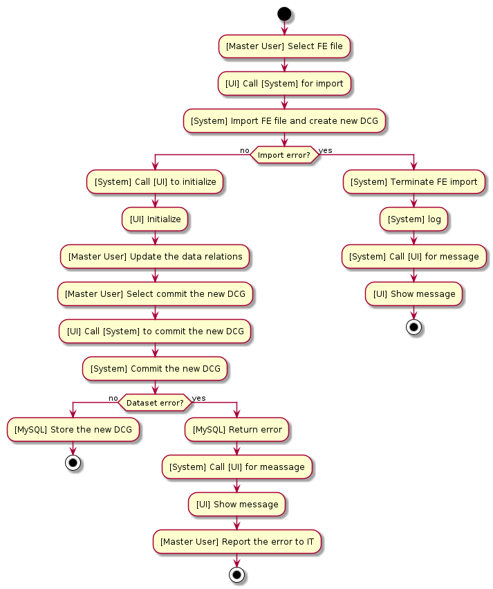

**Contents**
1. [About The Project](#sec1)
2. [Problem Definition: Stress Analysis of the Structural Components](#sec2)
3. [Software Design: Requirements, Limitations & Assumptions](#sec3)
4. [Software Design Summary](#sec4)
5. [Further Discussions](#sec5)

**Nomenclature**
- **SC:** Structural Component
- **SCT:** Structural Component Tree
- **SCTN:** Structural Component Tree Node
- **SA:** Structural Analysis of an SC
- **SAA:** Structural Analysis Application
- **SAE:** Structural Analysis Engineer (i.e. the user of the application)
- **SAMM:** Structural Analysis Method & Module
- **SAR:** Structural Analysis Result
- **FE:** Finite Element
- **FEM:** Finite Element Model
- **FEA:** Finite Element Analysis
- **CAE:** Computer Aided Engineering
- **FM:** Failure Mode
- **LC:** LoadCase
- **RF:** Reserve Factor
- **R&L:** Requirements and Limitations

## 1. About The Project 

This project is a part of the repositories to illustrate my software engineering experience.
This repository especially demonstrates my skills about the software architecture and design.

In the first section, I will start by describing the problem without diving into too much detail.
Then, I will examine the requirements and limitations (R&L) for the requested software.
Finally, I will cover the architecture and design aspects based on the those R&L.
Although this flowchart looks straight forward,
the process is an iterative procedure where the R&L, the architecture and the design will evolve eventually.
Hence, I will have a number of milestones to discuss about the current state of the software as a design review.

**CAUTION**\
**This project defines only the core framework of a structural analysis application (SAA).**
**Only the interface (i.e. the R&L) is defined for the other components (e.g. the DB, the UI).**

## 2. Problem Definition: Stress Analysis of the Structural Components 

The design of structural components (SCs) includes various aspects:
- Manufacturing R&L
- Cost analysis
- Effectivity issues
- Repairability R&L
- Ergonomy
- etc.

In addition to the above list, the structural analysis (SA) is another part of the design process
which is crucial as it validates the safety requirements.
The SA inspects a SC loaded by a LoadCase (LC) in order to validate if the SC can withstand the loading.
In other words, the SA can be abstracted as an engine which runs on a given SC-LC combination and returns a measure of safety.
Formally, the parameters of this abstraction are:
- **Reserve Factor (RF):** A unitless value to measure the structural analysis result (SAR): the current stiffness / the critical stiffness
- **Inspection:** The procedure to find the RF value of an SC for a given failure mode (FM)
- **Sizing:** The procedure to determine the required properties of an SC to have an acceptable RF

There exist mainly two approaches to handle an SA:
1. The analytical approach is mainly based on the principles of *the strength of materials*, *fracture mechanics*, etc.
2. The finite element (FE) approach is based on the numerical methods

The former relies on the theoretical and experimental rules and data while 
the later performs numerical calculations based on some primitive physical laws.
In other words, the FE approach relies on the power of the computers
in order to replace the complex formulation of the analytical analysis with simple definitions.
Having a simple formulation, the FE analysis can be applied on any problem **uniformly**.
However, the cost of the uniform analysis interface is the requirement for a large computation power.
In other words, an inspection handled in a few miliseconds by the analytical approach may take hours by an FE solver.
Nevertheless, the FE approach contains some inevitable assumptions which results with the loss of the accuracy.

**The aim of the project is to design the core framework of a *closed form stand-alone* solution for the analytical approach**.

## 3. Initial Costumer Requirements 

I will try to generate a set of initial customer requirements by examining the followings:
1. An overview of the problem
2. The target market
3. Initial architectural decisions

### 3.1. An Overview of the Problem 

SAA is an engine measuring the safety of SCs.
This definition yields three components of an SAA: the SC, the structural analysis (SA) and the structural analysis result (SAR).
The structural industry involves many types of SCs: panels, beams, stiffeners, trusses, brackets, etc.
**The size of the list may go up to hundreds even thousands.**
**The type of an SC determines its' failure modes (FMs) which yield to the 2nd and 3rd components, the SA and the SAR respectively.**

The SCs withstand various kinds of loading to ensure the safety of a structure.
For example a truss element carries only axial loading while a beam carries combined loading
although they may have the same geometrical properies.
Hence, the geometry is not the only parameter to define an SC.
The 2nd parameter is **the role** of the component.
For example, the role of a beam is to carry combined loading while the role of a stiffener is to support a panel by carring the axial loading.
Hence, the definition of an SC would contain the followings:
1. The geometry
2. The material
3. The role
4. The FMs
5. The structural analysis methods and modules (SAMMs)
6. The SARs

**The SAA must involve a definition for each SC type (e.g. panel).**
Some abstractions can be defined to improve these definitions based on the properties, roles and FMs.
For example, a plate type would support the definitions of the panels, joints and stiffener segments.

A very important point about the SCs is that **the SCs are related to each other by definition**.
A panel is defined as a rectangular plate **supported by the side stiffeners**.
A stiffener is defined as a cross-sectional element **supported by two side panels**.
A joint is formed by **at least two plates and a fastener**.

In order to perform an SA on an SC, the applied loading must be given.
The determination of the load distribution within a complex structural assembly **cannot be performed analytically**.
Hence, **the SAA needs an interface with the FE softwares** in order to obtain the loading on each SC together with the geometry and material.
The interface must contain both the input and output routines.
Additional to the IO routines, **the SAA may contain an FE display for the visual purposes**.

### 3.2. The Target Market 

The SAs are performed on the SCs against a number of the FMs.
The variaty of the SCs and the FMs depends on the industry.
In the history, the SAs have been performed using simple tools like excel which was satisfactory for small business.
Excel provides an efficient computation capability and traceability in such a case.
However, excel becomes useless when the variaty and the number of the data gets large.
Besides, the size of the engineering team is another parameter due to the role definitions.
This application is the candidate to take place of excel in such conditions.
In other words, the target customers are the large companies:
- managing projects with a large variaty of types,
- having a large team of SAEs.

Considering the customers, there is one more important point.
The large companies in the industry have their own algorithms for the SAMMs and they dont want this data to be public.
Hence, they would like to embed their methods into the application themselves.
This requires a plugin based software where the development of the SAMMs is left to the customer.
Additionally, the companies may assign a team of SAEs instead of the software engineers for the plugin development.
This is quite common in the industry as the SAEs are equipped with some level of software development skills.

### 3.3. The Architecture: The 1st Overview 

I will review the following major aspects of the software architecture to make some decisions:
- Deployment model
- User model
- Data & Persistency
- Performance
- Concurrency

Some other issues have already been covered in the previous sections.

#### 3.3.1. Deployment Model

1. Options:
- Desktop (native)
- Web-based (cloud)
- Hybrid
2. Questions:
- How are the installation, the maintanance and the security managed?
- How is the configuration of the SAA managed?
- Do SAMMs run heavy computations?
- Can the SAMMs be handled locally, or do they require scalable cloud CPUs/GPUs, or is a hybrid solution required?
- Does the customer have HPCs?
- Does the customer have a powerful server to satisfy the latency and bandwidth constraints?

#### 3.3.2. User Model

1. Options:
- Single user (standalone)
- Multi-user (shared data, roles, collaboration)
2. Questions:
- Will multiple analysts ever work on the same dataset concurrently?
- Is there a need to define user credentials (e.g. role)?
- Is central data sharing or report distribution a requirement?

#### 3.3.3. Data & Persistency

1. Options:
- Filesystem (JSON, XML, binary)
- Embedded DB (e.g. SQLite)
- Client-Server DB (e.g. MySQL, NoSQL)
2. Questions:
- How large will the datasets grow?
- How is it planed to store the data in the REM (discussion if a DOD approach is needed)?
- How is it planed to save the data (on local disk or DB or PLM)?
- Is there a need for transactions or roll-backs if a computation fails?
- Is cross-platform file portability important?
- Are the available resources sufficient to manage efficient transactions from/to a DB?

#### 3.3.4. Performance

1. Options:
- Local CPU and GPU
- An HPC solver distributed by a server
2. Questions:
- Are analyses instantaneous or long-running (minutes/hours)?
- Does the UI (together with the graphics display if needed) keep processing large data?
- Does the graphics display need to be interactive?
- Is there a need to scale out to handle many simultaneous jobs?
- Is there a need for multithreading or multi-processing or both?

#### 3.3.5. Concurrency

The application woulld obviously need the concurrent execution in terms of:
- Separation of responsibility (e.g. core framework and UI)
- Parallel computation
- Concurrent access by multiple user

Previous sections already listed some arguments related to the concurrency.
Later, I will discuss about this important issue in detail.

#### 3.3.6. Summary of the 1st Overview of the Architecture

Considering the descussions held in the previous sections, the first overview of the architecture would be:
- A web-based (cloud) application supported by a local company server
- Multi-user model considering the follwing issues: shared data, roles and collaboration
- A client-Server DB: MySQL
- An HPC solver distributed by a powerful server

The first two requirements above are obvious by the discussions held in the previous sections.
The third requirement is to support an efficient multi-user concurrent access on the large data.
A NoSQL DB could be prefered to deal with the graph data more efficiently.
However, the SAA is not a low-latency application and it needs to employ the graph algorithms itself.
The last requirement is to perform the heavy computations of structural analysis.
The GPU resources need to be spared for the FE graphics display.

### 3.4. The Architecture: The 2nd Overview 

On top of :
- Deployment model
- User model
- Data & Persistency
- Performance
- Concurrency

Some other issues have already been covered in the previous sections.

Here, I will

#### 3.4.1. Frontend

This project excludes the details of the front-end development.
However, the architecture and design need some solid definitions about the UI in order to have a clear interface.
Following two were the initial requirements related to the UI:
- The SAA will define a UI form for each type.
- The SAA will contain a graphics display for the FE model.

Based on these requirements, I will continue with **javascript/react as the front-end language** in order to make use of:
- the great library,
- high-performance interactive 3D visualization (e.g. vtk),
- best start-up and runtime performance.

Additionally, the separation of responsibility between the main framework and the UI is satisfied
as react executes asynchronously with the core framework.

#### 3.4.2. Plugins

We had a requirement related to the extensibility:
- The SAA will provide a plugin style extensibility in terms of SCs, SAs, SARs and SAMMs.
- The plugins could be developed by the customer.

The SCs, SAs and SARs are the objects of the application which need type definitions
while SAMMs present the behaviours of these types.
The application will be used by the structural engineers among whom Python is the most popular choice (even de-facto).
Hence, I will continue with **Python for the SAMM plugin development**.
A plugin style architecture for the SCs, SAs and SARs needs a type registration.
**Hence, the core framework shall provide the type registration.**
Additionally, each new type would need a UI form.
**Hence, if required a plugin may involve a UI form implementation with js as well.**

The SAA installation needs to unpack **some sample plugins** including the following items:
- Plugin descriptor json file
- Type module with type registry (e.g. panel.py including register_panel function)
- SAMM module with analysis registry (e.g. panel_buckling.py including register_panel_buckling function)
- Type UI form js file with UI form registry (e.g. panel_ui.js including register_panel_ui function)
- **Core API shall provide the registry routines which shall be executed by the python and js registry functions.**

#### 3.4.3. Remainings

The discussions up to here helped us to make decisions about the software architecture.
However, there remains some gaps in the architecture mostly related with the core framework:
- The types required by the SAA are mainly classified as SCs, FMs, SAs and SARs.
- In addition to the above types, the SAA needs some auxilary data (e.g. material, geometry and loading).
- Each group may contain hundreds of types.
- There exist *dependency relationships* between the types.

These will be covered in the following sections by studying the aspects of the software design.

## 4. Software Design 

In this chapter, I will start by a use case diagram in order to have a view of the execution flow of the SAA.
Then, I will discuss the issues related to the software design in detail.

### 4.1. Use Case Diagram 1 

- **Primary Actor:** SAE
- **Scope:** SAA
- **Level:** User goal  

#### 4.1.1. Stakeholders and Interests
- **SAE**: wants to inspect the SCs under the FE extracted loads.
- **Project Manager**: needs quick feedback on the analysis status.

#### 4.1.2. Preconditions
- an existing FE data pack with a predefined format including the geometry, material and loading exists.

#### 4.1.3. Scenarios

There are mainly two use case scenarios:
1. Zero-to-end scenario including the FE import
2. DAG-to-end scenario where an existing DAG is requested to run SAMMs

I will demonstrate the former scenario.
The later requires an existing DAG which is an issue related to the IO algorithms.

**Main Flow**
1. **SAE** selects to import an FE data with a predefined format.
2. **UI** emits an event to activate the system for the FE data extraction.
3. **System** creates the DAG corresponding to the FE data and links the DAG to the FE.
4. **System** emits an event to initialize the user forms and the graphics.
5. **UI** initializes the user forms and the graphics.
6. **SAE** selects the analysis dataset (i.e. SCs, LCs and SAMMs) from the component tree.
7. **SAE** clicks **Run Analysis** to execute the SAs for the selected analysis dataset.
8. **UI** emits an event to activate the system for an analysis request with the selected dataset.
9. **System** retrieves the FE data from the DAG corresponding to the requested dataset.
10. **System** executes the SAMMs with the requested dataset.
11. **System** creates the SAR nodes in the DAG and links them to the requested dataset.
12. **System** updates the states of the SCs as **up-to-date**.
13. **System** emits an event to activate the UI for the states and SARs.
14. **UI** refreshes the component tree for the state of the selected dataset as **up-to-date**.

**Alternate Flows (Errors) - 1: Error during FE import**
- **3. System** terminates the the FE Import.
- **4. System** logs an error and sets the status to **Error**.
- **5. System** emits an event to activate the UI to display the error message for the import failure.
- **6. UI** displays the error message for the import failure.

**Alternate Flows (Errors) - 2: Missing data (the analysis dataset is incomplete)**
- **9. System** terminates the SAMM run.
- **10. System** emits an event to activate the UI to display the error message for the missing dataset.
- **11. UI** displays the error message for the missing dataset.

**Alternate Flows (Errors) - 3: The computation fails**
- **11. System** logs an error for the erroneous SA.
- **12. System** sets status to **Error**.
- **13. System** waits until the remainning SAs finishes.
- **14. System** emits an event to activate the UI to act for the successful and failed SAs correspondingly.
- **15. UI** updates the RFs in the form of the active SC if not erroneous.
- **16. UI** refreshes the component tree for the state of the selected dataset as **up-to-date** and as **failed** correspondingly.
- **17. UI** displays the error message for the erroneous SA.

#### 4.1.4. Postconditions
- The SAR nodes for the successful SAs exist in the DAG.
- The RF in the current user form has the latest value if not erroneous.
- UI reflects the updated state data.

#### 4.1.5. UML Diagram

## 4. Software Design Summary 

## 5. Further Discussions 

