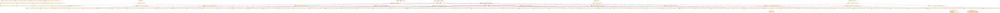
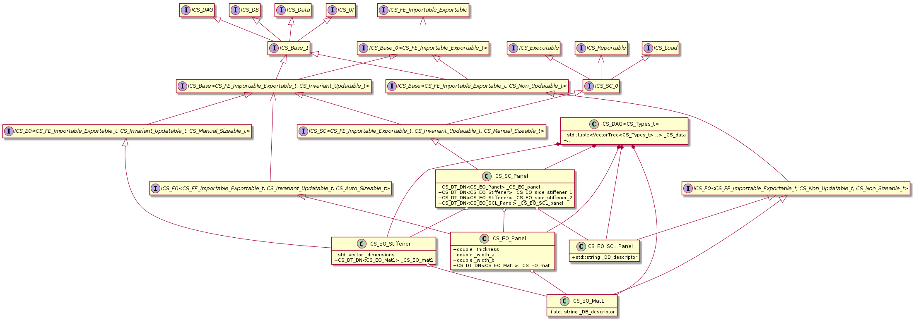

**Contents**
- [1. About The Project](#sec1)
- [2. Problem Definition: Stress Analysis of the Structural Components](#sec2)
- [3. Software Architecture](#sec3)
  - [3.1. An Overview of the Problem](#sec31)
  - [3.2. The Target Market](#sec32)
  - [3.3. The Architecture: The 1st Overview](#sec33)
    - [3.3.1. Deployment Model](#sec331)
    - [3.3.2. User Model](#sec332)
    - [3.3.3. Data & Persistency](#sec333)
    - [3.3.4. Configuration](#sec334)
    - [3.3.5. Concurrency](#sec335)
    - [3.3.6. Summary of the 1st Overview](#sec336)
  - [3.4. The Frontend](#sec34)
  - [3.5. The Core](#sec35)
    - [3.5.1. The CS in C++](#sec351)
    - [3.5.2. The CS in Java](#sec352)
    - [3.5.3. The CS in Python](#sec353)
    - [3.5.4. The CS Language Comparison](#sec354)
  - [3.6. Use Case Diagrams](#sec36)
    - [3.6.1. Use Case scenario #1](#sec361)
    - [3.6.2. Use Case scenario #2](#sec362)
    - [3.6.3. Use Case scenario #3](#sec363)
    - [3.6.4. A Quick Review on the Use Case scenarios](#sec364)
  - [3.7. The Architecture: Summary](#sec37)
- [4. Software Design](#sec4)
  - [4.1. The UI](#sec41)
  - [4.2. The Core System (CS)](#sec42)
    - [4.2.1. The UI Interface](#sec421)
    - [4.2.2. The Functionally Persistent DAG](#sec422)
    - [4.2.3. The SP Interface](#sec423)
    - [4.2.4. The FE Interface](#sec424)
    - [4.2.5. The MySQL DB Interface](#sec425)
    - [4.2.6. The Class Hierarchy](#sec426)
    - [4.2.7. The UML Diagram](#sec427)
  - [4.3. The Solver Pack (SP)](#sec43)
- [5. Other Issues](#sec5)

**Nomenclature**
- **SC:** Structural Component
- **SCL:** Structural Component Loading
- **SA:** Structural Analysis
- **SAD:** Structural Analysis Dataset
- **SAA:** Structural Analysis Application
- **SAE:** Structural Analysis Engineer (i.e. the user of the application)
- **SAMM:** Structural Analysis Method & Module
- **SAR:** Structural Analysis Result
- **FE:** Finite Element
- **FEM:** Finite Element Model
- **FEA:** Finite Element Analysis
- **CAE:** Computer Aided Engineering
- **FM:** Failure Mode
- **LC:** LoadCase
- **RF:** Reserve Factor
- **R&L:** Requirements and Limitations
- **CS:** Core System
- **SP:** Solver Pack
- **OETV:** Object Explorer Tree View
- **OETVN:** Object Explorer Tree View Node

## 1. About The Project <a id='sec1'></a>

This project is a part of the repositories to illustrate my software engineering experience.
This repository especially demonstrates my skills about the software architecture and design.

In the first section, I will start by describing the problem without diving into too much detail.
Then, I will discuss about the architecture and design of an application to serve as a solution to the given problem.

**Note**\
**This project includes example code snippets (e.g., EO_Panel.h) to support and clarify architectural and design discussions.**
**However, these source files are intended as illustrative pseudocode.**
**They have not been compiled, tested, or validated.**
**The code may contain bugs, and in some cases, contradictions with the stated design or architectural intent**
**(especially regarding the const correctness and interface boundaries).**
**Please interpret the code accordingly and focus on the architectural and design concepts rather than the implementation accuracy.**

**I did not get support from an AI tool while preparing this repository accept for the discussions related with the frontend.**
**I dont have an experience with the frontend development.**
**The remaining discussions and the code blocks are all belong to my software engineering experience.**

## 2. Problem Definition: Stress Analysis of the Structural Components <a id='sec2'></a>

The design of structural components (SCs) includes various aspects:
- Manufacturing R&L
- Cost analysis
- Effectivity issues
- Repairability R&L
- Ergonomy
- etc.

In addition to the above list, the structural analysis (SA) is another part of the design process
which is crucial as it validates the safety requirements.
The SA inspects a SC loaded by a LoadCase (LC) in order to validate if the SC can withstand the loading.
In other words, the SA can be abstracted as an engine which runs on a given SC-LC combination and returns a measure of safety.
Formally, the parameters of this abstraction are:
- **Reserve Factor (RF):** A unitless value to measure the structural analysis result (SAR): the current stiffness / the critical stiffness
- **Inspection:** The procedure to find the RF value of an SC for a given failure mode (FM)
- **Sizing:** The procedure to determine the required properties of an SC to have an acceptable RF

There exist mainly two approaches to handle an SA:
1. The analytical approach is mainly based on the principles of *the strength of materials*, *fracture mechanics*, etc.
2. The finite element (FE) approach is based on the numerical methods

The former relies on the theoretical and experimental rules and data while 
the later performs numerical calculations based on some primitive physical laws.
In other words, the FE approach relies on the power of the computers
in order to replace the complex formulation of the analytical analysis with simple definitions.
Having a simple formulation, the FE analysis can be applied on any problem **uniformly**.
However, the cost of the uniform analysis interface is the requirement for a large computation power.
In other words, an inspection handled in a few miliseconds by the analytical approach may take hours by an FE solver.
Nevertheless, the FE approach contains some inevitable assumptions which results with the loss of the accuracy.

**The aim of the project is to design the core framework of a *closed form stand-alone* solution for the analytical approach**.

## 3. Software Architecture <a id='sec3'></a>

I will try to generate a set of initial customer requirements by examining the following two:
1. An overview of the problem
2. The target market

### 3.1. An Overview of the Problem <a id='sec31'></a>

SAA is an engine measuring the safety of SCs.
This definition yields three components of an SAA: the SC, the structural analysis (SA) and the structural analysis result (SAR).
The structural industry involves many types of SCs: panels, beams, stiffeners, trusses, brackets, etc.
**The size of the list may go up to hundreds even thousands.**
**The type of an SC determines its' failure modes (FMs) which yield to the 2nd and 3rd components, the SA and the SAR respectively.**

The SCs withstand various kinds of loading to ensure the safety of a structure.
For example a truss element carries only axial loading while a beam carries combined loading
although they may have the same geometrical properies.
Hence, the geometry is not the only parameter to define an SC.
The 2nd parameter is **the role** of the component.
For example, the role of a beam is to carry combined loading while the role of a stiffener is to support a panel by carring the axial loading.
Hence, the definition of an SC would contain the followings:
1. The geometry
2. The material
3. The role
4. The FMs
5. The structural analysis methods and modules (SAMMs)
6. The SARs

**The SAA must involve a definition for each SC type (e.g. panel).**
Some abstractions can be defined to improve these definitions based on the properties, roles and FMs.
For example, a plate type would support the definitions of the panels, joints and stiffener segments.

A very important point about the SCs is that **the SCs are related to each other by definition**.
A panel is defined as a rectangular plate **supported by the side stiffeners**.
A stiffener is defined as a cross-sectional element **supported by two side panels**.
A joint is formed by **at least two plates and a fastener**.

In order to perform an SA on an SC, the applied loading must be given.
The determination of the load distribution within a complex structural assembly **cannot be performed analytically**.
Hence, **the SAA needs an interface with the FE softwares** in order to obtain the loading on each SC together with the geometry and material.
The interface must contain both the input and output routines.
Additional to the IO routines, **the SAA may contain an FE display for the visual purposes**.

### 3.2. The Target Market <a id='sec32'></a>

The SAs are performed on the SCs against a number of the FMs.
The variaty of the SCs and the FMs depends on the industry.
In the history, the SAs have been performed using simple tools like excel which was satisfactory for small business.
Excel provides an efficient computation capability and traceability in such a case.
However, excel becomes useless when the variaty and the number of the data gets large.
Besides, the size of the engineering team is another parameter due to the role definitions.
This application is the candidate to take place of excel in such conditions.
In other words, the target customers are the large companies:
- managing projects with a large variaty of types,
- having a large team of SAEs.

Considering the customers, there is one more important point.
The large companies in the industry have their own algorithms for the SAMMs and they dont want this data to be public.
Hence, they would like to embed their methods into the application themselves.
This requires a plugin based software where the development of the SAMMs is left to the customer.
Additionally, the companies may assign a team of SAEs instead of the software engineers for the plugin development.
This is quite common in the industry as the SAEs are equipped with some level of software development skills.

### 3.3. The Architecture: The 1st Overview <a id='sec33'></a>

Firstly, I will summarize the previous two sections as a requirement list:
- [An overview of the problem](#sec31) yields to the following requirements:
1. The types required by the SAA are mainly classified as SCs, FMs, SAs and SARs.
2. In addition to the above types, the SAA needs some auxilary data (e.g. material, geometry and loading).
3. Each group may contain hundreds of types.
4. There exist *dependency relationships* between the types.
5. The SAA needs an interface with the FE software.
- [The target market](#sec32) analysis yields to the following requirements:
1. The company would provide sufficient resources of processors and servers.
2. The SAA will manage and process large data.
3. The SAA will have DBs.
4. The SAA will define a UI form for each type.
5. The SAA will contain a graphics display for the FE model.
6. The SAA will manage the configuration issues.
7. The SAA will provide a plugin style extensibility in terms of SCs, SAs, SARs and SAMMs.
8. The plugins could be developed by the customer.

I will review the following major aspects of the software architecture to make some decisions:
- Deployment model
- User model
- Data & Persistency
- Performance
- Concurrency

#### 3.3.1. Deployment Model <a id='sec331'></a>

1. Options:
- Desktop (native)
- Web-based (cloud)
- Hybrid
2. Questions:
- How are the installation, the maintanance and the security managed?
- How is the configuration of the SAA managed?
- Do SAMMs run heavy computations?
- Can the SAMMs be handled locally, or do they require scalable cloud CPUs/GPUs, or is a hybrid solution required?
- Does the customer have HPCs?
- Does the customer have a powerful server to satisfy the latency and bandwidth constraints?

#### 3.3.2. User Model <a id='sec332'></a>

1. Options:
- Single user (standalone)
- Multi-user (shared data, roles, collaboration)
2. Questions:
- Will multiple analysts ever work on the same dataset concurrently?
- Is there a need to define user credentials (e.g. role)?
- Is central data sharing or report distribution a requirement?

#### 3.3.3. Data & Persistency <a id='sec333'></a>

1. Options:
- Filesystem (JSON, XML, binary)
- Embedded DB (e.g. SQLite)
- Client-Server DB (e.g. MySQL, NoSQL)
2. Questions:
- How large will the datasets grow?
- How is it planed to store the data in the REM (discussion if a DOD approach is needed)?
- How is it planed to save the data (on local disk or DB or PLM)?
- Is there a need for transactions or roll-backs if a computation fails?
- Is cross-platform file portability important?
- Are the available resources sufficient to manage efficient transactions from/to a DB?

#### 3.3.4. Configuration <a id='sec334'></a>

1. Options:
- Local CPU and GPU
- An HPC solver distributed by a server
2. Questions:
- Are analyses instantaneous or long-running (minutes/hours)?
- Does the UI (together with the graphics display if needed) keep processing large data?
- Does the graphics display need to be interactive?
- Is there a need to scale out to handle many simultaneous jobs?
- Is there a need for multithreading or multi-processing or both?

#### 3.3.5. Concurrency <a id='sec335'></a>

The application woulld obviously need the concurrent execution in terms of:
- Separation of responsibility (e.g. core framework and UI)
- Parallel computation
- Concurrent access by multiple user

Previous sections already listed some arguments related to the concurrency.
Later, I will discuss about this important issue in detail.

#### 3.3.6. Summary of the 1st Overview <a id='sec336'></a>

Considering the discussions held in the previous sections, the first overview of the architecture would be:
- A web-based (cloud) application supported by a local company server
- Multi-user model considering the following issues: shared data, roles and collaboration
- A client-Server DB: MySQL
- An HPC solver distributed by a powerful server

The first two decissions above serve for the requirements coming from the target market analysis.
The third one is to support an efficient multi-user concurrent access on the large data.
A NoSQL DB could be prefered to deal with the graph data more efficiently.
However, the SAA is not a low-latency application and it needs to employ the graph algorithms itself.
The last one is to perform the heavy computations of structural analysis.
The GPU resources need to be spared for the FE graphics display.

### 3.4. The Frontend <a id='sec34'></a>

**This project excludes the details of the frontend development.**
However, the architecture and design need some solid definitions about the UI in order to have a clear interface.
Following two were the initial requirements related to the UI:
- The SAA will define a UI form for each type.
- The SAA will contain a graphics display for the FE model.

Based on these requirements, I will continue with **javascript/react as the frontend language** in order to make use of:
- the great library,
- high-performance interactive 3D visualization (e.g. vtk),
- best start-up and runtime performance.

Additionally, the separation of responsibility between the main framework and the UI is satisfied
as react executes asynchronously with the core framework.

### 3.5. The Core <a id='sec35'></a>

The core systems has the following responsibilities:
1. Memory management,
2. Data transformations,
3. Forwarding the requests between the frontend and the memory, the MySQL DB, the SP and the FE.

While performing the above duties, the core needs to satisfy the three requirements related to the extensibility from [the overview of the problem](#sec31):
- The SAA will provide a plugin style extensibility in terms of SCs, SAs, SARs and SAMMs.
- The plugins could be developed by the customer.
- There may exist hundreds even thousands of types and correspondingly too many objects may need to be managed.

The SCs, SAs and SARs are the objects of the application which need type definitions
while SAMMs present the behaviours of these types.
Considering that the SAMMs involve the implementation of some scientific calculations,
**python is the best choice for the SAMMs**
as Python is the most popular language (even can be considered as de-facto) among various engineering fields including the SAEs.

A plugin style architecture for the SCs, SAs and SARs needs a type registration.
**Hence, the core framework shall provide the type registration.**

The requirements arised from [the overview of the problem](#sec31) underline that the application
would need to construct a type/class hierarchy which requires a careful design study following:
- object oriented design (OOD),
- function oriented design (FOD),
- data oriented design (DOD),
- test driven design (TDD),
- etc.

The type definitions and the class hierarchy (i.e. the design) have a significant workload.
Besides, the software design needs qualified software engineers.
**A plugin approach assuming an empty framework to be extended by the client plugins**
**would fail as it pushes too much pressure on the client.**
Thus, the SAA should provide a generic design with some abstractions, interfaces, transformations, etc.
Additionally, the SAA should be shipped with the plugins of the fundamental types (e.g. panel, beam, ISection, LC, isotropic material, etc.).
In this approach, the client is mainly considered to develop the SAMMs.
The SAA would still be extensible with introducing new plugins on top of the compiled core plugins.

A plugin may include the following items:
- Plugin descriptor json file,
- Type module with type registry,
- SAMM module with analysis registry and
- Type UI form js file with UI form registry.

**The core API shall provide the registry routines for the new types, SP routines and the UI forms defined by the plugins.**

**Memory Management:**\
[The overview of the problem](#sec31) explained the dependencies within the data.
The dependencies/relations in the data require a link-based (i.e. pointer-based) data structure for the memory managemant.
The relations are not linear such that the data contains both the one-to-many and many-to-one relations.
Semantically, there also exist ancestor/descendant relations such that a material is an ancestor of the SCs using that material.
For example, when a material is updated, all the descendants of the material shall be visited.
In other words, an action on an element shall be propogated through the descendants of the element.
This could be performed using a proxy design pattern.
However, a better/compact solution is to use a **directed graph** data structure for the memory management.
There, by physical definition, exists mutual dependencies in case of the SAA.
For example, a panel is formed by a plate supported by two side stiffeners against the axial loading while
a stiffener is an extruded cross-section balanced by two side panels against the shear loading.
Hence, both the panel and the stiffener depend on each other.
However, this problem can be solved by delaying the dependencies to a higher definition.
The SAA contains two fundamental types: engineering object (EO) and structural component (SC).
The dependencies can be defined in the SCs (i.e. SC_Panel and SC_Stiffener)
leaving the EOs (i.e. EO_Panel and EO_Stiffener) with the raw data (e.g. thickness).
Now the SAA is free of the **cyclic relations**.
Hence, the core data structure of the SAA is a **directed acyclic graph (DAG)**.

Consider a geometry application (e.g. Dassault's Catia).
The application would be simulated with a DAG.
The DAG can be very deep in case of a geometry application
as each geometrical element (e.g. points, curves, surfaces) would be defined using other elements.
The DAG is acyclic as a point cannot be created from a curve which has a relation with the point somewhere in the history.
On the other hand, the application may allow cycled nodes (e.g. Catia) and continue in an **invalid state**.
A background thread would inspect the cycled nodes asynchronously as the cycles would be terminated by the user actions.
Catia also allows removing an element without removing the decendants which requires a background thread as well.
[My persistent DAG](https://github.com/BarisAlbayrakIEEE/PersistentDAG.git) repository examines the background thread in detail.
Please see the Readme file for a detailed discussion.

We have different requirements and usage in case of the SAA:
- The depth of the DAG in case of the SAA is very small: Ex: material -> panel -> panel buckling -> RF.
- No need to allow cycled nodes as it doesn't make sence in case of the SAA.
- No need to allow deleting the nodes with descendants as it doesn't make sence in case of the SAA.

**The above three points show that the DAG of the SAA shall be single-threaded.**

**Data Transformations and the Interfaces:**\
The SAA has a number of components:
- the DAG,
- the UI,
- the FE,
- the MySQL DB and
- the SP.

These components have a number of interactions that need to be handled by the CS.
These interactions define the main interfaces.

Each component would require the data in its own format
so that the CS shall perform a data transformation before transfering the data.
For example, lets consider a sample SA method defined by the SP: panel buckling.
Before, I stated that the SP shall implement the SAMMs in python.
The client would prefer simple OOP objects while working on the SAMMs.
For example, a Panel class would encapsulate the panel data (e.g. thickness)
in order to access data with dot notation easily (e.g. panel.t).
Additionally, Panel class would have some methods.
In other words, SAMMs would contain simple classes without a complex class hierarchy
in order for the simplicity and traceability of the SAMMs.
What about the CS?
Shall the CS involve these type definitions?
For example, does the DAG store the panel data by gathering these Panel objects?
The answer to this question is actually a big *NO*.
SAMMs will be defined by the client and the CS is not.
Hence, the CS and the SP involve their own design.
They even can be implemented in different languages such as C++ for the CS and python for the SP.

Another approach would be distributing the memory management and the design to the CS and SP respectively
by assuming that the CS can work with the raw data and would not need to know about the design (i.e. the class hierarchy).
However, the responsibilities of the CS listed above clearly shows that the CS needs to access and forward the data via a number of interfaces.
Below list presents a couple of example operations that need a careful design:
- The types would need to implement some functions for the DAG: `get_ancestors`, `update_state`, `inspect_invariant`,
- The types would need to implement the import and export functions for the FE: `import_FE` and `export_FE`,
- The types would need to implement the functions for the mutability and sizeability: `size_structurally`,
- The types would need to implement a factory function for the SP: `create_SP_object`,
- Extensibility fails for the user operations as designing new behaviours is cumbersome: `get_all_materials` function would envolve too many branches.

[The software design](#sec4) section will discuss on these issues later in detail.
However, I will review the above items shortly here as well.
The 1st one is especially important as it means that
a traversal through the DAG would require the construction of temporary objects (e.g. Mat1, Panel)
if the CS involves only the raw data.
Actually, all of the operations may require the temporary objects.
Another solution is to apply the FOD approach to every problem but
it will cause an explosion in the type tags and the boilerplate code which will kill the traceability.

**Hence, a design with the CS handling DOD style raw data and the SP defining the whole class hierarchy is not reasonable.**
**The CS shall be responsible from both the memory and the design.**

**The Language:**\
The client implements the SAMMs (i.e. the SP) in python.

We have four choices for the CS:
1. Python: Involve each type (e.g. CS_EO_Panel) within a class hierarchy and store the objects of these types in the DAG,
2. Python: Involve a DOD container for each type (e.g. CS_EO_Panel_Container) within a class hierarchy and store the containers in the DAG,
3. Python: Use Cython for the CS type definitions and store the objects of these types in contiguous arrays,
4. use one of C++, rust and java.

The 1st solution is not a choice as python would use the heap memory in this case which is obviously not a design choice but to be more clear: 
- The DOD style data management would fail and
- Later, I will review the DAG in detail and select functionally persistent DAG to manage the memory.
The persistent solution would require frequent copy operations for which the heap memory usage is a significant problem.
Every action of the user may take considarable time for large DAGs if the data is spread out of the heap memory.

I will eliminate the 3rd solution as its no better than the 4th one.
I also eliminate the rust solution as I dont have any experience with the rust development.

#### 3.5.1. The CS in C++ <a id='sec351'></a>

C++ provides variadic templates for varying type lists.
C++ solution for the DAG would look like:

```
// ~/src/system/dag.h

template<typename... Ts>
class DAG {
  private:
    std::tuple<std::vector<Ts>...> _type_containers;
  ...
}
```

C++ provides a powerful type traits library in order to handle type transformations statically.
For example, the Nth type T within the typelist Ts would be obtained by:

```
// ~/src/system/CS_type_traits.h

// The base template to extract the Nth type from a type list
template<std::size_t N, typename Types>
struct type_at;

// The 1st template specialization of type_at defining the variadic parameters
template<std::size_t N, typename T, typename... Ts>
struct type_at<N, TypeList<T, Ts...>> : type_at<N - 1, TypeList<Ts...>> {};

// The 2nd template specialization of type_at which is the boundary of the recursion
template<typename T, typename... Ts>
struct type_at<0, TypeList<T, Ts...>> {
  using type = T;
};

// Define a type list
template<typename... Ts>
struct Types{};
struct Foo{};
struct Bar{};
using TypeList = Types<Foo, Bar>;

// Get and use the 0th type from the type list
static constexpr type_at<0, TypeList> obj{};
```

C++ would perform better than java in terms of the static programming as it provides the whole functionality required for the static type transformations.
However, there is a problem with the static programming: how to reconcile the extensibility via new plugins with the static programming?
This issue actually points to two problems:
1. Plugin extensions need re-compilation and
2. Injecting the new types into the CS.

Requesting re-compilation from the clients is not a big deal.
The process can be described by the following maintanance procedure handled by a master user:
1. shut the server for maintanance,
2. define the new type,
2. recompile the application and
3. restart the server.

As I discussed before, the SAA would run on a cloud server which allows the above maintanance procedure to be handled easily.
The remaining question is how to embed the new type into the CS type list statically.
Consider that the CS has a source file defining the CS type list statically: `CS_type_list.h`.
The CS is designed based on this source file such that the only update required to embed a new type is to append the new type into the type list.
There exist four approaches to add a new type statically into the CS:
1. Ship the SAA with a codegen or build tool which inspects the compatibility of the type list with the plugins,
2. Ask the client to update the type list (i.e. `CS_type_list.h`) while adding a new type,
3. Defining the type list with pre-reserved slots (e.g. EO_1, EO_2, etc.) and ask the client to map to these pre-reserved slots and
4. Using macros.

I will skip the macro solution as the macros are not safe.
Using pre-reserved types is a limited solution.
Besides, it would result in a loss in the type safety and traceability.
The 2nd solution makes the clients responsible from the system files which is totaly a bad design practice.
Besides, the plugins are not self-contained anymore due to this coupling with the system source file.
The 1st solution on the other hand provides a type safe solution where the client is only responsible from the self-contained plugins.
A CMake macro would automatically detect the new types defined by new plugins and regenerate the CS type list source file accordingly.
The CMake code would need a custom command to visit all the plugins in the plugins directory:

```
# ~/scripts/regenerate_CS_type_list.py

import os
import re

def match_type_def(line: str):
  '''
  As a simple solution, assumes that the class names start with one of EO_, SC_, SA_, SAR_.
  A generic solution is required.
  '''
  inspection = re.match(r"class\s+(\w+)\s*:\s*public\s+(EO|SC|SA|SAR)_", line)
  if inspection:
    return inspection
  return re.match(r"struct\s+(\w+)\s*:\s*public\s+(EO|SC|SA|SAR)_", line)

def collect_types(plugin_dir):
  types = []
  for fname in os.listdir(plugin_dir):
    if fname.endswith(".h") or fname.endswith(".hpp"):
      with open(os.path.join(plugin_dir, fname)) as f:
        for line in f:
          if match_type_def(line):
            types.append(match.group(1))
  return types

def regenerate_CS_type_list(types, output_file):
  with open(output_file, "w") as f:
    f.write("// Auto-generated\n")
    f.write("#pragma once\n")
    f.write("#include \"TypeList.h\"\n")
    for t in types:
      f.write(f"#include \"{t}.h\"\n")
    f.write("using CS_Types_t = TypeList<\n")
    f.write(",\n".join(f"    {t}" for t in types))
    f.write("\n>;\n")

if __name__ == "__main__":
  types = collect_types("plugins")
  regenerate_CS_type_list(types, "generated/CS_type_list.generated.h")
```

The CmakeLists.txt would execute this custom command:

```
# ~/CMakeLists.txt

# paths
set(PLUGIN_DIR "${CMAKE_SOURCE_DIR}/plugins")
set(GENERATED_DIR "${CMAKE_BINARY_DIR}/generated")
file(MAKE_DIRECTORY ${GENERATED_DIR})

# command
add_custom_command(
    OUTPUT ${GENERATED_DIR}/CS_type_list.generated.h
    COMMAND ${Python3_EXECUTABLE} ${CMAKE_SOURCE_DIR}/scripts/regenerate_CS_type_list.py
    DEPENDS ${PLUGIN_DIR}
    COMMENT "Generating CS_type_list.generated.h from plugin headers"
)
add_custom_target(
  regenerate_CS_type_list_command
  ALL
  DEPENDS ${GENERATED_DIR}/CS_type_list.generated.h
)

# include the generated directory
include_directories(${GENERATED_DIR})

# executable that depends on the CS type list
add_executable(core main.cpp)
add_dependencies(core regenerate_CS_type_list_command)
```

**This solution (i.e. the 1st one above) shipped with the SAA would preserve the CS type list compatibility.**

We can summarize the highlights of the CS in C++:
- **C++ provides a type-safe static solution which perfectly satisfies the mentioned requrements.**
- **The static solution would absolutely be the best performing solution.**
- **The static programming would eliminate the need for the type registration.**

Considering that the CS would involve some interfaces mentioned before (e.g. the interface for the MySQL DB),
the C++ solution would require the followings skills to be met by the clients:
1. C++: Capability to add new concrete types that will be involved in an existing class hierarchy.
2. Python: Capability to generate a class hierarchy and corresponding concrete types.
3. Cython: Capability to define new types (a wrapper class for each type, e.g. Bind_Panel) based on some interface.

For the 3rd one, there exist other solutions (e.g. pybind11).
**I would prefer pybind11 as it is very elegant in sharing C++ objects considering the reference counting.**
This approach requires an additional wrapper class definition for each new type.
The interface between the CS in C++ and the SP in python (i.e. cython or pybind11) is an issue to be solved
and some part of this interface would have to be managed by the client.

#### 3.5.2. The CS in Java <a id='sec352'></a>

Java handles the problem applying the type erasure which loses the compile-time static definition capability.
Additionally, java does not have type utilities provided by C++ such that the type containers of the DAG must be hardcoded:

```
// ~/src/system/dag.java

import java.util.ArrayList;

class DAG{
  private ArrayList<Panel> panels;
  private ArrayList<Stiffener> stiffeners;
  ...
};
```

In this architecture, the client is supposed to update the DAG source file for each new type.
This issue would arise for the other interfaces of the application as well (e.g. interface with the MySQL DB)
which requires the client to update the core parts of the application for each new type.
A codegen would do this on behalf of the client, but the codegen would absolutely be more complex than the one we had in the C++ solution.

I will not go through the details with the java solution
since in this problem case I am more interested in C++ and python.

Below presents some of the superiorities of java in case of the SAA:
- cross-platform applicability,
- wide worldwide use and shorter learning curves for the clients comparing with C++,
- good enterprise libraries,
- ensured type and memory safety,
- simpler multithreading interface (i.e. java.util.concurrent) comparing with C++.

Below presents some of the disadvantages of java in case of the SAA:
- The dynamism involved in the static type definitions and the heap allocated memory,
- lack of the type traits utilities and harder type transformations comparing with C++,
- garbage collection (GC) might pause unpredictably.

#### 3.5.3. The CS in Python <a id='sec353'></a>

As mentioned above, python uses heap for the memory management.
The alternative is to use raw data types or NumPy data types for the data management.
However, this approach cannot involve the pre-mentioned interfaces required by the CS.
The solution is separating the data and the interfaces.
Consider the following interfaces for the DAG, UI, MySQL DB, SP and FE.
The interfaces will be implemented by data containers which store the data in contiguous DOD style arrays.
The index argument in the function definitions represents the index of the data within the container.
The interfaces here are defined quite basic as they will be inspected in the [Software Design]('sect4') section in detail.

**The sample interface for the DAG:**

```
# ~/src/system/idag.py

from abc import ABC, abstractmethod

class IDAG(ABC):
  @abstractmethod
  def get_ancestors(self, index:int, DAG_:DAG) -> []:
    """Getter for the ancestor DAG node indices"""
    pass

  @abstractmethod
  def get_descendants(self, index:int, DAG_:DAG) -> []:
    """Getter for the descendant DAG node indices"""
    pass
```

**The sample interface for the UI:**

```
# ~/src/system/iui.py

from abc import ABC, abstractmethod

class IUI(ABC):
  @abstractmethod
  def get_type_name(self, index:int) -> None:
    """gets the type name"""
    pass

  @abstractmethod
  def get_from_json(self, index:int, josn_:json) -> None:
    """gets the member data from a json input"""
    pass

  @abstractmethod
  def set_to_json(self, index:int) -> json:
    """sets the member data to the output json"""
    pass
```

**The sample interface for the MySQL DB:**

```
# ~/src/system/idb.py

from abc import ABC, abstractmethod

class IDB(ABC):
  def get_modified_indexs(self) -> []:
    """gets the items modified during the session"""
    modified_indexs = []
    for i, state__DB in enumerate(self._states_DB):
      if state_DB:
        modified_indexs.append(i)
    return modified_indexs

  @abstractmethod
  def load_from_DB_1(self, DB_descriptor) -> None:
    """loads all data for this type from the MySQL DB"""
    pass

  @abstractmethod
  def load_from_DB_2(self, index:int, DB_descriptor) -> None:
    """loads the data for the indexth element from the MySQL DB"""
    pass

  @abstractmethod
  def save_to_DB_1(self, index:int, DB_descriptor) -> None:
    """saves all modified data for this type to the MySQL DB"""
    pass

  @abstractmethod
  def save_to_DB_2(self, index:int, DB_descriptor) -> None:
    """saves the data for the indexth element to the MySQL DB"""
    pass
```

**The sample interface for the SP:**

```
# ~/src/system/isp.py

from abc import ABC, abstractmethod

class ISP(ABC):
  @abstractmethod
  def create(self, CS_: CS, index:int) -> ISP: # CS is the CS class
    """creates the corresponding SP object (e.g. SP_Panel object for the data stored in CS_EO_Panel_Container class)"""
    pass
```

**The sample interface for the FE:**

```
# ~/src/system/ife.py

from abc import ABC, abstractmethod

class IFE(ABC):
  @abstractmethod
  def import_FE(self, index:int, FE_file_path:str) -> None:
    """imports the data of the indexth item within the container from an FE file (e.g. a bdf file)"""
    pass

  @abstractmethod
  def export_FE(self, index:int, FE_file_path:str) -> None:
    """exports the data of the indexth item within the container to an FE file (e.g. a bdf file)"""
    pass
```

The container types of the CS implement these interfaces.
**A sample container definition for the panel EO would be:**

```
# ~/src/plugins/core/panel/eo_panel.py

import array

class CS_EO_Panel_Container(IDAG, IUI, IDB, ISP, IFE):
  def __init__():
    self._names = array.array(dtype=str)
    self._states__DB = array.array(dtype=bool) # bool holds whether the item is modified during the session
    self._ts = array.array(dtype=float)
    self._EO_side_stiffeners_1 = array.array(dtype=int) # ancestors: indices of the EOs - the side stiffeners - 1
    self._EO_side_stiffeners_2 = array.array(dtype=int) # ancestors: indices of the EOs - the side stiffeners - 2
    self._SC_panels = array.array(dtype=int) # descendants: indices of the SCs - the panels
    self._SC_stiffeners_1 = array.array(dtype=int) # descendants: indices of the SCs - the stiffeners - 1
    self._SC_stiffeners_2 = array.array(dtype=int) # descendants: indices of the SCs - the stiffeners - 2
    ...
  
  def get_ancestors(self, index:int, DAG_:DAG) -> []:
    """Getter for the ancestor DAG node indices"""
    return [
      self._EO_side_stiffeners_1[index],
      self._EO_side_stiffeners_2[index]]

  def get_descendants(self, index:int, DAG_:DAG) -> []:
    """Getter for the descendant DAG node indices"""
    return [
      self._SC_panels[index],
      self._SC_stiffeners_1[index],
      self._SC_stiffeners_2[index]]

  def get_type_name(self, index:int) -> None:
    """gets the type name"""
    return 'EO_Panel'

  def get_from_json(self, index:int, josn_:json) -> None:
    """gets the member data from a json input"""
    self._ts[index] = json_["_ts"]
    self._EO_side_stiffeners_1[index] = json_["_EO_side_stiffeners_1"]
    ...

  def set_to_json(self, index:int) -> json:
    """sets the member data to the output json"""
    return create_json(
      {
        {"_ts": self._ts[index]},
        {"_EO_side_stiffeners_1": self._EO_side_stiffeners_1[index]},
        ...
      }
    )

  def load_from_DB_1(self, DB_descriptor) -> None:
    """loads all data for this type from the MySQL DB"""
    self._ts = table_EO_panel__column_ts # TODO: get DB data using DB_descriptor
    self._EO_side_stiffeners_1 = table_EO_panel__column_EO_side_stiffeners_1 # TODO: get DB data using DB_descriptor
    ...

  def load_from_DB_2(self, index:int, DB_descriptor) -> None:
    """loads the data for the indexth element from the MySQL DB"""
    self._ts = table_EO_Panel__column_ts__row_index # TODO: get DB data using DB_descriptor
    self._EO_side_stiffeners_1 = table_EO_panel__column_EO_side_stiffeners_1__row_index # TODO: get DB data using DB_descriptor
    ...

  def save_to_DB_1(self, index:int, DB_descriptor) -> None:
    """saves all modified data for this type to the MySQL DB"""
    modified_indexs = self.get_modified_indexs()
    for modified_index in modified_indexs:
      self.save_to_DB_2(modified_index, DB_descriptor)

  def save_to_DB_2(self, index:int, DB_descriptor) -> None:
    """saves the data for the indexth element to the MySQL DB"""
    table_EO_panel__column_ts__row_index = self._ts # TODO: set DB data using DB_descriptor
    table_EO_panel__column_EO_side_stiffeners_1__row_index = self._EO_side_stiffeners_1 # TODO: set DB data using DB_descriptor
    ...

  def create(self, CS_: CS, index:int) -> ISP: # CS is the CS class
    """creates the corresponding SP object (e.g. SP_Panel object for the data stored in CS_EO_Panel_Container class)"""
    return SP_Panel(
      self._ts[index],
      CS_.EO_Stiffeners.create(CS_, self._EO_side_stiffeners_1[index]),
      ...
      )

  def import_FE(self, index:int, FE_file_path:str) -> None:
    """imports the data of the indexth item within the container from an FE file (e.g. a bdf file)"""
    # TODO: this is a quite complex function which requires a significant portion of the clients' effort.

  def export_FE(self, index:int, FE_file_path:str) -> None:
    """exports the data of the indexth item within the container to an FE file (e.g. a bdf file)"""
    # TODO: this is a quite complex function which requires a significant portion of the clients' effort.
```

The above definition satisfies the DOD principles while supporting all the required interfaces.
**I would not expect a significant performance difference for this architecture comparing with the one formed by C++.**
The only measurable performance loss would be the absence of the static definitions obtained by C++.
The static definitions would transfer some work to the compile time which we cannot achieve by python.
However, I dont think that this performance loss would affect the end user statistics significantly.

#### 3.5.4. The CS Language Comparison <a id='sec354'></a>

In order to select the CS language, I will discuss about some critical issues such as memory management, performance and compatibility.

**Memory Management:**\
First of all, C++ is the best language to manage the memory and the access patterns efficiently.
The alignments and paddings can be controlled and the memory pools can be utilized perfectly.
Java and python, on the other hand, uses heap memory if the fundamental OOP approach is followed.

Python can be forced to use contiguous memory segments by activating the NumPy or array libraries
which can be achieved by a DOD embedded OOP approach explained in [The CS in Python](sec353) section clearly.
This approach fulfills the memory requirements effectively.

An important point about the memory aspect is that the objects of the SP are temporary
such that they are only required during an SA.
When the CS is requested to execute an SA via the SP (e.g. SP_SA_Panel_Buckling),
the SP creates the required objects (e.g. SP_EO_Panel and SP_SCL_Panel_Buckling_Load),
run the analysis, store the results in the analysis object (i.e. SP_SA_Panel_Buckling)
or in an SAR object (e.g. SP_SAR_Panel_Buckling) and return the results to CS.
The CS would store the results in its own format which means that all the objects created by the SP
are not needed anymore.
This situation is independent from the language.
Even both the CS and the SP are developed in the same language (i.e. python),
the SP objects are temporary.
The data is stored by the CS whichever the languages are used for the CS and the SP.

**Performance:**\
Lets examine the operations handled by the CS in order to visualize the performance requirements in more detail.
1. Performing an SA on an SC under a SCL,
2. Performing an SA on an SC under all SCLs applied on the SC,
3. Extracting data from an FE file and creating a DAG involving the SAA objects corresponding to the FE data,
4. Loading a DAG from the MySQL DB,
5. Saving a DAG to the MySQL DB,
6. Responding to the UI that requesting an SC data (e.g. CS_EO_Panel),
7. Responding to the UI that requesting the names of all objects of an SC (e.g. CS_EO_Panel),
8. Responding to the UI that requesting updating an SC (e.g. CS_EO_Panel) which is close to the root of the DAG,
9. Responding to the UI that requesting updating an SC (e.g. CS_EO_Panel) which is close to the tail of the DAG.

The 1st two operations involve SAMMs.
In case of the SAA, the SAs are naturally long running
so that the runtime of any system operation (e.g. creating an SP object based on the DAG data) can be neglected.
Hence, the 1st two operations are out of the consideration.

The 3rd one would be the most complex and time consuming process.
It highly depends on the algorithms written by the client
that converts the FE data to the SAA objects.
For example, the client shall develop the algorithm that reads the geometry, material and load data from the FE
element and nodes to create a Panel object that is recognized by the SAA.
This algorithm is quite complex.
As an example, the elements of a panel in an FE usualy do not form a rectangule
so that the algorithm needs to idealize the FE geometry to a rectangule
and transform the element and node loading to the local frame of this rectangule.
So, similar to the previous two, this operation can also be excluded from the performance examinations.

The 4th one is quite important.
Its similar to the 3rd one while the data can be considered to be accessed in zero time
by neglecting the DB access which is out of consideration.
Hence, this operation simulates the initialization and construction of a DAG.
Keep in mind that the construction of the DAG involves the construction of the SAA objects
as the DAG owns all the data in a session.

Lets consider the copy construction of the DAG.
The data stored in the DAG can be copied bitwise if the DAG stores the data in contiguous buffers (e.g. the data of all panels).
The only problem with this approach is that the existance of the pointers/references hidden in the data will cause a shallow copy.
The problem is out of the concern by default since the DOD approach suggests the usage of the indices instead of the pointers.
All the three languages (i.e. C++, java and python) allow this approach.
The 4th process is actually similar to this copy construction
such that the contiguous buffers can be accessed from the MySQL DB.

The 5th operation is nothing by the inverse of the 4th one
where semantically the algorithms are similar.

The 6th operation is similar with the 1st two with a crucial difference.
In this case, the user would refuse the latencies.
For example, when the user clicks on an element in the tree view,
she would expect the data of the item to be present in the form view in a non-sensible time.
The operation involves following three:
1. An interaction between the frontend and the backend (i.e. a UI request),
2. The fetch of the data from the memory and
3. Another interaction between the frontend and the backend (i.e. a CS request).


Again, C++ serves best in terms of performance.


The below table summarizes the previous three sections:

| Criterion                     | C++                                    | Python                                 | Java                                   |
|:------------------------------|:---------------------------------------|:---------------------------------------|:---------------------------------------|
| Type safety | Strong, <br> good at type transformations (traits) | Weak, <br> only runtime type checks | Strong, <br> good for complex hierarchies |
| Memory Management | Full memory control, <br> fast memory access | Contains memory overheads, <br> enhanced by DOD containers | Contains little overhead |
| Concurrency | Strong but complex | No multithreading | Strong, safe and simple |
| Performance | Best performance, <br> runtime to compile-time load transfer | Worst performance, <br> enhanced by DOD approach | Medium performance, <br> lack of static definitions |
| OOP | Strong but requires <br> much more effort (e.g. rule of 3/5/7) | Not good for complex class hierarchies | Strong but dynamic |
| Compatibility | Worst, requires too much effort <br> for multi-platform compilation | No compilation at all | JVM handles |
| Harmony with other components | Medium with JS. <br> Native with python <br> but requires wrapper classes | Strong with JS | Strong with JS, <br> Medium with python |
| Developer learning curve | Steepest | Smooth to None | Medium |

As I mentioned earlier, the DAG is single-threaded.
Javascript itself works asynchronously.
The interfaces (i.e. the SP, MySQL DB and FE) would run sequencially.
As a result, the CS does not need multi-threading at all even for the separation of the responsibilities.
Hence, the concurrency is not an aspect for the design of the CS.

I would not expect a significant performance difference for the three languages
accept for the edge cases (e.g. pauses due to the GC).
**The DOD container solution given in [The CS in Python](sec353) section would perform close to C++ solution.**
**However, its good to add a **TODO** here to measure some benchmarks for this expectation.**

Although the client is supposed to define the SAMMs,
she would develop some code within the CS via the plugins as well (e.g. adding a new type, CS_EO_Tension_Fitting).
Hence, the learning curve is an important parameter for which python is far more better comparing with any language.

Finally, the SAMMs are going to be defined in python.
Using the same language for the CS and SP would form a compact application.
**Gathering all of these discussions, python is the best choice for the CS.**

### 3.6. Use Case Diagrams <a id='sec36'></a>

I will examine three use case scenarios:
1. [Master User] | Import an FEM, create a DAG and insert it into the client-server MySQL DB
2. [Ordinary User] | Check-out a sub-DAG from MySQL DB, inspect/size the SCs within the sub-DAG and save the updates to MySQL DB
3. [Ordinary User] | Perform offline tradeoff

There exist other scenarios as well.
For example a scenario when a master user creates another version of an SAMM.
This requires an *applicability* field to be defined for the structural configuration.
All SARs having the same *applicability* as the new version of SAMM becomes **OutOfDate**
and shall be revisited by the ordinary users.

I expect that these three scenarios are sufficient to have an understanding about the SAA.
Later, I will discuss on these scenarios in terms of the architecture.

#### 3.6.1. Use Case scenario #1 <a id='sec361'></a>

In this scenario, a master user imports an FEM.
The core framework has IO routines for the FE data.
The importer reads the material, load, node and element data from the FE file (e.g. a bdf file)
and create the DAG by constructing the objects of SAA (e.g. panel and stiffener) based on this FE data.
This process would require additional input such as a text file listing the IDs of the elements for each SC (e.g. panel_11: elements 1,2,3,4).
With the import process:
- the importer loads the FE data to be displayed by the FE graphics window and
- the importer creates a DAG involving the SAA objects (e.g. panel_11)

The importer, constructs the SAA objects without the dependencies.
In other words, the ancestor and descendant data blocks of the DAG is empty.
For example, the side stiffeners of a panel object are not set yet.
The master user needs to set these relations between the SAA objects from the UI.
Each UI action of the master user is transfered to the core system (CS) to update the ancestor/descendant relations of the DAG.
Finally, the master user inserts the new DAG into the MySQL DB assigning a structural configuration ID related to the imported FEM.

- **Primary Actor:** Master user
- **Scope:** SAA
- **Level:** User goal

**Stakeholders and Interests**
- **Master user**: wants to create a new DAG based on an FE data.
- **Ordinary users**: need the new DAG to inspect/size.

**Preconditions**
- an existing FE data pack with a predefined format including the geometry, material and loading exists.

**Main Flow**
1. **Master user** clicks **import an FE data**.
2. **UI** emits an event to activate the CS for the FE data extraction.
3. **System** imports the FE file to create a new DAG linked to the input FE file.
4. **System** emits an event to initialize the user forms and the graphics.
5. **UI** initializes the user forms and the graphics.
6. **Master user** updates the elements of the DAG for the relations.
7. **Master user** clicks **save new DAG**.
8. **UI** emits an event to save the new DAG.
9. **System** inserts the new DAG into the MySQL DB.
10. **MySQL** inserts the new DAG.

**Alternate Flows (Errors) - 1: Error during FE import**
- **3. System** terminates the FE Import.
- **4. System** logs an error and sets the status to **Error**.
- **5. System** emits an event to activate the UI to display the error message.
- **6. UI** displays the error message for the import failure.

**Alternate Flows (Errors) - 2: Error during MySQL insert**
- **10. MySQL** returns insert error.
- **11. System** emits an event to activate the UI to display the error message.
- **12. Master user** reports the DB error to the server IT.

**Postconditions**
- MySQL DB contains the new DAG.

**UML Diagram**\


#### 3.6.2. Use Case scenario #2 <a id='sec362'></a>

In this scenario, an ordinary user checks out a sub-DAG from MySQL DB for inspection or sizing.
The CS loads the sub-DAG and the FEM attached to the DAG.
Then, the CS initializes the UI.
The analysis results (i.e. the SARs and RFs) may have values if the sub-DAG has been studied before.
In this case, the SARs may have **UpToDate** state.
Otherwise, SARs have null values and the states are **OutOfDate**.
The ordinary user has two options: inspection or sizing.
The ordinary user runs the SAMMs for each SC in case of an inspection process.
Otherwise, the ordinary user updates the properties of the SCs (e.g. material and geometry)
and run the SAMMs in order to get the acceptable SARs (i.e. RFs).
After completing the inspection/sizing, the ordinary user saves the sub-DAG with the updated SARs to MySQL DB.

In this scenario, I will skip the inspection process.
Although the SAA shall implement an optimization routine to automate the sizing,
I will prepare the scenario for a manual procedure.

- **Primary Actor:** Ordinary user
- **Scope:** SAA
- **Level:** User goal

**Stakeholders and Interests**
- **Ordinary user**: wants to update a sub-DAG for the SARs.
- **Project Manager**: needs quick feedback on the analysis status of the sub-DAG.

**Preconditions**
- the sub-DAG shall already be loaded to MySQL DB by the master user.

**The Flow (skip the error conditions for simplicity)**
1. **Ordinary User** selects to load a sub-DAG from MySQL DB.
2. **UI** emits an event to activate the CS for the DAG loading.
3. **System** loads the sub-DAG from MySQL DB and the attached FEM.
4. **System** emits an event to initialize the user forms and the FE graphics.
5. **UI** initializes the user forms and the FE graphics.
6. **Ordinary User** reviews the SARs to detect the SCs that need sizing.
7. **Ordinary User** updates the properties (e.g. material and geometry) of the SCs that needs sizing.
8. **UI** emits an event to activate the CS for each update.
9. **System** reflects each update to the sub-DAG and sets the state of the SARs corresponding to each updated SC as **OutOfDate**.
10. **Ordinary User** runs SAMMs for the updated SCs.
11. **UI** emits an event to activate the CS to run SAMMs for the updated SCs.
12. **System** runs SAMMs for the updated SCs.
13. **System** updates the SARs and sets their state as **UpToDate**.
14. **System** emits an event to activate the UI for the states and SARs.
15. **UI** refreshes the SARs for the state and values.
16. Repeat Steps 6 to 15 to finish sizing all SCs.
17. **Ordinary User** selects to save the sub-DAG to MySQL DB.
18. **UI** emits an event to activate the CS for the sub-DAG save.
19. **System** saves the sub-DAG to MySQL DB.

**Postconditions**
- The SARs are **UpToDate** and safe.

**UML Diagram**\


#### 3.6.3. Use Case scenario #3 <a id='sec363'></a>

In this scenario, an ordinary user performs tradeoff analysis offline.
The SAs involves complex strength analysis where the engineer would not make predictions without performing the calculations.
For example, the effect of the panel thickness may not be linear on the result of panel buckling analysis.
Hence, the engineer usualy needs to perform a quick analysis to see the effect of an action.
**The SAA shall offer this utility as well.**
In this case, the engineer works offline (independent of MySQL DB).
She needs to define the SC to be examined (e.g. panel) and the auxilary objects (e.g. material, load).
Then, she plays with the properties which she wants to examine (e.g. thickness) and runs the corresponding SAMM.
The user neither imports an FE data nor connects to the MySQL DB for a DAG.
The constructed objects will be destructed when the user finishes her session.

- **Primary Actor:** Ordinary user
- **Scope:** SAA
- **Level:** User goal

**Stakeholders and Interests**
- **Ordinary user**: wants to perform offline tradeoffs.

**Preconditions**
- none

**The Flow (skip the error conditions for simplicity)**
1. **Ordinary User** selects to create a SC and auxilary items required by the SC (e.g. material and load) and SAMM.
2. **UI** emits an event to activate the CS to create the requested objects.
3. **System** creates the requested objects.
4. **System** emits an event to initialize the user forms.
5. **UI** initializes the user forms.
6. **Ordinary User** fills the fields of the objects.
7. **Ordinary User** selects to run the requested SAMMs.
8. **UI** emits an event to activate the CS to run the requested SAMMs.
9. **System** runs the requested SAMMs.
10. **System** updates the SARs.
11. **System** emits an event to activate the UI for the SARs.
12. **UI** refreshes the SARs for the values.
13. **Ordinary User** reviews the SARs.

**Postconditions**
- none

**UML Diagram**\


#### 3.6.4. A Quick Review on the Use Case scenarios <a id='sec364'></a>

Below are some observations I realized by examining the UML diagrams of the use case scenarios:
- FE data is managed by the UI component (i.e. js) while the DAG data is managed by the CS.
- There is a frequent request traffic between the backend and the frontend.
- Large data may be transfered between the backend and the frontend.
- **The DAG shall follow DOD approach to store the data.**
- **The DAG shall define and manage a state (e.g. UpToDate) for each node in the DAG.**
- The routines of the DAG related to the node states would be based on the ancestor/descendant relations.
- **The OETV and the FE display components of the UI shall reflect the current node states (i.e. SCs and SARs).**
- The CS needs a temporary DAG to manage the lifetime of the objects constructed in an offline process.
- The SAA needs role definitions such as: System User, Admin User, Master User and Ordinary User.
- System Users would manage the plugins and SAMMs.
- Admin Users would manage the standard parts (e.g. material and fastener).
- Master Users would manage the configuration.
- Ordinary users would perform the analysis.
- **The SP shall run asynchrously.**
- **While the solver is running, the UI shall switch to read-only mode allowing requests for new runs.**
- **The SP shall be defined to list the SAMMs together with the versions.**
- **The SPs shall define the applicability (e.g. DAG type version) as well.**
- **The DAGs shall define a configuration which contains: company policies, DAG type version and the SP version.**

I tested Crow for the large data transfer from C++ to js.
The results are satisfactory (i.e. some miliseconds for MBs of data).

The node state management becomes quite complex in some conditions especialy for the undo/redo operations.
Consider SC1 is a SC and SAR1 and SAR2 are the two SARs related to this SC.
In other words, the SC has two FMs.
Assume that, currently, SAR1 is UpToDate but SAR2 is OutOfDate.
Assume also that an ordinary user updated a property (e.g. a thickness) of SC1.
System would make both SAR1 and SAR2 OutOfDate due to this update.
When the user wants to undo the update operation, SAR1 should go to UpToDate but SAR2 should remain OutOfDate.
This is a very simple case.
In some cases, the update may effect many nodes even recursively due to the descendant relations.
The command design pattern would be too complicated and need many branches to cover different conditions.
Hence, for undo/redo functionality, **I will continue with a functionally persistent DAG data structure** instead of the command pattern.
The DAG would make use of **the structural sharing** for the memory and performance.

**The CS shall define two arrays of DAGs:**
1. The 1st array stores the functionally persistent DAGs for the online process connected to the MySQL DB.
2. The 2nd array stores the functionally persistent DAGs for the offline process.

**The SAA shall define a user profile with a role definition.**
**The DAGs shall manage the roles by a field defined by the DAG nodes.**

**The SAA shall assign MySQL DBs for the standard items (e.g. material and fastener).**

### 3.7. The Architecture: Summary <a id='sec37'></a>

In this chapter, I discussed on some aspects of the software architecture to build an initial view of the SAA.
In the next chapter, I will continue with the design of the SAA which may affect the decissions made in this chapter.
Below are the current features of the SAA based on the previous sections:
- A web-based (cloud) application supported by a local company server
- Multi-user model considering the following issues: shared data, roles and collaboration
- A client-Server DB: MySQL
- An HPC solver distributed by a powerful server
- A three component application: the CS, the SP and the frontend
- The CS language: C++
- The SP language: Python
- The frontend language: js/react
- UI contains three interactive components: OETV, user forms and FE display
- Backend/frontend communication | backend: Crow
- Backend/frontend communication | frontend: HTTP or WebSocket
- The CS base types (i.e. current interfaces): SC, LC, SCL, SAR
- Create a wrapper for each CS type to support the SP
- Plugin style extensibility
- The core plugins for the fundamental types (e.g. panel) are shipped with the installation
- The core framework provides the type registration
- Follow TDD approach for the core plugins
- The CS data structure: Functionally persistent DAG with structural sharing
- Core manages two DAGs: online and offline
- The DAG manages the state for each node which is visualized by the frontend
- DAG_Node_Handle undo/redo operations making use of the persistency of the DAG
- DAG configuration field: the FE version (e.g. fe-v0.1), the DAG version (e.g. dcg-v0.1) and the SP version (e.g. sp-v0.1)
- The SP keeps the SAMMs and their versions
- The SP version: sp-v0.1
- The SP applicability: DAG type version (e.g. dcg-v0.1)
- User profile with the role definition
- DBs for the standard items like material and fastener (per project)
- DBs for the SCL and SAR data (per DAG)

## 4. Software Design <a id='sec4'></a>

The architecture section defines three components for the SAA: the UI, the CS and the SP:
1. The UI is composed of three sub-components: the tree, the forms and the FE display.
2. The CS is responsible from the memory and state management, the MySQL DB interactions, the frontend interactions and the SP interactions.
3. The SP handles the structural analyses computations.

### 4.1. The UI <a id='sec41'></a>

[Use Case Diagrams](#sec36) section inspects three scenarios from which we can deduce the expected functionality for the UI:
- Present the current shape of the DAG via the OETV.
- Present the data stored in the DAG via the user forms.
- Present the node state data stored in the DAG via the OETV, user forms and the FE display.
- Present the FE data stored by the UI via the FE display.
- Modify the shape of the DAG via the user forms.
- Modify the data stored in the DAG via the user forms.
- Modify the FE mapping stored in the DAG (e.g. elements of a SC) via the FE display.
- Run SAs.

First of all, the frontend shall define a registry for each user form.
The system needs to provide the registry:

```
// ~/src/system/UI_registry.js

export class UIRegistry {
  constructor() {
    this.formSchemas = new Map();
  }

  /**
   * @param {string} typeName   e.g. "EO_Panel", "EO_Stiffener"
   * @param {object} schema     JSON/schema describing fields, labels, types
   */
  registerFormSchema(typeName, schema) {
    if (this.formSchemas.has(typeName)) {
      console.warn(`Overwriting form schema for ${typeName}`);
    }
    this.formSchemas.set(typeName, schema);
  }

  /**
   * Look up the schema for a given type
   * @param {string} typeName
   * @returns {object|undefined}
   */
  getFormSchema(typeName) {
    return this.formSchemas.get(typeName);
  }
}

// singleton instance
export const uiRegistry = new UIRegistry();
```

Initialize the type registry:

```
// ~/src/bootstrap.js
import { uiRegistry } from "./system/UIRegistry";

// create a context for every form.js in plugins/**/
const pluginForms = require.context(
  "./plugins",    // directory
  true,           // recursive
  /form\.js$/     // match files named form.js
);

pluginForms.keys().forEach((modulePath) => {
  const { registerForm } = pluginForms(modulePath);
  if (typeof registerForm === "function") {
    registerForm(uiRegistry);
    console.log(`[UI] Registered form from ${modulePath}`);
  }
});
```

Finally, each new form shall provide the definition of the registry function:

```
// ~/src/plugins/panel/form.js
export function registerForm(uiRegistry) {
  uiRegistry.registerFormSchema("EO_Panel", {
    title: "Panel Properties",
    fields: [
      { name: "name",       label: "Name",       type: "text"   },
      { name: "width_a",    label: "Width",      type: "number" },
      { name: "width_b",    label: "Height",     type: "number" },
      { name: "thickness",  label: "Thickness",  type: "number" }
    ]
  });
}
```

The SAA manages all data via the DAG and the MySQL DB accept for the FE data which is stored by the UI.
Hence, almost every action of the user is handled by the following flow:
- the user makes a request,
- the UI emits a corresponding CS request,
- the CS executes the action,
- the CS returns the outputs (if exists) to the UI,
- the UI presents the outputs (if exists).

The UI needs to store the DAG node indices within the OETVNs.
When, for example, the user clicks on an OETVN, the frontend:
- gets the DAG node index from the OETVN,
- emits a request from the CS to retrieve the type (e.g. panel) and data (e.g. thickness and width_a) belonging to the DAG node and
- presents the retreived data via the user form corresponding to the retreived type.

### 4.2. The CS <a id='sec42'></a>

The CS contains six components:
1. The DAG
2. The types (i.e. the plugins)
3. The UI interface
4. The SP interface
5. The MySQL DB interface
6. The FE interface

Firstly, I will discuss on the above issues based on the requests by the UI.

#### 4.2.1. The UI Interface <a id='sec421'></a>

The CS and the DAG shall define the below interface in order to handle the UI requests:
- create_DAG_node(data_type, json)
- get_DAG_node(DAG_node_index)
- set_DAG_node(DAG_node_index, json)
- remove_DAG_node(DAG_node_index)
- run_analysis(DAG_node_index)
- get_DAG_node_indices_for_data_type(data_type)
- calculate_properties(DAG_node_index)

All items in the above list are obvious or have already been discussed accept for the last two functions.
The 6th function is required during the 1st scenario inspected before when
the master user constructs the DAG by importing an FEM.
The core importer algorithm imports the FE data and constructs the SCs without
setting the node relation data (e.g. side stiffeners of a panel).
The master user needs to define the relations manually.
She has the panels and stiffeners generated by the importer.
She would click on a panel from the OETV and set the side stiffeners.
At this point, two combobox widgets shall exist allowing her to select the side stiffeners.
Each combobox widget shall list all of the stiffeners generated by the importer.
Hence, the UI requests the list of the stiffeners from the CS.

The last function, calculate_properties, applies to some of the SCs those having a behaviour.
In other words, this function represents a behavioural design pattern.
Other similar functions would be considered later for other behaviours.
The current one, calculate_properties, would calculate some properties such as:
- section properties of a stiffener,
- ABD matrix of a composite laminate,
- buckling coefficient of a panel, etc.

**Below, I will present the pseudocode of the backend/frontend interface at the CS side based on the three fundamental functions: create, get and set.**
Other functions such as remove can easily be defined similarly.

Firstly, I will start with the a couple of simple type traits metafunctions to support the static type definitions.
The type traits involve the following functionality:
1. **This is the most important part of the CS: Defining the type list (e.g. EO_Panel, EO_Mat1, etc.).** Extending the SAA by adding plugins require an update in this file. **This is the only location that the client needs to modify the core code while defining new plugins.**
2. Some metafunctions to handle type list operations: Ex: Getting the Nth type in a type list.
3. Two metafunctions to apply the template parameters of a type list to classes and functions respectively.

```
// ~/src/system/core_type_traits.h

#ifndef _core_type_traits_h
#define _core_type_traits_h

#include <string>
#include <concepts>
#include <type_traits>
#include <nlohmann/json.hpp>

// Generic type list
template <typename... Ts>
struct TypeList {};

// CAUTION:
//   Each new type needs to be added to this type list.
//   This is the only CS modification the client has to perform to add a new type via a plugin!!!
using CS_Types_t = TypeList<
  EO_Panel,
  EO_Stiffener,
  EO_Mat1,
  EO_Mat2,
  EO_Mat8,
  EO_Mat9,
  EO_PanelLoading,
  EO_StiffenerLoading,
  SC_Panel,
  SC_Stiffener,
  SA_PanelBuckling,
  SA_PanelPressure,
  SA_StiffenerInstability,
  SA_StiffenerStrength>;

// -----------------------------------------------------------------------

// The base template to extract the Nth type from a type list
template<std::size_t N, typename Types>
struct type_at;

// The 1st template specialization of type_at defining the variadic parameters
template<std::size_t N, typename T, typename... Ts>
struct type_at<N, TypeList<T, Ts...>> : type_at<N - 1, TypeList<Ts...>> {};

// The 2nd template specialization of type_at which is the boundary of the recursion
template<typename T, typename... Ts>
struct type_at<0, TypeList<T, Ts...>> {
  using type = T;
};

template<std::size_t N, typename Types>
using type_at_t = type_at<N, Types>::type;

// The base template to extract the order of type T within a type list
template <typename T, typename Types>
struct index_of;

// Specialization for non-empty list
template <typename T, typename Head, typename... Tail>
struct index_of<T, TypeList<Head, Tail...>> {
private:
  static constexpr std::size_t next = index_of<T, TypeList<Tail...>>::value;

public:
  static constexpr std::size_t value = std::is_same<T, Head>::value ? 0 : 1 + next;
};

// Base case: T not found — triggers error
template <typename T>
struct index_of<T, TypeList<>>; // no definition: compile-time error if T not found

template <typename T, typename Types>
static constexpr std::size_t index_of_v = index_of<T, Types>::value;

// The base template to get the size of a type list
template<typename Types>
struct type_list_size;

template<typename... Ts>
struct type_list_size<TypeList<Ts...>>
  : std::integral_constant<std::size_t, sizeof...(Ts)> {};

// convenient alias
template<typename Types>
inline constexpr std::size_t type_list_size_v = type_list_size<Types>::value;

// -----------------------------------------------------------------------

// Unpacking a type list for class definitions
template <typename Types>
struct UnpackTypeList;

template <template <typename...> class List, typename... Ts>
struct UnpackTypeList<List<Ts...>> {
    template <template <typename...> class Target>
    using apply = Target<Ts...>;
};

// -----------------------------------------------------------------------

// Unpacking a type list for function definitions
template<typename T>
struct type_tag { using type = T; };

// Compile-time iteration over TypeList<Ts...>
template<typename Types, typename F>
struct for_each_type_impl;

template<typename... Ts, typename F>
struct for_each_type_impl<TypeList<Ts...>, F> {
  static void apply(F&& f) { (f(type_tag<Ts>{}), ...); }
};

template<typename Types, typename F>
inline void for_each_type(F&& f) {
  for_each_type_impl<Types, F>::apply(std::forward<F>(f));
}

// -----------------------------------------------------------------------

using json = nlohmann::json;

// Concept for json constructibillity - Single template parameter
template <typename T>
concept Json_Constructible = std::constructible_from<T, const json&>;

// Concept for json constructibillity - Variadic template parameters
template <typename... Ts>
concept All_Json_Constructible = (Json_Constructible<Ts> && ...);

#endif
```

The type traits provide static constraints for the CS types.
The CS also needs to define an interface in order to allow the CS objects to interact with the UI efficiently:

```
// ~/src/system/IUI.h

#ifndef _IUI_h
#define _IUI_h

#include <string>
#include <nlohmann/json.hpp>

using json = nlohmann::json;

struct IUI {
  virtual std::string get_type_name() const = 0;
  virtual void get_from_json(json) = 0;
  virtual json set_to_json() const = 0;
  virtual ~IUI() = default;
};

#endif
```

The next pseudocode represents the DAG.
The DAG makes use of the structural sharing by utilizing the [vector tree](https://github.com/BarisAlbayrakIEEE/VectorTree.git) data structure.
As mentioned above, the pseudocode represents only the backend/frontend interface at the CS side including only three functions: create, get and set.

```
// ~/src/system/DAG.h

/*
 * CAUTION:
 *   Excludes the node relations and the functions unrelated with the UI interface!!!
 */

#ifndef _DAG_h
#define _DAG_h

#include <memory>
#include "core_type_traits.h"
#include "VectorTree.h"

using json = nlohmann::json;

template<typename... Ts>
  requires (All_Json_Constructible<Ts...>)
class DAG {
  std::shared_ptr<VectorTree<TODO>> _object_positions{}; // TODO: needs some type traits work
  std::shared_ptr<VectorTree<std::vector<std::size_t>>> _descendant_DAG_node_indices{};
  std::tuple<std::shared_ptr<VectorTree<Ts>>...> _type_containers{};
  ...

public:

  DAG() = default;
  DAG(
    std::shared_ptr<VectorTree<TODO>> object_positions,
    std::shared_ptr<VectorTree<std::vector<std::size_t>>> descendant_DAG_node_indices,
    std::tuple<std::shared_ptr<VectorTree<Ts>>...> type_containers,
    ...
  )
  :
  _object_positions(object_positions),
  _descendant_DAG_node_indices(descendant_DAG_node_indices),
  _type_containers(type_containers) {};

  // create
  template<typename T>
  auto emplace(const json& json_) const ->  DAG<Ts...>
  {
    // get the containet for type T
    const auto container_T = _type_containers.get<std::shared_ptr<VectorTree<T>>>();
    if (!container_T) {
      _type_containers.get<std::shared_ptr<VectorTree<T>>>() = std::make_shared<VectorTree<T>>
      container_T = _type_containers.get<std::shared_ptr<VectorTree<T>>>();
    }

    // create a new container by updating the node
    // Json_Constructible concept guarantees the constructor with the json input.
    auto new_container_T = container_T->emplace_back(json_);

    // TODO: update node positions, ancestors/descendants, etc.
    
    return DAG<Ts...>(new_object_positions, new_descendant_DAG_node_indices, new_container_T, ...);
  };
  
  // get
  template<typename T>
  auto get(std::size_t DAG_node_index) const -> json
  {
    const auto container_T = _type_containers.get<std::shared_ptr<VectorTree<T>>>();
    if (!container_T) {
      throw std::exception("DAG does not contain requested type.");
    }

    const auto& obj{ container_T[DAG_node_index] };
    return obj.set_to_json();
  };
  
  // set
  template<typename T>
  void set(std::size_t DAG_node_index, const json& json_) const -> DAG<Ts...>
  {
    const auto container_T = _type_containers.get<std::shared_ptr<VectorTree<T>>>();
    if (!container_T) {
      throw std::exception("DAG does not contain requested type.");
    }

    // create a new container by updating the node
    auto new_container_T = container_T.apply(
      DAG_node_index,
      [&json_](auto& obj) { obj.get_from_json(json_); });

    // TODO: update node positions, ancestors/descendants, etc.
    
    return DAG<Ts...>(new_object_positions, new_descendant_DAG_node_indices, new_container_T, ...);
  };
};

#endif
```

The VectorTree shall be examined in detail.
[VectorTree](https://github.com/BarisAlbayrakIEEE/VectorTree.git) has two important concepts:
- the structural sharing provided by a tree data structure and
- the swap-and-pop (SAP) idiom to improve the remove operation.

The SAP idiom has a side effect: the last element is moved to the remove position.
In DOD terms, the index of the last element is changed.
The DAG can perform some operations in order to update the object relations easily.
[The persistent DAG](https://github.com/BarisAlbayrakIEEE/PersistentDAG.git) repository defines and describes these operations in detail.
However, in case of the SAA, the CS shall also inform and update the UI as it contains a mapping of the DAG nodes.
This would add loading on the UI such that every remove action should be followed by an update in the UI mapping.

There is another approach for the remove operation: set the state of the DAG node as **deleted** and delay the remove operation.
For example, the remove operations can be delayed till a save.
This approach can still apply the SAP.
**All of these solutions must be benchmarked in order to fix the remove process.**

The next pseudocode represents the CS with create, get and set.

```
// ~/src/system/CS.h

#ifndef _CS_h
#define _CS_h

#include <stack>
#include "DAG.h"

// Define the type of the DAG
using DAG_t = typename UnpackTypeList<CS_Types_t>::apply<DAG>;

// Store the DAGs for undo/redo
std::stack<DAG_t> _DAGs();
constexpr unsigned char undo_count = 10;

// UI synch
std::mutex _mutex;
using _lg = std::lock_guard<std::mutex>;

// create
template <Json_Compatible T>
std::size_t create(const json& json_) {
  _lg lock(_mutex);
  const auto& DAG_ = _DAGs.top();
  _DAGs.push_back(std::move(DAG_.emplace<T>(json_)));
  if (_DAGs.size() > undo_count) _DAGs.pop_front();

  return _DAGs.top().size() - 1;
};

// get
template <Json_Compatible T>
json get(std::size_t DAG_node_index) {
  _lg lock(_mutex);
  if (_DAGs.empty())
    return json{{"error", "No DAGs found"}};

  const auto& DAG_ = _DAGs.top();
  return DAG_.get<T>(DAG_node_index);
};

// set
template <Json_Compatible T>
void set(std::size_t DAG_node_index, const json& json_) {
  _lg lock(_mutex);
  if (_DAGs.empty())
    return json{{"error", "No DAGs found"}};

  const auto& DAG_ = _DAGs.top();
  _DAGs.push_back(std::move(DAG_.set<T>(DAG_node_index, json_)));
  if (_DAGs.size() > undo_count) _DAGs.pop_front();
};

// store creators, getters and setters to maps in order to respond the UI requests.
std::unordered_map<std::string, std::size_t (*)(const json&)> creators;
std::unordered_map<std::string, json (*)(std::size_t)> getters;
std::unordered_map<std::string, (*)(std::size_t, const json&)> setters;

// register creator, getter and setter for each type statically
template <typename T>
  requires (Has_type_name<T> && Json_Compatible<T>)
void register_CS_type() {
  creators[T::_type_name] = create<T>;
  getters[T::_type_name] = get<T>;
  setters[T::_type_name] = set<T>;
}

// register creator, getter and setter for each type statically by calling register_CS_type recursively.
// this is a static procedure which improves the SAA runtime performance.
template<typename Types>
void register_CS_types_helper() {
  for_each_type<Types>(
    [this](auto t) {
      using T = typename decltype(t)::type;
      register_type<T>(); });
}
void register_CS_types() {
    register_CS_types_helper<CS_Types_t>();
}

#endif
```

The next pseudocode represents the main involving the Crow routines with create, get and set.

```
// ~/src/main.cpp

/*
 * CAUTION:
 *   CROW ROUTINES ARE IMPLEMENTED WITH THE HELP OF CHATGPT
 */

include "./system/CS.h"

int main() {
  crow::SimpleApp app;

  // Register the types
  register_CS_types();

  // create
  CROW_ROUTE(app, "/create/<string>").methods("POST"_method)(
    [](const crow::request& req, const std::string& type) {
      auto it = creators.find(type);
      if (it == creators.end())
        return crow::response(400, "Unknown type");

      auto json_ = json::parse(req.json_, nullptr, false);
      if (json_.is_discarded())
        return crow::response(400, "Invalid JSON");

      std::size_t DAG_node_index = it->second(json_);
      json res = {{"status", "created"}, {"DAG_node_index", DAG_node_index}};
      return crow::response{res.dump()};
    });

  // get
  CROW_ROUTE(app, "/get/<string>/<size_t>").methods("GET"_method)(
    [](const std::string& type, std::size_t DAG_node_index) {
      auto it = getters.find(type);
      if (it == getters.end())
        return crow::response(400, "Unknown type");

      json res = it->second(DAG_node_index);
      return crow::response{res.dump()};
    });

  // set
  CROW_ROUTE(app, "/set/<string>/<size_t>").methods("POST"_method)(
    [](const crow::request& req, const std::string& type, std::size_t DAG_node_index) {
      auto it = setters.find(type);
      if (it == setters.end())
        return crow::response(400, "Unknown type");

      auto json_ = json::parse(req.json_, nullptr, false);
      if (json_.is_discarded())
        return crow::response(400, "Invalid JSON");

      it->second(DAG_node_index, json_);
      return crow::response{R"({"status":"updated"})"};
    });

  app.port(18080).multithreaded().run();
};
```

The final pseudocode represents a sample SAA type, EO_Panel, with create, get and set.

```
// ~/src/plugins/core/panel/EO_Panel.h

#ifndef _EO_Panel_h
#define _EO_Panel_h

#include <nlohmann/json.hpp>

using json = nlohmann::json;

struct EO_Panel : public IUI {
  double _thickness;
  double _width_a;
  double _width_b;

  // Notice that EO_Panel satisfies Json_Constructible!!!
  EO_Panel(const json& json_) {
    if (
        !json_.contains("thickness") ||
        !json_.contains("width_a") ||
        !json_.contains("width_b"))
      throw std::exception("Wrong inputs for EO_Panel type.");
    
    thickness = json_["thickness"];
    width_a = json_["width_a"];
    width_b = json_["width_b"];
  };

  // IUI interface function: get_type_name
  inline std::string get_type_name() const { return "EO_Panel"; };

  // IUI interface function: get_from_json
  void get_from_json(const json& json_) {
    if (json_.contains("thickness")) thickness = json_["thickness"];
    if (json_.contains("width_a")) width_a = json_["width_a"];
    if (json_.contains("width_b")) width_b = json_["width_b"];
  }

  // IUI interface function: set_to_json
  json set_to_json() const {
    return {
      {"thickness", thickness},
      {"width_a", width_a},
      {"width_b", width_b}
    };
  }
};

#endif
```

A final point about the UI is related with the standard items.
The SAA contains many standard items such as material and fastener.
The UI representation of the standard items can be handled by simple forms listing the values.
For example, an isotropic material has a number of members/properties such as E1, E2, etc.
Similarly, the SCL holds 2D data where the loading (e.g. Fxx, Fyy, etc.) is defined per LC.
The frontend library shall provvide simple solutions for the UI form representation of these standard items.
Actually, many SAA types can be visualized by standard UI forms.
In some cases, an additional picture can be added to support the table view.

#### 4.2.2. The Functionally Persistent DAG <a id='sec422'></a>

The architecture chapter underlined that we need two DAG definitions which are online and offline respectively.
**I will skip the offline DAG in order for the simplicity of the project.**

The DAG would additionally need some auxilary data in order to perform some actions more efficiently (e.g. traversal).

Lets recall the discussions in the previous section.
The UI stores the data type as it contains a unique form for each type.
The CS/DAG also knows the data types as it does not utilize type erasure while storing the data.
Hence, both the UI and CS have the type information.
The SP works with its own types and class hierarchy which will be explained later.
However, the SP types will be wrapper classes for the CS types and the SP procedure works with a factory
which means that the SP also keeps the type information.

Additionally, I stated earlier that the DAG will follow the DOD approach to define the relations/dependencies.
In other words, the DAG and so the CS keeps the indices instead of the pointers/references.
All of this discussion is related with how the indices are stored and used.
Up to this point, I keep talking about the DAG node indices.
However, working with DAG node indices is not reasonable
while storing the data in type containers and holding the type information all over the application.
**Hence, instead of the DAG node indices, I will use the indices within the type containers.**
Even further, instead of working with indices of std::size_t, I will define a templated class which stores both the type and index information.
This approach will add significant efficiency into the design while working on:
- the ancestor/descendant relations,
- the factories for the SP interface,
- the data transfer to UI,
- etc.

The current definition of the class is very simple where some functionalities will be added later to support the functions in the above list:

```
// ~/src/system/DAG_node.h

#ifndef _DAG_node_h
#define _DAG_node_h

#include "core_type_traits.h"

// This class defines the index of an object within the DAG type container.
// This class can work statically with zero overhead over the DAG containers as it holds the type information.
template <typename T>
class DAG_Node {
  std::size_t _index{}; // The index of the object within the type container
};

// A simple struct to convert a type list to the variant of a wrapper class over the type list.
template <typename... Ts, template <typename...> class Wrapper>
struct type_list_to_variant {
  using type = std::variant<Wrapper<Ts>...>;
};

// Create an alias to set DAG_Node as the wrapper class
template <typename... Ts>
using type_list_to_variant_for_DAG_node = typename type_list_to_variant<Ts..., DAG_Node>::type;

// This type holds the variants of DAG_Node.
// This type can be used to deal with the objects of DAG_Node where the stored value is not known statically:
using DAG_node_variant = UnpackTypeList<CS_Types_t>::apply<type_list_to_variant_for_DAG_node>;

#endif
```

From now on, i will stop using the term **DAG node index** and switch to **type container index**.

**Initial Member List**\
Lets start by recalling the data that should be stored by the DAG:
1. ancestor and descendant relations,
2. DAG node states,
3. the structural data and
4. the FE data (e.g. FE elements linked to a Panel instance).

A corresponding member list definition for the DAG would be:
1. _ancestors: Stores the ancestor type container indices.
2. _descendants: Stores the descendant type container indices.
3. _states__DAG: Stores the states.
4. _type_containers: Stores the data.
5. _FE_link: A descriptor for the linked FEM.

**Ancestor Relations**\
The above list contains both the ancestor and the descendant node relations.
There exists a problem with the ancestor relations.
The type definitions would (have to) contain that information.
For example, a panel type would be:

```
...

class Panel {
  DAG_Node<EO_Stiffener> _EO_side_stiffener_1;
  DAG_Node<EO_Stiffener> _EO_side_stiffener_2;
  ...
};
```

**Defining the ancestor relations within the DAG would duplicate the data which breaks the design rules.**
The DAG shall request the ancestor relations from the stored data.
Hence, the DAG members become:
1. _descendants: Stores the descendant indices.
2. _states__DAG: Stores the states.
3. _type_containers: Stores the data.
4. _FE_link: A descriptor for the linked FEM.

**An interface is required in order for the DAG to get the ancestors from the types.**

```
// ~/src/system/IDAG.h

#ifndef _IDAG_h
#define _IDAG_h

#include <vector>

struct IDAG {
  virtual std::vector<IDAG const*> get_ancestors(DAG_t const* DAG_) const = 0;
  virtual ~IDAG() = default;
};

#endif
```

Correspondingly, the source file defined before for the sample EO_Panel class becomes:

```
// ~/src/plugins/core/panel/EO_Panel.h

#ifndef _EO_Panel_h
#define _EO_Panel_h

#include <nlohmann/json.hpp>
#include "~/src/system/IUI.h"
#include "~/src/system/IDAG.h"
#include "~/src/system/DAG_Node.h"

using json = nlohmann::json;

struct EO_Panel : public IUI, IDAG {
  double _thickness;
  double _width_a;
  double _width_b;
  DAG_Node<EO_Stiffener> _EO_side_stiffener_1; // CAUTION: Normally, will be defined in SC_Panel! I involved here to show the object relations.
  DAG_Node<EO_Stiffener> _EO_side_stiffener_2; // CAUTION: Normally, will be defined in SC_Panel! I involved here to show the object relations.

  // Notice that EO_Panel satisfies Has_type_name!!!
  static inline std::string _type_name = "EO_Panel";

  // Notice that EO_Panel satisfies Json_Constructible!!!
  EO_Panel(const json& json_) {
    if (
        !json_.contains("thickness") ||
        !json_.contains("width_a") ||
        !json_.contains("width_b") ||
        !json_.contains("_EO_side_stiffener_1") ||
        !json_.contains("_EO_side_stiffener_2"))
      throw std::exception("Wrong inputs for EO_Panel type.");
    
    thickness = json_["thickness"];
    width_a = json_["width_a"];
    width_b = json_["width_b"];
    _EO_side_stiffener_1 = DAG_Node<EO_Stiffener>(json_["_EO_side_stiffener_1"]);
    _EO_side_stiffener_2 = DAG_Node<EO_Stiffener>(json_["_EO_side_stiffener_2"]);
  };

  // Notice that EO_Panel satisfies Json_Serializable!!!
  void get_from_json(const json& json_) {
    if (json_.contains("thickness")) thickness = json_["thickness"];
    if (json_.contains("width_a")) width_a = json_["width_a"];
    if (json_.contains("width_b")) width_b = json_["width_b"];
    if (json_.contains("_EO_side_stiffener_1")) _EO_side_stiffener_1 = DAG_Node<EO_Stiffener>(json_["_EO_side_stiffener_1"]);
    if (json_.contains("_EO_side_stiffener_2")) _EO_side_stiffener_2 = DAG_Node<EO_Stiffener>(json_["_EO_side_stiffener_2"]);
  }

  // Notice that EO_Panel satisfies Json_Serializable!!!
  json set_to_json() const {
    return {
      {"thickness", thickness},
      {"width_a", width_a},
      {"width_b", width_b},
      {"_EO_side_stiffener_1", ["EO_Stiffener", _EO_side_stiffener_1._index]},
      {"_EO_side_stiffener_1", ["EO_Stiffener", _EO_side_stiffener_2._index]}
    };
  }

  // IDAG interface function: get_ancestors
  std::vector<IDAG const*> get_ancestors(DAG_t const* DAG_) const {
    std::vector<IDAG const*> ancestors{};
    ancestors.push_back(_EO_side_stiffener_1.get_object(DAG_));
    ancestors.push_back(_EO_side_stiffener_2.get_object(DAG_));
    return ancestors;
  };
};

#endif
```

DAG_Node class needs to define get_object method.

```
// ~/src/system/DAG_Node.h

#ifndef _DAG_Node_h
#define _DAG_Node_h

#include "core_type_traits.h"
#include "IDAG.h"

// This class defines the index of an object within the DAG type container.
// This class can work statically with zero overhead over the DAG containers as it holds the type information.
template <typename T>
class DAG_Node {
  std::size_t _index{};
  IDAG const* get_object(DAG_t const* DAG_) const {
    const auto type_container = std::get<std::shared_ptr<VectorTree<T>>>(DAG_->_type_containers);
    return &(type_container->operator[](_index));
  };
};

// A simple struct to convert a type list to the variant of a wrapper class over the type list.
// this will be moved to core_type_traits
template <typename... Ts, template <typename...> class Wrapper>
struct type_list_to_variant {
  using type = std::variant<Wrapper<Ts>...>;
};

// Create an alias to set DAG_Node as the wrapper class
template <typename... Ts>
using type_list_to_variant_for_DAG_node = typename type_list_to_variant<Ts..., DAG_Node>::type;

// This type holds the variants of DAG_Node.
// This type can be used to deal with the objects of DAG_Node where the stored value is not known statically:
using DAG_node_variant = UnpackTypeList<CS_Types_t>::apply<type_list_to_variant_for_DAG_node>;

#endif
```

**The Dynamic Behaviour**\
The static definition of the DAG is problematic in case of the dynamically dominated behaviours.
As edge case examples, the descendants of the root node or the ancestors of the tail node cannot be defined statically.
Another example would be Material class such that too many objects of too many types would depend on material objects.
In such cases, an algorithm is required to access statically defined data (e.g. _type_containers) with the runtime information.
The efficiency of this algorithm is crucial as it would help central algorithms used frequently (e.g. the descendant traversal for the state propogation).
**I will create a function hierarchy to apply the FP solutions to the problem.**
A higher level templated function is defined where each specialization would bind to the corresponding type container (e.g. `VectorTree<EO_Panel>`).
Then, the functions of the DAG (e.g. DFS traversal) would be routed by this templated higher level function.
The two functions in the below pseudocode serve for this purpose: `with_type_object` and `with_type_container`.

```
// ~/src/system/DAG.h

#ifndef _DAG_h
#define _DAG_h

#include <tuple>
#include <vector>
#include <array>
#include <utility>
#include <type_traits>
#include <cstdint>
#include <memory>
#include "core_type_traits.h"
#include "VectorTree.h"

using json = nlohmann::json;

template<typename... Ts>
  requires (All_Json_Constructible<Ts...>)
class DAG {
  // Type utilities
  using _a_DAG = DAG<Ts...>;
  using _a_type_tuple = std::tuple<Ts...>;
  using _a_type_containers = std::tuple<std::shared_ptr<VectorTree<Ts>>...>;
  using _a_DAG_node_handles__obj = std::vector<DAG_Node_Handle>;
  using _a_DAG_node_handles__type = std::shared_ptr<VectorTree<_a_DAG_node_handles__obj>>;
  using _a_DAG_node_handles__DAG = std::vector<_a_DAG_node_handles__type>;
  using _a_states__DAG__type = std::shared_ptr<VectorTree<enum_DAG_node_states>>;
  using _a_states__DAG__DAG = std::vector<_a_states__DAG__type>;
  static constexpr std::size_t _type_list_size = sizeof...(Ts);

  // The DAG node handle defines the position of an object:
  //   type: represents the index of the type within CS_Types_t.
  //   index: represents the index of the object within the corresponding type container.
  struct DAG_Node_Handle { std::uint32_t type; std::uint32_t index; };

  // Members
  // Invariant: Keep the ordering for all outermost containers: std::get<N>(_type_containers) corresponds to _descendants[N] and _states__DAG[N]
  _a_type_containers _type_containers;   // SoA: Type indexing is same as the other members
  _a_DAG_node_handles__DAG _descendants; // [type][index] -> children
  _a_states__DAG__DAG _states__DAG;       // The ordering of the outer most std::vector is the same as the CS_Types_t
  std::string _FE_link;
  ...


  // Returns the type id corresponding to the index of the type parameter T.
  template<typename T>
  static consteval std::size_t get_type_id() {
    return []<std::size_t... Is(std::index_sequence<Is..>) {
      std::size_t id = _type_list_size;
      ((std::is_same_v<T, std::tuple_element_t<Is _a_type_tuple>> ? id = Is: 0), ...);
      return id;
    }(std::make_index_sequence<_type_list_size>{});
  }

  // FP: Transforms the input function to be applicable to the type container corresponding to the input type id.
  // std::size_t type_id corresponds to the index of a type within CS_Types_t.
  template<typename F>
  decltype(auto) with_type_container(std::size_t type_id, F&& f) {
    using R = std::common_type_t<std::invoke_result_t<F, std::vector<Ts>&>...>;
    using Fn = R(*)(DAG&, F&&);

    static constexpr std::array<Fn, _type_list_size> function_array{
      +[](DAG& DAG_, F&& f)->R { return std::forward<F>(f)(
        std::get<std::shared_ptr<VectorTree<Ts>>>(DAG_._type_containers)); }...
    };

    return function_array[type_id](*this, std::forward<F>(f));
  }

  // FP: Transforms the input function to be applicable to the object corresponding to the input DAG_Node_Handle.
  template<typename F>
  decltype(auto) with_type_object(DAG_Node_Handle h, F&& f) {
    return with_type_container(h.type, [&](auto type_container) -> decltype(auto) {
      return std::forward<F>(f)(type_container->operator[](h.index));
    });
  }

public:

  DAG() : _descendants(_type_list_size) {}  // TODO: prepare outer dimensions

  // TODO: Sample emplace function to demonstrate the solution for the the dynamic type selection.
  // TODO: Shall be updated for functional persistency.
  template<typename T, class... Args>
  auto emplace(Args&&... args) const -> _a_DAG
  {
    auto& type_container = std::get<std::shared_ptr<VectorTree<T>>>(_type_containers);
    type_container = std::make_shared<VectorTree<T>(type_container->emplace_back(std::forward<Args>(args)...));
    const std::uint32_t idx  = static_cast<std::uint32_t>(type_container->size() - 1);
    const std::uint32_t tid  = static_cast<std::uint32_t>(get_type_id<T>());

    auto& descendant_DAG_nodes__T = _descendants[tid];
    if (descendant_DAG_nodes__T.size() <= idx) descendant_DAG_nodes__T.resize(type_container->size());

    // TODO: update node positions, ancestors/descendants, etc.

    return _a_DAG(new_type_containers, new_states, new_descendants, ...);
  }
  
  // get
  template<typename T>
  auto get(std::size_t DAG_node_index) const -> json
  {
    const auto container_T = _type_containers.get<std::shared_ptr<VectorTree<T>>>();
    if (!container_T) {
      throw std::exception("DAG does not contain requested type.");
    }

    const auto& obj{ container_T[DAG_node_index] };
    return obj.set_to_json();
  };
  
  // set
  template<typename T>
  void set(std::size_t DAG_node_index, const json& json_) const -> _a_DAG
  {
    const auto container_T = _type_containers.get<std::shared_ptr<VectorTree<T>>>();
    if (!container_T) {
      throw std::exception("DAG does not contain requested type.");
    }

    // create a new container by updating the node
    auto new_container_T = container_T.apply(
      DAG_node_index,
      [&json_](auto& obj) { obj.get_from_json(json_); });

    // TODO: update node positions, ancestors/descendants, etc.
    
    return _a_DAG(new_type_containers, new_states, new_descendants, ...);
  };

  // TODO: The DAG will have inner Iterator and ConstIterator classes, this function is to demonstrate the solution for the dynamic type selection.
  // TODO: The iteration needs a visited node definition as the DAG holds many-to-one relations.
  template<typename F>
  void dfs(DAG_Node_Handle root, F&& visit) {
    std::vector<DAG_Node_Handle> stack{root};
    while (!stack.empty()) {
      DAG_Node_Handle h = stack.back(); stack.pop_back();
      with_type_object(h, [&](auto& obj) { visit(obj, h); });
      auto& kids = _descendants[h.type].size() > h.index ? _descendants[h.type][h.index] : _empty_vector;
      // push children (LIFO)
      for (auto it = kids.rbegin(); it != kids.rend(); ++it) stack.push_back(*it);
    }
  }

private:
  static inline std::vector<DAG_Node_Handle> _empty_vector{};
};
```

Having stated the problem of the static typing in case of dynamic behaviours, lets look at the descendant relations more closely.
**The above design assumes that the descendant relations are all runtime dependent which is actually not correct.**
In fact, for most of the types, the types of the descendants of an object are predefined and have a short list.
For example, for the SCs the list contains only the SAs defined for the SC.
The most problematic types are the auxilary types (e.g. material and fastener) which would not be expected to exist alot in a DAG.
In summary, the descendants can also be moved to the type definitions.
Keep in mind that, having the static definitions would improve the other components of the SAA.
For example, if the SCs would have the SAs defined statically, the state management for the SCs and the SAs would become generic.

```
// ~/src/system/DAG.h

...

template<typename... Ts>
  requires (All_Json_Constructible<Ts...>)
class DAG {
  // Type utilities
  using _a_DAG = DAG<Ts...>;
  using _a_type_tuple = std::tuple<Ts...>;
  using _a_type_containers = std::tuple<std::shared_ptr<VectorTree<Ts>>...>;
  using _a_DAG_node_handles__obj = std::vector<DAG_Node_Handle>;
  using _a_DAG_node_handles__type = std::shared_ptr<VectorTree<_a_DAG_node_handles__obj>>;
  using _a_DAG_node_handles__DAG = std::vector<_a_DAG_node_handles__type>;
  using _a_states__DAG__type = std::shared_ptr<VectorTree<enum_DAG_node_states>>;
  using _a_states__DAG__DAG = std::vector<_a_states__DAG__type>;
  static constexpr std::size_t _type_list_size = sizeof...(Ts);

  // The DAG node handle defines the position of an object:
  //   type: represents the index of the type within CS_Types_t.
  //   index: represents the index of the object within the corresponding type container.
  struct DAG_Node_Handle { std::uint32_t type; std::uint32_t index; };

  // Members
  // Invariant: Keep the ordering for all outermost containers: std::get<N>(_type_containers) corresponds to _descendants[N] and _states__DAG[N]
  _a_type_containers _type_containers;   // SoA: Type indexing is same as the other members
  _a_states__DAG__DAG _states__DAG;      // The ordering of the outer most std::vector is the same as the CS_Types_t
  std::string _FE_link;
  ...

  ...

};
```

Moving the descendants to the type definitions requires an update for IDAG interface:

```
// ~/src/system/IDAG.h

#ifndef _IDAG_h
#define _IDAG_h

#include <vector>

struct IDAG {
  virtual std::vector<IDAG const*> get_ancestors(DAG_t const* DAG_) const = 0;
  virtual std::vector<IDAG const*> get_descendants(DAG_t const* DAG_) const = 0;
};

#endif
```

The descendants are moved to the type definitions:

```
// ~/src/plugins/core/panel/EO_Panel.h

#ifndef _EO_Panel_h
#define _EO_Panel_h

#include <nlohmann/json.hpp>
#include "~/src/system/IUI.h"
#include "~/src/system/IDAG.h"
#include "~/src/system/DAG_node.h"

using json = nlohmann::json;

struct EO_Panel : public IUI, IDAG {
  double _thickness;
  double _width_a;
  double _width_b;
  DAG_Node<EO_Stiffener> _EO_side_stiffener_1; // CAUTION: Normally, will be defined in SC_Panel! I involved here to show the object relations.
  DAG_Node<EO_Stiffener> _EO_side_stiffener_2; // CAUTION: Normally, will be defined in SC_Panel! I involved here to show the object relations.
  DAG_Node<SA_Panel_Buckling> _SA_panel_pressure; // CAUTION: Normally, will be defined in SC_Panel! I involved here to show the object relations.
  DAG_Node<SA_Panel_Pressure> _SA_panel_buckling; // CAUTION: Normally, will be defined in SC_Panel! I involved here to show the object relations.

  // Notice that EO_Panel satisfies Has_type_name!!!
  static inline std::string _type_name = "EO_Panel";

  // Notice that EO_Panel satisfies Json_Constructible!!!
  EO_Panel(const json& json_) {
    if (
        !json_.contains("thickness") ||
        !json_.contains("width_a") ||
        !json_.contains("width_b") ||
        !json_.contains("_EO_side_stiffener_1") ||
        !json_.contains("_EO_side_stiffener_2"))
      throw std::exception("Wrong inputs for EO_Panel type.");
    
    thickness = json_["thickness"];
    width_a = json_["width_a"];
    width_b = json_["width_b"];
    _EO_side_stiffener_1 = DAG_Node<EO_Stiffener>(json_["_EO_side_stiffener_1"]);
    _EO_side_stiffener_2 = DAG_Node<EO_Stiffener>(json_["_EO_side_stiffener_2"]);
  };

  // Notice that EO_Panel satisfies Json_Serializable!!!
  void get_from_json(const json& json_) {
    if (json_.contains("thickness")) thickness = json_["thickness"];
    if (json_.contains("width_a")) width_a = json_["width_a"];
    if (json_.contains("width_b")) width_b = json_["width_b"];
    if (json_.contains("_EO_side_stiffener_1")) _EO_side_stiffener_1 = DAG_Node<EO_Stiffener>(json_["_EO_side_stiffener_1"]);
    if (json_.contains("_EO_side_stiffener_2")) _EO_side_stiffener_2 = DAG_Node<EO_Stiffener>(json_["_EO_side_stiffener_2"]);
  }

  // Notice that EO_Panel satisfies Json_Serializable!!!
  json set_to_json() const {
    return {
      {"thickness", thickness},
      {"width_a", width_a},
      {"width_b", width_b},
      {"_EO_side_stiffener_1", ["EO_Stiffener", _EO_side_stiffener_1._index]},
      {"_EO_side_stiffener_1", ["EO_Stiffener", _EO_side_stiffener_2._index]}
    };
  }

  // IDAG interface function: get_ancestors
  std::vector<IDAG const*> get_ancestors(DAG_t const* DAG_) const {
    std::vector<IDAG const*> ancestors{};
    ancestors.push_back(_EO_side_stiffener_1.get_object(DAG_));
    ancestors.push_back(_EO_side_stiffener_2.get_object(DAG_));
    return ancestors;
  };

  // IDAG interface function: get_descendants
  std::vector<IDAG const*> get_descendants(DAG_t const* DAG_) const {
    std::vector<IDAG const*> descendants{};
    descendants.push_back(_EO_side_stiffener_1.get_object(DAG_));
    descendants.push_back(_EO_side_stiffener_2.get_object(DAG_));
    descendants.push_back(_SA_panel_pressure.get_object(DAG_));
    descendants.push_back(_SA_panel_buckling.get_object(DAG_));
    return descendants;
  };
};

#endif
```

I excluded the root and the tail node definitions and the iterators (const aand non-const) of the DAG intensionally.
[The persistent DAG](https://github.com/BarisAlbayrakIEEE/PersistentDAG.git) repository describes these issues in detail.
**Its worth to note only that the relations of both the root and the tail nodes are runtime dependent.**
Hence, the descendants of the root node and the ancestors of the tail node
should be treated with the high level FP functions (i.e. `with_type_container` and `with_type_object`).

**DAG node state enumeration: enum_DAG_node_states**\
The node state data management is the most important responsibility of the DAG in order for the user to follow the states of the SAs and SCs.
Below are the possible states for a DAG node:
- up to date,
- out of date,
- failed by the invariant,
- failed due to the ancestors,
- deleted (if the DAG node removal relies on *the lazy removal* discussed before in this section for the VectorTree).

The 1st two are obvious where the 1st one is the only positive state for a DAG node.
The 3rd one simulates the invariant of the types.
For example, a joint would fail from the knife edge condition if the following law breaks:
- edge distance >= 2 * D + 1 where D is the nominal diameter of the fastener.

The 4th one simulates the ancestor/descendant relations of the DAG.
If a DAG node fails, the descendants would fail as well.

When the state of a node is changed, the DAG shall propogate the state change through the descendants up to the leaf nodes.
For example, consider the user updates the web thickness of a stiffener.
The SARs connected to the stiffener would need to become out-of-date obviously.
But, that is not all the DAG needs to do.
Other SCs using the stiffener would also be affected by the operation such as the panels having the stiffener as the side stiffener.
A side stiffener must satisfy a condition to support a panel.
This is called the restrain requirement.
In other words, a stiffener must have at least a treshold inertia to support a panel.
The treshold inertia depends both on the panel and stiffener properties.
If the restrain condition fails, the assumption related with the panel support (i.e. enhanced simply supported panel) fails as well.
In other words, the restrain condition is actually one of the invariants of the panel simulating the support condition.
In summary, an update on a node shall be propogated by the DAG inspecting the following two for each descendant node:
- the invariant and
- the final state.

**Considering the state propogation the IDAG interface becomes:**

```
// ~/src/system/IDAG.h

#ifndef _IDAG_h
#define _IDAG_h

#include <vector>

struct IDAG {
  virtual std::vector<IDAG const*> get_ancestors(DAG_t const* DAG_) const = 0;
  virtual enum_DAG_node_states reevaluate_state__DAG(DAG_t const* DAG_) const = 0;
  virtual bool inspect_invariant(DAG_t const* DAG_) const = 0;
  virtual bool inspect_ancestors(DAG_t const* DAG_) const = 0;
};

#endif
```

**MySQL DB**\
The DAG has another interface which is the MySQL DB.
Consider an ordinary user checks out a sub-DAG from the MySQL DB, works on it and saves it into the MySQL DB.
The user modifications may include some nodes but data corresponding to some other nodes may remain the same.
Hence, the DAG needs to determine the modified nodes.
This requires another state parameter:
- DB_state: bool

When a DAG is loaded or constructed, it needs to initialize array of DB_states sized by the number of the nodes.
Initially all nodes are non-updated so that the array is filled up with the default false value.
Each user action with an update makes the update state true for the corresponding DAG node.
Hence, the members of the DAG becomes:

```
// ~/src/system/DAG.h

...

template<typename... Ts>
  requires (All_Json_Constructible<Ts...>)
class DAG {
  // Type utilities
  using _a_DAG = DAG<Ts...>;
  using _a_type_tuple = std::tuple<Ts...>;
  using _a_type_containers = std::tuple<std::shared_ptr<VectorTree<Ts>>...>;
  using _a_DAG_node_handles__obj = std::vector<DAG_Node_Handle>;
  using _a_DAG_node_handles__type = std::shared_ptr<VectorTree<_a_DAG_node_handles__obj>>;
  using _a_DAG_node_handles__DAG = std::vector<_a_DAG_node_handles__type>;
  using _a_states__DAG__type = std::shared_ptr<VectorTree<enum_DAG_node_states>>;
  using _a_states__DAG__DAG = std::vector<_a_states__DAG__type>;
  using _a_states__DB__type = std::shared_ptr<std::vector<bool>>;
  using _a_states__DB__DAG = std::vector<_a_states__DB__type>;
  static constexpr std::size_t _type_list_size = sizeof...(Ts);

  ...

  // Members
  // Invariant: Keep the ordering for all outermost containers: std::get<N>(_type_containers) corresponds to _descendants[N] and _states__DAG[N]
  _a_type_containers _type_containers;   // SoA: Type indexing is same as the other members
  _a_states__DAG__DAG _states__DAG       // The ordering of the outer most std::vector is the same as the CS_Types_t
  _a_states__DB__DAG _states__DB;        // The ordering of the outer most std::vector is the same as the CS_Types_t
  std::string _FE_link;
  ...

};

#endif
```

**Other States**\
The following lists the whole state data required by the SAA algorithms:
- DAG_state        : per DAG  : read-only and read-write
- user_state       : per DAG  : owner, viewer, approver, etc.
- config_state     : per DAG  : design, sizing, inspection and frozen
- read_write_state : per node : bool
- structural_state : per node : safe and fail
- DAG_node_state   : per node : already defined

I will not redefine the DAG for all of these states as its straight forward.

**State Management**\
The DAG is responsible from the management of the state of the data (i.e. enum_DAG_node_states).
Previously, I defined IDAG interface for this purpose which requires: `reevaluate_state__DAG`, `inspect_invariant` and `inspect_ancestors`.
However, not all the types of the SAA follows this path for the state inspection.
Some may not have any ancestors (e.g. standard items like material), some may even not hold any invariant.
Hence, we have 3 base types considering the updateability of the SAA types:
- Non_Updatable: No update issue. `inspect_invariant` returns true.
- Ancestor_Updatable: `reevaluate_state__DAG` calls `inspect_ancestors`.
- Invariant_Updatable: Requires `inspect_invariant`. `reevaluate_state__DAG` calls `inspect_invariant` and `inspect_ancestors`.

Obviously, IDAG interface treats all SAA types the same in terms of the updateability issue.
I will define 3 abstract classes and move the updateability to those classes to obey the single responsibiliity rule.
The IDAG interface becomes:

```
// ~/src/system/IDAG.h

#ifndef _IDAG_h
#define _IDAG_h

#include <vector>

struct IDAG {
  virtual std::vector<IDAG const*> get_ancestors(DAG_t const* DAG_) const = 0;
  virtual std::vector<IDAG const*> get_descendants(DAG_t const* DAG_) const = 0;
  virtual bool reevaluate_state__DAG(DAG_t const* DAG_) const = 0;
};

#endif
```

I will involve the updateability interface later.
The code snippet for the updateability interface would be:

```
#include "IDAG.h"

struct INon_Updatable : public IDAG {
  bool reevaluate_state__DAG(DAG_t const* DAG_) const { return true; };
};

struct IAncestor_Updatable : public IDAG {
  bool reevaluate_state__DAG(DAG_t const* DAG_) const { return inspect_ancestors(DAG_); };
  bool inspect_ancestors(DAG_t const* DAG_) const {
    auto ancestors{ get_ancestors(DAG_) };
    for (auto ancestor : ancestors) {
      if (!ancestor->get_state__DAG()) return false;
    }
    return true;
  };
};

struct IInvariant_Updatable : public IDAG {
  bool reevaluate_state__DAG(DAG_t const* DAG_) const {
    auto inspection{ inspect_ancestors(DAG_) };
    if (!inspection) return false;
    return inspect_invariant(DAG_);
  };
  bool inspect_ancestors(DAG_t const* DAG_) const {
    auto ancestors{ get_ancestors(DAG_) };
    for (auto ancestor : ancestors) {
      if (!ancestor->get_state__DAG(DAG_)) return false;
    }
    return true;
  };
  virtual bool inspect_invariant(DAG_t const* DAG_) const = 0;
};
```

**Other Issues About the DAG**\
[The persistent DAG](https://github.com/BarisAlbayrakIEEE/PersistentDAG.git) repository describes
many aspects of the DAG data structure such as the DFS/BFS iterators.
There, offcourse, exist many significant differences in the two data structures.
However, I think, up to this point, I clearified the fundamental aspects of the issue in terms of the software architecture and design.

#### 4.2.3. The SP Interface <a id='sec423'></a>

We have the following architecture for the SAA:
- The UI is developed in js.
- The CS is developed in C++.
- The SP is developed in python.

The CS/SP interface requires the communication between C++ and python in both directions.
I will use pybind11 for this interface as it allows flexible and efficient access from both sides.

The problem in case of the CS/SP interface is that the CS types delegates the definition of the relations/dependencies to the DAG.
However, the SP should not access the DAG for the security puposes.
I will apply a C++/python binding strategy to solve this problem:
- The CS defines the types: Ex: EO_Material, EO_Panel and SA_Panel_Buckling.
- The CS defines the python binding (i.e. pybind11) types: Ex: Bind_Material, Bind_Panel and Bind_Panel_Buckling.
- The SP defines the python wrapper classes if needed: Ex: Py_Material, Py_Panel and Py_Panel_Buckling.

The SP python wrapper classes (e.g. Py_Panel) is defined when there is a need.
Some EOs would have behaviours which is strongly related with the processes executed by the SP.
For example, the cross-sectional properties of a stiffener is needed frequently during the SAs of the stiffeners.
Hence, the SP would need the Py_Stiffener wrapper.

The process flow for this strategy is as follows:
1. The user requests an analysis on an SC with type and index,
2. The CS asks to the DAG to create a temporary Bind SC object corresponding to the type and index,
3. The CS exposes the Bind object to python and requests an SP analysis,
4. If needed, the SP analysis function creates a Python object (e.g. Py_Panel) wrapping the Bind object,
5. The SP analysis function performs the calculations and updates the results (i.e. Bind SAR object composed by the Bind SC object),
6. The CS reads the results and updates CS SAR object stored by the DAG or MySQL DB,
7. The CS releases all temporary shared objects.

The flow involves the construction of Bind objects and executing python functions.
The 1st part is type dependent which requires type transformations if the solution is intended to contain interfaces.
A better solution is assigning an **executor process** at the CS level (like create, get and set defined before).
The **executor** involves the whole flow above.
The **executor** is a templated function and shall be registered like the other CS utilities (i.e. create<T>, get<T> and set<T>).
The **executor** asks the CS types to construct Bind objects.
Hence, the CS types shall implement a method returning the Bind object which requires an interface while
the DAG needs a function which would return the Bind objects for the input type and index.
The function will be templated and the return type (e.g. Bind_Panel) depends on the template type (e.g. EO_Panel).
The solution is defining an alias within the CS types that stores the type of the corresponding Bind type.
This alias would be used in many steps of the above flow.

The best solution for this interface is a concept as it can evaluate the return type at compile time.
The concept would look like:

```
// ~/src/system/core_type_traits.h

...

// CAUTION: CBindable depends on the DAG which will depend on CBindable: circular dependency
// TODO: Dependency inversion:
//   Create IDAG_Base which defines create_bind_object method
//   Inherit DAG<Ts...> from this interface
//   Use IDAG_Base in this file instead of DAG_t
template <typename T>
concept CBindable = requires (T obj) {
  typename T::bind_type;
  { obj.create_bind_object(DAG_t const* DAG_) } -> std::same_as<std::shared_ptr<typename T::bind_type>>;
};

...
```

Notice that the caution in the above header detects the circular dependency between the DAG and CBindable.
**TODO explains the solution which is quite an easy application of the dependency inversion and I will not go into the details.**

The CS types shall satisfy CBindable which can be examined by a concept like Json_Constructible used before:
This concept can easily be applied to all the types in the CS_Types_t similar to All_Json_Constructible.

The factory function of the DAG is:

```
...

  template <typename T>
  std::shared_ptr<typename T::bind_type> create_bind_object(std::size_t index) {
    const auto type_container = std::get<std::shared_ptr<VectorTree<T>>>(_type_containers);
    const auto& CS_object = type_container->operator[](index);
    return CS_object.create_bind_object(this);
  };

...
```

The CS panel class becomes:

```
// ~/src/plugins/core/panel/EO_Panel.h

...

struct EO_Panel : public IUI, Abstract_Invariant_Updatable {
  using bind_type = Bind_Panel;

  double _thickness;
  double _width_a;
  double _width_b;
  DAG_Node<EO_Stiffener> _EO_side_stiffener_1; // CAUTION: Normally, will be defined in SC_Panel! I involved here to show the Bind object creation in detail.
  DAG_Node<EO_Stiffener> _EO_side_stiffener_2; // CAUTION: Normally, will be defined in SC_Panel! I involved here to show the Bind object creation in detail.
  
  ...

  std::shared_ptr<bind_type> create_bind_object(IDAG_Base const* DAG_) const {
    auto EO_side_stiffener_1{ DAG_->create_bind_object<EO_Stiffener>(_EO_side_stiffener_1._index) };
    auto EO_side_stiffener_2{ DAG_->create_bind_object<EO_Stiffener>(_EO_side_stiffener_2._index) };
    return std::make_shared<bind_type>(_thickness, _width_a, _width_b, EO_side_stiffener_1, EO_side_stiffener_2);
  };

  ...

};

...
```

The Bind class definition for the panel would be:

```
// ~/src/plugins/core/panel/Bind_Panel.h

#ifndef _Bind_Panel_h
#define _Bind_Panel_h

struct Bind_Panel{
  double _thickness;
  double _width_a;
  double _width_b;
  std::shared_ptr<Bind_Stiffener> _EO_side_stiffener_1;
  std::shared_ptr<Bind_Stiffener> _EO_side_stiffener_2;

  Bind_Panel(
    double thickness,
    double width_a,
    double width_b,
    const std::shared_ptr<Bind_Stiffener>& EO_side_stiffener_1,
    const std::shared_ptr<Bind_Stiffener>& EO_side_stiffener_2
  ):
    _thickness(thickness),
    _width_a(width_a),
    _width_b(width_b),
    _EO_side_stiffener_1(EO_side_stiffener_1),
    _EO_side_stiffener_2(EO_side_stiffener_2) {};
};

#endif
```

Additionally, we need the pybind11 binding file for each CS type:

```
// ~/src/plugins/core/panel/pybind11_Panel.cpp

#include <pybind11/pybind11.h>
#include <pybind11/smart_ptr.h>
#include "bind_types.hpp"

namespace py = pybind11;

PYBIND11_MODULE(panel_bindings, m) {
  py::class_<Bind_Panel, std::shared_ptr<Bind_Panel>>(m, "Bind_Panel")
    .def(
      py::init<
        double,
        double,
        double,
        const std::shared_ptr<Bind_Stiffener>&,
        const std::shared_ptr<Bind_Stiffener>&>());

  py::class_<Bind_Panel, std::shared_ptr<Bind_Panel>>(m, "Bind_Panel")
    .def(
      py::init<
        double,
        double,
        double,
        const std::shared_ptr<Bind_Stiffener>&,
        const std::shared_ptr<Bind_Stiffener>&>());
    .def_readonly("_thickness", &Bind_Panel::_thickness)
    .def_readonly("_width_a", &Bind_Panel::_width_a)
    .def_readonly("_width_b", &Bind_Panel::_width_b)
    .def_readonly("_EO_side_stiffener_1", &Bind_Panel::_EO_side_stiffener_1)
    .def_readonly("_EO_side_stiffener_2", &Bind_Panel::_EO_side_stiffener_2);
}
```

The SP python class definition for the panel would be:

```
# ~/src/plugins/core/panel/SP_Panel.py

from panel_bindings import Bind_Panel

class SP_Panel:
  def __init__(self, bind_panel: Bind_Panel):
    self._bind_panel = bind_panel

  def calculate_buckling_coefficient(self) -> double:
    # TODO: perform calculations: t = self._bind_panel._EO_side_stiffener_1.web_thickness
    return buckling_coeff

def calculate_buckling_coefficient(bind_panel):
  sp_panel = SP_Panel(bind_panel)
  sp_panel.calculate_buckling_coefficient()
```

The CS defines all operations required by the flow at the beginning:

```
// ~/src/system/CS.h

...

template<typename T>
void execute(std::size_t type_container_index, const std::string& function_name) {
  py::scoped_interpreter guard{};  // Start Python interpreter

  // get the DAG
  auto DAG_{ get_current_DAG() };

  // create the Bind object
  auto bind_object{ DAG_.get_bind_object<T>(type_container_index) };

  // find the module containing the requested function
  auto module_name{ get_module(function_name) };

  // execute the requested SP function
  py::module py_module = py::module::import(module_name);
  py::function py_function = py_module.attr(function_name);
  py_function(bind_object);  // pass shared_ptr<Bind_Panel> to python
};

...

// register creator, getter, setter and executor for each type statically
template <typename T>
  requires (Has_type_name<T> && Json_Compatible<T>)
void register_CS_type() {
  creators[T::_type_name] = create<T>;
  getters[T::_type_name] = get<T>;
  setters[T::_type_name] = set<T>;
  executors[T::_type_name] = execute<T>;
}

...

```

Similarly, main.cpp needs an update for the registration of the executor:

```
// ~/src/main.cpp

...

  // executor
  CROW_ROUTE(app, "/execute/<string>/<size_t>").methods("POST"_method)(
    [](const crow::request& req, const std::string& type, std::size_t DAG_node_index) {
      auto it = executors.find(type);
      if (it == executors.end())
        return crow::response(400, "Unknown type");

      it->second(DAG_node_index);
      return crow::response{R"({"status":"updated"})"};
    });

...
```

Lets exemine the components of this strategy:
- The CS implements the factory and the strategy patterns.
- The client needs to define the factory method creating the Bind type object (e.g. Bind_Panel) within each CS type (e.g. EO_Panel).
- The client needs to define a Bind class for each CS type which is almost a copy of the original CS class.
- The client needs to implement the pybind11 interface for each CS class.
- The client needs to implement the SP processes.

**The last one is inevitable; actually the client side development of the SP is a requirement for the SAA.**
The 2nd, the 3rd and the 4th are quite standard processes which would not put too much load on the client.
**The CS safely implements all the connections and the patterns required for C++/Python interaction.**

#### 4.2.4. The FE Interface <a id='sec424'></a>

In terms of the FE interface, we can mainly define 4 types:
1. IFE_Non: No FE utility
2. IFE_Importable: import_FE(const std::string& FE_file_path)
3. IFE_Exportable: export_FE(const std::string& FE_file_path) const
4. IFE_Importable_Exportable: import_FE(const std::string& FE_file_path) and export_FE(const std::string& FE_file_path) const

The FE importability is required for all types existing in an online DAG.
The FE exportability is required for all types which is involved in an FEA solution (the SP may involve SA methods executing the FEA).
Hence:
1. IFE_Non: Cannot involve in an FE import/export process.
2. IFE_Importable: Can be constructed by the FE data (i.e. both online and offline) but cannot be involved in an FEA.
3. IFE_Exportable: Cannot be constructed by the FE data (i.e. only offline) but can be involved in an FEA.
4. IFE_Importable_Exportable: Can be constructed by the FE data (i.e. both online and offline) and can be involved in an FEA.

```
// ~/src/system/FE.h

#ifndef _FE_h
#define _FE_h

struct IFE_Importable {
  virtual void import_FE(const std::string& FE_file_path) = 0;
  virtual ~IFE_Importable() = default;
};

struct IFE_Exportable {
  virtual void export_FE(const std::string& FE_file_path) const = 0;
  virtual ~IFE_Exportable() = default;
};

struct IFE_Importable_Exportable {
  virtual void import_FE(const std::string& FE_file_path) = 0;
  virtual void export_FE(const std::string& FE_file_path) const = 0;
  virtual ~IFE_Importable_Exportable() = default;
};

#endif
```

Most of the types are expected to be FE_Importable_Exportable.

#### 4.2.5. The MySQL DB Interface <a id='sec425'></a>

The below database class is simple enough to implement the DB access algorithms such as:
- DB and table creation,
- loading an item from the DB,
- inserting a new item into the DB and
- saving an item over an existing field.

```
// ~/src/system/DB.h

#ifndef _DB_h
#define _DB_h

#include <string>
#include <memory>
#include <vector>
#include <optional>
#include <cstdint>

namespace sql { class Connection; class PreparedStatement; class ResultSet; }

struct DB_Config {
  std::string uri, user, password, DB_name;
};

class DB {
public:
  explicit DB(const DB_Config& cfg);
  ~DB();

  void bootstrap();
  template<typename T>
  void load(const DAG_t&, const DAG_Node<T>&);
  template<typename T>
  void insert(DAG_t&, const DAG_Node<T>&);
  template<typename T>
  void save(const DAG_Node<T>&);

private:
  static constexpr std::string table_name_prrefix{ "table_" };

  template<typename T>
  std::string initiate_member_vals_str_1(const std::string&);
  template<typename T>
  std::string initiate_member_vals_str_2(const std::string&);
  template<typename T>
  std::string get_DDL_str(const std::string&);

  void ensure_connected();
  void create_DB();
  void create_tables_helper();
  void create_tables();
  std::unique_ptr<sql::PreparedStatement> prepare(const std::string& sql);

  DB_Config _DB_config;
  std::unique_ptr<sql::Connection> _connection;
};

#endif
```

The implementation of this interface would look like:

```
// ~/src/system/DB.cpp

#include <iostream>
#include <stdexcept>
#include <mysql/jdbc.h>
#include <cppconn/driver.h>
#include <cppconn/connection.h>
#include <cppconn/statement.h>
#include <cppconn/prepared_statement.h>
#include <cppconn/resultset.h>
#include <cppconn/exception.h>
#include "DB.h"

static void log_sql_error(const sql::SQLException& e, const char* where) {
  std::cerr
    << "[MySQL][" << where << "] " << e.what()
    << " (code " << e.getErrorCode()
    << ", SQLState " << e.getSQLStateCStr() << ")\n";
}

// T::member_names_str: Member names accept for the MySQL DB ID. Panel::member_names_str: "thickness, EO_side_stiffener_1, EO_side_stiffener_2"
// initiate_member_vals_str_1 replaces each member name with a question mark
// initial_member_vals_str_1: Ex: "?, ?, ?"
template<typename T>
std::string Database::initiate_member_vals_str_1() { // an easy string manipulation funcction };

// T::member_names_str: Member names accept for the MySQL DB ID. Panel::member_names_str: "thickness, EO_side_stiffener_1, EO_side_stiffener_2"
// initiate_member_vals_str_2 adds '=?' after each member name
// initial_member_vals_str_2: Ex: "thickness=?, EO_side_stiffener_1=?, EO_side_stiffener_2=?"
template<typename T>
std::string Database::initiate_member_vals_str_2() { // an easy string manipulation funcction };

// 
template<typename T>
  requires(HasIDMember<T> && Has_Member_Names<T> && Has_Member_Types<T>)
std::string Database::get_DDL_str() {
  return "CREATE TABLE IF NOT EXISTS materials (" +
    " _DB_ID BIGINT PRIMARY KEY AUTO_INCREMENT," + // HasIDMember<T>
    " member_name_1 VARCHAR(255) NOT NULL," + // parameterize for member_name_1 and VARCHAR(255). ensured by Has_Member_Names<T> && Has_Member_Types<T>
    " member_name_2 DOUBLE NOT NULL," + // parameterize for member_name_2 and DOUBLE. ensured by Has_Member_Names<T> && Has_Member_Types<T>
    " created_at TIMESTAMP DEFAULT CURRENT_TIMESTAMP" +
    ") ENGINE=InnoDB";
};

void Database::ensure_connected() {
  if (_connection) return;

  try {
    sql::mysql::MySQL_Driver* driver = sql::mysql::get_mysql_driver_instance();

    // use (uri, user, pass) for simplicity
    _connection.reset(driver->connect(_DB_config.uri, _DB_config.user, _DB_config.password));

    // connect without a default schema first.
    // if missing call setSchema(_DB_config.DB_name) later in bootstrap().
  } catch (const sql::SQLException& e) {
    log_sql_error(e, "connect");
    throw;
  }
}

void Database::bootstrap() {
  create_DB();
  // switch to the app schema
  try {
    _connection->setSchema(_DB_config.DB_name);
  } catch (const sql::SQLException& e) {
    log_sql_error(e, "setSchema");
    throw;
  }
  create_tables();
}

void Database::create_DB() {
  try {
    std::unique_ptr<sql::Statement> s(_connection->createStatement());
    // Choose a modern utf8mb4 collation (adjust if your server version differs)
    s->execute(
      "CREATE DATABASE IF NOT EXISTS `" + _DB_config.DB_name + "` "
      "DEFAULT CHARACTER SET utf8mb4 "
      "DEFAULT COLLATE utf8mb4_0900_ai_ci"
    );
  } catch (const sql::SQLException& e) {
    log_sql_error(e, "create_DB");
    throw;
  }
}

// Call it from bootstrap after setSchema(_DB_config.DB_name)
template<typename Types>
void Database::create_tables_helper() {
  for_each_type<Types>(
    [this](auto t) {
      using T = typename decltype(t)::type;
      std::unique_ptr<sql::Statement> s(_connection->createStatement());
      s->execute(get_DDL_str<T>()); });
}
void Database::create_tables() {
    create_tables_helper<CS_Types_t>();
}

std::unique_ptr<sql::PreparedStatement> Database::prepare(const std::string& MySQL_command) {
  try {
    return std::unique_ptr<sql::PreparedStatement>(_connection->prepareStatement(MySQL_command));
  } catch (const sql::SQLException& e) {
    log_sql_error(e, "prepare");
    throw;
  }
}

template<typename T>
void DB::insert(DAG_t& DAG_, const DAG_Node<T>& DAG_node) {
  std::string table_name{ DB::table_name_prefix + T::_type_name };

  // MySQL string for the members
  std::string initial_member_vals_str_1{ initiate_member_vals_str_1<T>() };
  std::string MySQL_command{
    "INSERT INTO " +
    table_name +
    " (" +
    T::member_names_str +
    ") VALUES (" +
    initial_member_vals_str_1 +
    ")" };

  try {
    auto ps = prepare(MySQL_command);

    std::int64_t DB_key{};
    std::unique_ptr<sql::ResultSet> rs1(ps->getGeneratedKeys());
    if (rs1 && rs1->next()) {
      DB_key = rs1->getInt64(1);
    }
    else {
      std::unique_ptr<sql::Statement> rs2(_connection->createStatement());
      auto rs2 = std::unique_ptr<sql::ResultSet>(s->executeQuery("SELECT LAST_INSERT_ID()"));
      rs2->next();
      DB_key = rs2->getInt64(1);
    }
    DAG_.set_DB_key(DAG_node, DB_key);
    DAG_node.save_to_DB(*this);
    ps->executeUpdate();
  } catch (const sql::SQLException& e) {
    log_sql_error(e, "insert")
    throw;
  }
}

template<typename T>
void DB::save(const DAG_Node<T>& DAG_node) {
  std::string table_name{ DB::table_name_prefix + T::_type_name };

  // MySQL string for the members
  std::string initial_member_vals_str_2{ initiate_member_vals_str_2<T>() };
  std::string MySQL_command{
    "UPDATE " +
    table_name +
    " SET " +
    initial_member_vals_str_2 +
    " WHERE _DB_ID=?" };

  try {
    auto ps = prepare(MySQL_command);
    DAG_node.save_to_DB(*this);
    ps->executeUpdate();
  } catch (const sql::SQLException& e) {
    log_sql_error(e, "update");
    throw;
  }
}
```

The DB core defined above is too simple and needs lots of work.
However, I will not go through the details here.

A parameterized DB core requires an interface at the CS side.
The fields like member names and member types would also support automization of the UI interface.
Following defines a short and clean interface which would most probably be improved while designing the DB in more detail.

```
// ~/src/system/IDB.h

#ifndef _IDB_h
#define _IDB_h

struct IDB {
  virtual void load_from_DB(const DB&) = 0;
  virtual void save_to_DB(const DB&) const = 0;
  virtual ~IDB() = default;
};

#endif
```

**CAUTION**\
At this point, I want to discuss about the raw data types used by the CS.
**All CS types (e.g. EO_Panel) would hold only the raw data types (e.g. int, double) and DAG_Nodes as the object relations are covered by the DAG.**
The MySQL DB, the UI and the SP interfaces involve the transfer of the raw data.
Currently, its impossible to automize these interactions due to the data types of the members.
Hence, these issues have been declared by the interfaces and concepts before.
However, if we define a uniform interface for the raw data:
- the interface functions can be moved to the CS core,
- the definition of the final derived classes would be way more clear and
- the load on the clients will be quite less.

The operations on the fundamental data involves the interactions with the UI, MySQL DB and SP.
Hence, the following interface would satisfy these three requirements:

```
// ~/src/system/CS_Data.h

#ifndef _CS_Data_h
#define _CS_Data_h

const std::string CS_string_separator = "$"
const std::string CS_string_0D_array  = "0D"
const std::string CS_string_1D_array  = "1D"
const std::string CS_string_2D_array  = "2D"
const std::string CS_string_DAG_node  = "DAG_Node"

const std::string CS_string_bool      = "bool"
const std::string CS_string_char      = "char"
const std::string CS_string_uchar     = "unsigned char"
const std::string CS_string_int       = "int"
const std::string CS_string_uint      = "unsigned int"
const std::string CS_string_long      = "long"
const std::string CS_string_ulong     = "unsigned long"
const std::string CS_string_ll        = "long long"
const std::string CS_string_ull       = "unsigned long long"
const std::string CS_string_double    = "double"
const std::string CS_string_ld        = "long double"
const std::string CS_string_str       = "string"
const std::string CS_string_1d_bool   = CS_string_1D_array + CS_string_separator + CS_string_bool
const std::string CS_string_1d_char   = CS_string_1D_array + CS_string_separator + CS_string_char
const std::string CS_string_1d_uchar  = CS_string_1D_array + CS_string_separator + CS_string_uchar
const std::string CS_string_1d_int    = CS_string_1D_array + CS_string_separator + CS_string_int
const std::string CS_string_1d_uint   = CS_string_1D_array + CS_string_separator + CS_string_uint
const std::string CS_string_1d_long   = CS_string_1D_array + CS_string_separator + CS_string_long
const std::string CS_string_1d_ulong  = CS_string_1D_array + CS_string_separator + CS_string_ulong
const std::string CS_string_1d_ll     = CS_string_1D_array + CS_string_separator + CS_string_ll
const std::string CS_string_1d_ull    = CS_string_1D_array + CS_string_separator + CS_string_ull
const std::string CS_string_1d_double = CS_string_1D_array + CS_string_separator + CS_string_double
const std::string CS_string_1d_ld     = CS_string_1D_array + CS_string_separator + CS_string_ld
const std::string CS_string_1d_str    = CS_string_1D_array + CS_string_separator + CS_string_str
const std::string CS_string_2d_bool   = CS_string_2D_array + CS_string_separator + CS_string_bool
const std::string CS_string_2d_char   = CS_string_2D_array + CS_string_separator + CS_string_char
const std::string CS_string_2d_uchar  = CS_string_2D_array + CS_string_separator + CS_string_uchar
const std::string CS_string_2d_int    = CS_string_2D_array + CS_string_separator + CS_string_int
const std::string CS_string_2d_uint   = CS_string_2D_array + CS_string_separator + CS_string_uint
const std::string CS_string_2d_long   = CS_string_2D_array + CS_string_separator + CS_string_long
const std::string CS_string_2d_ulong  = CS_string_2D_array + CS_string_separator + CS_string_ulong
const std::string CS_string_2d_ll     = CS_string_2D_array + CS_string_separator + CS_string_ll
const std::string CS_string_2d_ull    = CS_string_2D_array + CS_string_separator + CS_string_ull
const std::string CS_string_2d_double = CS_string_2D_array + CS_string_separator + CS_string_double
const std::string CS_string_2d_ld     = CS_string_2D_array + CS_string_separator + CS_string_ld
const std::string CS_string_2d_str    = CS_string_2D_array + CS_string_separator + CS_string_str

// The use of the fundamental types are limited by the integral types (signed and unsigned) and string!!! See the list below
template<typename T>
struct type_name_fundamental {
  static constexpr std::string value = [] {
    using U = std::remove_cv_t<std::remove_reference_t<T>>;

    if constexpr (std::is_same_v<U, bool>)                    return CS_string_bool;
    else if constexpr (std::is_same_v<U, char>)               return CS_string_char;
    else if constexpr (std::is_same_v<U, unsigned char>)      return CS_string_uchar;
    else if constexpr (std::is_same_v<U, int>)                return CS_string_int;
    else if constexpr (std::is_same_v<U, unsigned int>)       return CS_string_uint;
    else if constexpr (std::is_same_v<U, long>)               return CS_string_long;
    else if constexpr (std::is_same_v<U, unsigned long>)      return CS_string_ulong;
    else if constexpr (std::is_same_v<U, long long>)          return CS_string_ll;
    else if constexpr (std::is_same_v<U, unsigned long long>) return CS_string_ull;
    else if constexpr (std::is_same_v<U, double>)             return CS_string_double;
    else if constexpr (std::is_same_v<U, long double>)        return CS_string_ld;
    else if constexpr (std::is_same_v<U, std::string>)        return CS_string_str;
    else                                                      static_assert("Wrong data type for the core system (CS).");
  }();
};

template<typename T>
struct type_name {
  static constexpr std::string value = type_name_fundamental<T>::value;
};
template<typename T>
struct type_name<std::vector<T>> {
  static constexpr std::string value = CS_string_1D_array + CS_string_separator + type_name_fundamental<T>::value;
};
template<typename T>
struct type_name<std::vector<std::vector<T>>> {
  static constexpr std::string value = CS_string_2D_array + CS_string_separator + type_name_fundamental<T>::value;
};
template<typename T>
struct type_name<DAG_Node<T>> {
  static constexpr std::string value = CS_string_DAG_node + CS_string_separator + T::_type_name;
};
template<typename T>
static constexpr std::string type_name_v = type_name<T>::value;

struct ICS_Data{
  virtual ~ICS_Data() = default;
  
  // TODO: Implement the interface for the UI, MySQL DB and SP interactions (e.g. get_type_name and set_to_json).
  virtual std::string get_type_name() const { return type_name_v<std::vector<std::vector<T>>>; };
  virtual json set_to_json() const { // TODO };
  ...

};

// The data type for all CS types:
// Base template for the fundamental types (e.g. double)
template<typename T>
struct CS_Data : public ICS_Data {
  static constexpr std::string _type_name = type_name_v<T>;
  T _val{};

  CS_Data() = default;
  explicit CS_Data(T val) : _val(val) {};
  
  // TODO: Implement the interface for the UI, MySQL DB and SP interactions (e.g. get_type_name and set_to_json).
  std::string get_type_name() const { return type_name_v<std::vector<std::vector<T>>>; };
  json set_to_json() const { // TODO };
  ...

};

// The data type for all CS types:
// Template specialization for std::vector<T> where T is a fundamental type (e.g. double)
template<typename T>
struct CS_Data<std::vector<T>> : public ICS_Data {
  std::vector<T> _val{};

  CS_Data() = default;
  explicit CS_Data(const std::vector<T>& val) : _val(val) {};
  
  // TODO: Implement the interface for the UI, MySQL DB and SP interactions (e.g. get_type_name and set_to_json).
  std::string get_type_name() const { return type_name_v<std::vector<std::vector<T>>>; };
  json set_to_json() const { // TODO };
  ...

};

// The data type for all CS types:
// Template specialization for std::vector<std::vector<T>> where T is a fundamental type (e.g. double)
template<typename T>
struct CS_Data<std::vector<std::vector<T>>> : public ICS_Data {
  DAG_Node<T> _val{};

  CS_Data() = default;
  explicit CS_Data(DAG_Node<T> val) : _val(val) {};
  
  // TODO: Implement the interface for the UI, MySQL DB and SP interactions (e.g. get_type_name and set_to_json).
  std::string get_type_name() const { return type_name_v<std::vector<std::vector<T>>>; };
  json set_to_json() const { // TODO };
  ...

};

// The data type for all CS types:
// Template specialization for DAG_Node<T>
template<typename T>
struct CS_Data<DAG_Node<T>> : public ICS_Data {
  DAG_Node<T> _val{};

  CS_Data() = default;
  explicit CS_Data(std::size_t index) : _val(DAG_Node<T>(index)) {};
  
  // TODO: Implement the interface for the UI, MySQL DB and SP interactions (e.g. get_type_name and set_to_json).
  std::string get_type_name() const { return type_name_v<std::vector<std::vector<T>>>; };
  json set_to_json() const { // TODO };
  ...

};

using CS_DT_0D_bool   = CS_Data<bool>;
using CS_DT_0D_char   = CS_Data<char>;
using CS_DT_0D_uchar  = CS_Data<unsigned char>;
using CS_DT_0D_int    = CS_Data<int>;
using CS_DT_0D_uint   = CS_Data<unsigned int>;
using CS_DT_0D_long   = CS_Data<long>;
using CS_DT_0D_ulong  = CS_Data<unsigned long>;
using CS_DT_0D_ll     = CS_Data<long long>;
using CS_DT_0D_ull    = CS_Data<unsigned long long>;
using CS_DT_0D_double = CS_Data<double>;
using CS_DT_0D_ld     = CS_Data<long double>;
using CS_DT_0D_str    = CS_Data<std::string>;

using CS_DT_1D_bool   = CS_Data<std::vector<bool>>;
using CS_DT_1D_char   = CS_Data<std::vector<char>>;
using CS_DT_1D_uchar  = CS_Data<std::vector<unsigned char>>;
using CS_DT_1D_int    = CS_Data<std::vector<int>>;
using CS_DT_1D_uint   = CS_Data<std::vector<unsigned int>>;
using CS_DT_1D_long   = CS_Data<std::vector<long>>;
using CS_DT_1D_ulong  = CS_Data<std::vector<unsigned long>>;
using CS_DT_1D_ll     = CS_Data<std::vector<long long>>;
using CS_DT_1D_ull    = CS_Data<std::vector<unsigned long long>>;
using CS_DT_1D_double = CS_Data<std::vector<double>>;
using CS_DT_1D_ld     = CS_Data<std::vector<long double>>;
using CS_DT_1D_str    = CS_Data<std::vector<std::string>>;

using CS_DT_2D_bool   = CS_Data<std::vector<std::vector<bool>>>;
using CS_DT_2D_char   = CS_Data<std::vector<std::vector<char>>>;
using CS_DT_2D_uchar  = CS_Data<std::vector<std::vector<unsigned char>>>;
using CS_DT_2D_int    = CS_Data<std::vector<std::vector<int>>>;
using CS_DT_2D_uint   = CS_Data<std::vector<std::vector<unsigned int>>>;
using CS_DT_2D_long   = CS_Data<std::vector<std::vector<long>>>;
using CS_DT_2D_ulong  = CS_Data<std::vector<std::vector<unsigned long>>>;
using CS_DT_2D_ll     = CS_Data<std::vector<std::vector<long long>>>;
using CS_DT_2D_ull    = CS_Data<std::vector<std::vector<unsigned long long>>>;
using CS_DT_2D_double = CS_Data<std::vector<std::vector<double>>>;
using CS_DT_2D_ld     = CS_Data<std::vector<std::vector<long double>>>;
using CS_DT_2D_str    = CS_Data<std::vector<std::vector<std::string>>>;

template<typenamee T>
using CS_DT_DN = CS_Data<DAG_Node<T>>;

#endif
```

The CS types shall define the members with `CS_Data` type.
Additionally, the CS types shall define two members:
- the names of the members and
- the pointers to the members.

The CS panel class becomes:

```
// ~/src/plugins/core/panel/EO_Panel.h

...

struct EO_Panel : public IUI, Abstract_Invariant_Updatable {
  CS_DT_double _thickness{};
  CS_DT_double _width_a{};
  CS_DT_double _width_b{};
  CS_DT_DN<EO_Stiffener> _EO_side_stiffener_1{}; // CAUTION: Normally, will be defined in SC_Panel! to show the Bind object creation in detail.
  CS_DT_DN<EO_Stiffener> _EO_side_stiffener_2{}; // CAUTION: Normally, will be defined in SC_Panel! to show the Bind object creation in detail.

  // Get the names of the memebrs.
  // Add get_member_names into the ICS interface.
  std::vector<std::string> get_member_names{
    return std::vector<std::string>{
      "_thickness",
      "_width_a",
      "_width_b",
      "_EO_side_stiffener_1",
      "_EO_side_stiffener_2"
    };
  };

  // Get the pointers to the above memebrs.
  // Add get_member_ptrs into the ICS interface.
  std::vector<ICS_Data*> get_member_ptrs{
    return std::vector<ICS_Data*>{
      &_thickness,
      &_width_a,
      &_width_b,
      &_EO_side_stiffener_1,
      &_EO_side_stiffener_2
    };
  };

  ...

};

...
```

`ICS_Data` interface together with `get_member_names` and `get_member_ptrs` functions added to `ICS` interface
allow the CS to perform the UI, MySQL DB and SP interactions generically.
Within the CS, any interaction with the UI, MySQL DB and SP related with a CS object would implement the following flow:
1. get the pointers to the members of the CS object as pointers to `ICS_Data` base class object and
2. for each member, aplly the corresponding `ICS_Data` interface function (e.g. `set_to_json`).

The following interfaces and concepts defined previously would not be needed anymore:
- `Has_Member_Names` and `Has_Member_Types` concepts (replaced by `get_member_names` and `get_member_types`),
- Json_Compatible concept (as covered by `ICS_Data` interface),
- CBindable concept (as covered by `ICS_Data` interface),
- IUI interface function: `get_from_json` (as covered by `ICS_Data` interface),
- IUI interface function: `set_to_json` (as covered by `ICS_Data` interface),
- IDB interface function: `load_from_DB` (as covered by `ICS_Data` interface),
- IDB interface function: `save_to_DB` (as covered by `ICS_Data` interface),
- etc.

`CS_Data` wrapper also would provide a chance to automize the structural sizing which will be discussed later.
For example, for a panel, the thickness is sizeable while the widths are not.
Hence, `CS_Data` would be improved with a sizeability interface.

#### 4.2.6. The Class Hierarchy <a id='sec426'></a>

In this document, I mentioned about the following base types for the SAA:
- engineering object (EO),
- structural component (SC),
- structural component loading (SCL),
- structural analysis (SA) and
- structural analysis result (SAR).

All of these interfaces shall satisfy the above interfaces in order to:
- be stored by the DAG,
- suffice the UI interactions,
- suffice the SP interactions and
- suffice the DB interactions.
- suffice the FE interactions.

Hence, the CS shall form a class hierarchy which roots to a base class visualizing the interfaces defined in the previous sections (e.g. IDAG).

```
// ~/src/system/ICS.h

#ifndef _ICS_h
#define _ICS_h

struct ICS : public IUI, IDAG, IDB, ICS_Data {
  virtual ~ICS() = default;
};

#endif
```

Additionally, each CS type shall extend one of the abstract classes defined for the FE and the updateability.
The ICS interface becomes:

```
// ~/src/system/ICS.h

#ifndef _ICS_h
#define _ICS_h

#include "IDAG.h"

// ---------------------------------------------
// FE interface
struct FE_Non_t;
struct FE_Importable_t;
struct FE_Exportable_t;
struct FE_Importable_Exportable_t;

template<typename T>
struct ICS_0 {};

template<>
struct ICS_0<FE_Non_t> : public IFE_Non {
  virtual ~ICS_0() = default;
};

template<>
struct ICS_0<FE_Importable_t> : public IFE_Importable {
  virtual ~ICS_0() = default;
};

template<>
struct ICS_0<FE_Exportable_t> : public IFE_Exportable {
  virtual ~ICS_0() = default;
};

template<>
struct ICS_0<FE_Importable_Exportable_t> : public IFE_Importable_Exportable {
  virtual ~ICS_0() = default;
};

struct ICS_1 : public IUI, IDAG, IDB, ICS_Data {};

// ---------------------------------------------
// Updateability interface

struct Non_Updatable_t;
struct Ancestor_Updatable_t;
struct Invariant_Updatable_t;

template<typename FEType, typename UpdateableType>
struct ICS {};

template<typename FEType>
struct ICS<FEType, Non_Updatable_t> : public ICS_0<FEType>, ICS_1 {
  bool reevaluate_state__DAG(DAG_t const* DAG_) const { return true; };
  virtual ~ICS() = default;
};

template<typename FEType>
struct ICS<FEType, Ancestor_Updatable_t> : public ICS_0<FEType>, ICS_1 {
  bool reevaluate_state__DAG(DAG_t const* DAG_) const { return inspect_ancestors(DAG_); };
  bool inspect_ancestors(DAG_t const* DAG_) const {
    auto ancestors{ get_ancestors(DAG_) };
    for (auto ancestor : ancestors) {
      if (!ancestor->get_state__DAG()) return false;
    }
    return true;
  };
  virtual ~ICS() = default;
};

template<typename FEType>
struct ICS<FEType, Invariant_Updatable_t> : public ICS_0<FEType>, ICS_1 {
  bool reevaluate_state__DAG(DAG_t const* DAG_) const {
    auto inspection{ inspect_ancestors(DAG_) };
    if (!inspection) return false;
    return inspect_invariant(DAG_);
  };
  bool inspect_ancestors(DAG_t const* DAG_) const {
    auto ancestors{ get_ancestors(DAG_) };
    for (auto ancestor : ancestors) {
      if (!ancestor->get_state__DAG(DAG_)) return false;
    }
    return true;
  };
  virtual bool inspect_invariant(DAG_t const* DAG_) const = 0;
  virtual ~ICS() = default;
};

#endif
```

Now, we have a templated interface for all CS types.

**The EOs**\
The EOs represent the physical elements such as material, panel, stiffener, etc.
In other words, the SAs performed on the SCs actually examines the physical elements stored within the EOs.
Hence, the most important feature of the EOs is that they allow us to size the structure to handle the applied loading.
In other words, the EOs extends an interface related to the structural sizing:

```
// ~/src/system/IEO.h

#ifndef _IEO_h
#define _IEO_h

#include "ICS.h"

struct Non_Sizeable_t;
struct Auto_Sizeable_t;
struct Manual_Sizeable_t;

template<typename FEType, typename UpdateableType, typename SizeableType>
struct IEO : public ICS<FEType, UpdateableType> {};

template<typename FEType, typename UpdateableType>
struct IEO<FEType, UpdateableType, Non_Sizeable_t> : public ICS<FEType, UpdateableType> {
  void size_for_RF() { ; };
  virtual ~IEO() = default;
};

template<typename FEType, typename UpdateableType>
struct IEO<FEType, UpdateableType, Auto_Sizeable_t> : public ICS<FEType, UpdateableType> {
  void size_for_RF() { // TODO: Implement auto sizing. Would require new type definitions; };
  virtual ~IEO() = default;
};

template<typename FEType, typename UpdateableType>
struct IEO<FEType, UpdateableType, Manual_Sizeable_t> : public ICS<FEType, UpdateableType> {
  virtual void size_for_RF() = 0;
  virtual ~IEO() = default;
};

#endif
```

Defining the EO interface, the full version of EO_Panel can be defined:

```
// ~/src/plugins/core/panel/EO_Panel.h

#ifndef _EO_Panel_h
#define _EO_Panel_h

#include "~/src/system/IEO.h"
#include "~/src/plugins/core/material/EO_Mat1.h"
#include "~/src/plugins/core/stiffener/SC_Stiffener.h"
#include "SC_Panel.h"

using json = nlohmann::json;

struct EO_Panel : public IEO<FE_Importable_Exportable_t, Invariant_Updatable_t, Auto_Sizeable_t> {
  std::size_t _type_container_index;
  double _thickness;
  double _width_a;
  double _width_b;
  DAG_Node<EO_Mat1> _EO_mat1;
  DAG_Node<SC_Panel> _SC_panel;
  DAG_Node<SC_Stiffener> _SC_side_stiffener_1;
  DAG_Node<SC_Stiffener> _SC_side_stiffener_2;

  // Notice that EO_Panel satisfies Has_type_name concept.
  static inline std::string _type_name = "EO_Panel";

  // Notice that EO_Panel satisfies Has_Member_Names concept.
  static inline auto _member_names = std::vector<std::string>{
    "_type_container_index",
    "_thickness",
    "_width_a",
    "_width_b",
    "_EO_mat1",
    "_SC_panel",
    "_SC_side_stiffener_1",
    "_SC_side_stiffener_2"};

  // Notice that EO_Panel satisfies Has_Member_Types concept.
  static inline std::string member_names = std::vector<std::string>{
    "std::size_t",
    "double",
    "double",
    "double",
    "DAG_Node",
    "DAG_Node",
    "DAG_Node",
    "DAG_Node"};

  // Notice that EO_Panel satisfies Json_Constructible concept.
  EO_Panel(std::size_t type_container_index, const json& json_) {
    if (
        !json_.contains("_thickness") ||
        !json_.contains("_width_a") ||
        !json_.contains("_width_b") ||
        !json_.contains("_EO_mat1") ||
        !json_.contains("_SC_panel") ||
        !json_.contains("_SC_side_stiffener_1") ||
        !json_.contains("_SC_side_stiffener_2"))
      throw std::exception("Wrong inputs for EO_Panel type.");
    
    _type_container_index = type_container_index;
    _thickness = json_["_thickness"];
    _width_a = json_["_width_a"];
    _width_b = json_["_width_b"];
    _EO_mat1 = DAG_Node<EO_Mat1>(json_["_EO_mat1"]);
    _SC_panel = DAG_Node<SC_Panel>(json_["_SC_panel"]);
    _SC_side_stiffener_1 = DAG_Node<SC_Stiffener>(json_["_SC_side_stiffener_1"]);
    _SC_side_stiffener_2 = DAG_Node<SC_Stiffener>(json_["_SC_side_stiffener_2"]);
  };

  // Notice that EO_Panel satisfies CBindable concept.
  std::shared_ptr<bind_type> create_bind_object(IDAG_Base const* DAG_) const {
    auto EO_mat1{ DAG_->create_bind_object<EO_Mat1>(_EO_mat1._index) };
    return std::make_shared<bind_type>(
      _thickness,
      _width_a,
      _width_b,
      EO_mat1);
  };

  // IUI interface function: get_type_name
  inline std::string get_type_name() const { return "EO_Panel"; };

  // IUI interface function: get_from_json
  void get_from_json(const json& json_) {
    if (json_.contains("_thickness")) _thickness = json_["_thickness"];
    if (json_.contains("_width_a")) _width_a = json_["_width_a"];
    if (json_.contains("_width_b")) _width_b = json_["_width_b"];
    if (json_.contains("_EO_mat1")) _EO_mat1 = DAG_Node<EO_Mat1>(json_["_EO_mat1"]);
    if (json_.contains("_SC_panel")) _SC_panel = DAG_Node<SC_Panel>(json_["_SC_panel"]);
    if (json_.contains("_SC_side_stiffener_1")) _SC_side_stiffener_1 = DAG_Node<SC_Stiffener>(json_["_SC_side_stiffener_1"]);
    if (json_.contains("_SC_side_stiffener_2")) _SC_side_stiffener_2 = DAG_Node<SC_Stiffener>(json_["_SC_side_stiffener_2"]);
  }

  // IUI interface function: set_to_json
  json set_to_json() const {
    return {
      {"_thickness", _thickness},
      {"_width_a", _width_a},
      {"_width_b", _width_b},
      {"_EO_mat1", _EO_mat1._index},
      {"_SC_panel", _SC_panel._index},
      {"_SC_side_stiffener_1", _SC_side_stiffener_1._index},
      {"_SC_side_stiffener_2", _SC_side_stiffener_2._index}
    };
  
  // IDB interface function: load_from_DB
  void load_from_DB(const DB&) {
    // TODO
  };
  
  // IDB interface function: save_to_DB
  void save_to_DB(const DB&) const {
    // TODO
  };

  // IDAG interface function: get_ancestors
  std::vector<IDAG const*> get_ancestors(DAG_t const* DAG_) const {
    return std::vector<IDAG const*>{ _EO_mat1.get_object(DAG_) };
  };

  // IDAG interface function: get_descendants
  std::vector<IDAG const*> get_descendants(DAG_t const* DAG_) const {
    return std::vector<IDAG const*>{
      _SC_panel.get_object(DAG_),
      _SC_side_stiffener_1.get_object(DAG_),
      _SC_side_stiffener_2.get_object(DAG_) };
  };
  
  // FE interface function for FE_Importable_Exportable_t: import_FE
  virtual void import_FE(const std::string& FE_file_path) {
    // TODO
  };
  
  // FE interface function for FE_Importable_Exportable_t: export_FE
  virtual void export_FE(const std::string& FE_file_path) const {
    // TODO
  };

  // Updateability interface function for Invariant_Updatable_t: inspect_invariant
  bool inspect_invariant(DAG_t const* DAG_) const {
    // TODO
  };
};

#endif
```

As mentioned before at the end of the [Section 4.2.5](#sec425), the following interface functions would be moved to the CS
by defining the members with CS_Data wrapper:
- `Has_Member_Names` and `Has_Member_Types` concepts (replaced by `get_member_names` and `get_member_types`),
- Json_Compatible concept (as covered by `ICS_Data` interface),
- CBindable concept (as covered by `ICS_Data` interface),
- IUI interface function: `get_from_json` (as covered by `ICS_Data` interface),
- IUI interface function: `set_to_json` (as covered by `ICS_Data` interface),
- IDB interface function: `load_from_DB` (as covered by `ICS_Data` interface),
- IDB interface function: `save_to_DB` (as covered by `ICS_Data` interface),
- etc.

**The SCs**\
An SC is a combination of the EOs in order to perform the SAs.
In other words, the SAs are performed on the SCs.
Hence, the properties and behaviours of the SCs are related with the analysis requirements:
- structural inspectability,
- structural sizing,
- reporting and
- load related issues.

The SAs define the structural analyses procedures.
Hence, the SCs are the subject of the SAs.
However, the SCs defines which SAs would be applied to the SC.
For example, while sizing the EOs involved in an SC, all SAs assigned to the SC must be evaluated.
Hence, the SCs also shall define the procedures to run the analyses.
This is the structural inspectability window for the SCs which involves the structural sizing as well.

The structural sizing interface within the SCs is conceptually different than the one defined within the EOs.
An SC involve a nomber of EOs.
The structural sizing within the SC is the orchestration of the sizing procedures of the involved EOs.
It considers the behaviours of the EOs and the assigned SAs at the same time.
For example, sizing for SC_Panel shall consider the involved panel and striffener at the same time.
The side stiffener may not provide enough support which causes a failure.
Hence, both the panel and the stiffener shall be considered while sizing.
Besides, the sizing strategy corresponding to the panel pressure analysis would be different than the one corresponding to the panel buckling analysis.

The SAA shall have a wide range of reporting facilities.
Some of them would be a part of "in progress" utilities while some others satisfies the "documentation" requirements.
For example, the users shall be able to see the failed SCs and the critical LCs easily in order to examine/size the structure.
The reporting facilities can be considered as the utilities but the core shall be adjusted to provide them when required.
Hence, while designing the SCs the reporting features shall be considered.

Finally, the SCs would carry the loading.
As described before, the FE import procedures convert the FE loading (i.e. FE node/element loading) into the component loading.
For example, a stiffener physically carries the following load components:
- the axial load (tension or compression) and
- the bending load.

The loading on each type is defined by an EO such as `EO_SCL__Stiffener`.
The load EOs carries data for a number of LCs assigned to the DAG.
Hence, the load EOs store a double matrix.

As mentioned before, the loading multiplies the data stored in the DAG.
Hence, the load and the SAR data is stored in the MySQL DB.
The DAG nodes pointing to the load EOs and SARs store only the MySQL DB keys.

One last point about the loading is the critical LC selection.
The number of LCs may rise up to thousands so that running the analyses would consume too much CPU resourses and take long time.
Hence, one must eliminate the LCs that contains less loading than the other LCs.
This process may be very complex if the loading is combined or the corresponding analysis involves complex calculations.
For example, some load components may act on the element linearly (e.g. axial loading) while some other non-linearly (e.g. bending).
Some analyses would have complex calculations such that there is no direct relation between the loading and the RF.
The critical LC determination process depends on the components of the loading and the analyses type.
Hence, one must locate this process under the SC definition where both are defined.

Considering the above discussions, the interface for the SCs is as follows:

```
// ~/src/system/ISC.h

#ifndef _ISC_h
#define _ISC_h

#include "IEO.h"

struct IExecutable {
  virtual void run_analyses() = 0;
}

struct IReportable {
  virtual void create_report(const std::string& report_type) = 0; // TODO: This is a simple interface. shall be reevaluated.
}

struct ILoad {
  virtual std::vector<std::size_t> get_effective_LCs() = 0; // Returns the type container indices for the corresponding EO_Load (e.g. EO_Load__Panel).
  virtual std::size_t get_critical_LC() = 0; // Returns the type container index of the LC causing the min RF.
}

struct ISC_0 : public IExecutable, IReportable, ILoad {
  virtual std::vector<std::size_t> get_effective_LCs() = 0; // Returns the type container indices for the corresponding EO_Load (e.g. EO_Load__Panel).
  virtual std::size_t get_critical_LC() = 0; // Returns the type container index of the LC causing the min RF.
}

template<typename FEType, typename UpdateableType, typename SizeableType>
struct ISC : public ICS<FEType, UpdateableType> {};

// CAUTION: SCs cannot be Non_Sizeable_t. All SCs are the subject of structural sizing.

// Auto_Sizeable_t
template<typename FEType, typename UpdateableType>
struct ISC<FEType, UpdateableType, Auto_Sizeable_t> : public ICS<FEType, UpdateableType>, ISC_0 {
  void size_for_RF() { // TODO: Implement auto sizing. Would require new type definitions; };
  virtual ~ISC() = default;
};

// Manual_Sizeable_t
template<typename FEType, typename UpdateableType>
struct ISC<FEType, UpdateableType, Manual_Sizeable_t> : public ICS<FEType, UpdateableType>, ISC_0 {
  virtual void size_for_RF() = 0;
  virtual ~ISC() = default;
};

#endif
```

After defining the SC interface, we can implement SC_Panel:

```
// ~/src/plugins/core/panel/SC_Panel.h

#ifndef _SC_Panel_h
#define _SC_Panel_h

#include "~/src/system/ISC.h"
#include "~/src/plugins/core/stiffener/EO_Stiffener.h"
#include "EO_Panel.h"
#include "SA_Panel_Buckling.h"
#include "SA_Panel_Pressure.h"

using json = nlohmann::json;

struct SC_Panel : public ISC<FE_Importable_Exportable_t, Invariant_Updatable_t, Manual_Sizeable_t> {
  std::size_t _type_container_index;
  DAG_Node<EO_Panel> _EO_panel;
  DAG_Node<EO_Stiffener> _EO_side_stiffener_1;
  DAG_Node<EO_Stiffener> _EO_side_stiffener_2;
  DAG_Node<SA_Panel_Buckling> _SA_panel_pressure;
  DAG_Node<SA_Panel_Pressure> _SA_panel_buckling;

  // Notice that SC_Panel satisfies Has_type_name concept.
  static inline std::string _type_name = "SC_Panel";

  // Notice that SC_Panel satisfies Has_Member_Names concept.
  static inline auto _member_names = std::vector<std::string>{
    "_type_container_index",
    "_EO_panel",
    "_EO_side_stiffener_1",
    "_EO_side_stiffener_2",
    "_SA_panel_pressure",
    "_SA_panel_buckling"};

  // Notice that SC_Panel satisfies Has_Member_Types concept.
  static inline std::string member_names = std::vector<std::string>{
    "std::size_t",
    "DAG_Node",
    "DAG_Node",
    "DAG_Node",
    "DAG_Node",
    "DAG_Node"};

  // Notice that SC_Panel satisfies Json_Constructible concept.
  SC_Panel(std::size_t type_container_index, const json& json_) {
    if (
        !json_.contains("_EO_panel") ||
        !json_.contains("_EO_side_stiffener_1") ||
        !json_.contains("_EO_side_stiffener_2") ||
        !json_.contains("_SA_panel_pressure") ||
        !json_.contains("_SA_panel_buckling"))
      throw std::exception("Wrong inputs for SC_Panel type.");
    
    _type_container_index = type_container_index;
    _EO_panel = DAG_Node<EO_Panel>(json_["_EO_panel"]);
    _EO_side_stiffener_1 = DAG_Node<EO_Stiffener>(json_["_EO_side_stiffener_1"]);
    _EO_side_stiffener_2 = DAG_Node<EO_Stiffener>(json_["_EO_side_stiffener_2"]);
    _SA_panel_pressure = DAG_Node<SA_Panel_Buckling>(json_["_SA_panel_pressure"]);
    _SA_panel_buckling = DAG_Node<SA_Panel_Pressure>(json_["_SA_panel_buckling"]);
  };

  // Notice that SC_Panel satisfies CBindable concept.
  std::shared_ptr<bind_type> create_bind_object(IDAG_Base const* DAG_) const {
    auto EO_panel{ DAG_->create_bind_object<EO_Panel>(_EO_panel._index) };
    auto EO_side_stiffener_1{ DAG_->create_bind_object<EO_Stiffener>(_EO_side_stiffener_1._index) };
    auto EO_side_stiffener_2{ DAG_->create_bind_object<EO_Stiffener>(_EO_side_stiffener_2._index) };
    auto SA_panel_pressure{ DAG_->create_bind_object<SA_Panel_Buckling>(_SA_panel_pressure._index) };
    auto SA_panel_buckling{ DAG_->create_bind_object<SA_Panel_Pressure>(_SA_panel_buckling._index) };
    return std::make_shared<bind_type>(
      EO_panel,
      EO_side_stiffener_1,
      EO_side_stiffener_2,
      SA_panel_pressure,
      SA_panel_buckling);
  };

  // IUI interface function: get_type_name
  inline std::string get_type_name() const { return "SC_Panel"; };

  // IUI interface function: get_from_json
  void get_from_json(const json& json_) {
    if (json_.contains("_EO_panel")) _EO_panel = DAG_Node<EO_Panel>(json_["_EO_panel"]);
    if (json_.contains("_EO_side_stiffener_1")) _EO_side_stiffener_1 = DAG_Node<EO_Stiffener>(json_["_EO_side_stiffener_1"]);
    if (json_.contains("_EO_side_stiffener_2")) _EO_side_stiffener_2 = DAG_Node<EO_Stiffener>(json_["_EO_side_stiffener_2"]);
    if (json_.contains("_SA_panel_pressure")) _SA_panel_pressure = DAG_Node<SA_Panel_Buckling>(json_["_SA_panel_pressure"]);
    if (json_.contains("_SA_panel_buckling")) _SA_panel_buckling = DAG_Node<SA_Panel_Pressure>(json_["_SA_panel_buckling"]);
  }

  // IUI interface function: set_to_json
  json set_to_json() const {
    return {
      {"_EO_panel", _EO_panel._index},
      {"_EO_side_stiffener_1", _EO_side_stiffener_1._index},
      {"_EO_side_stiffener_2", _EO_side_stiffener_2._index},
      {"_SA_panel_pressure", _SA_panel_pressure._index},
      {"_SA_panel_buckling", _SA_panel_buckling._index}
    };
  }
  
  // IDB interface function: load_from_DB
  void load_from_DB(const DB&) {
    // TODO
  };
  
  // IDB interface function: save_to_DB
  void save_to_DB(const DB&) const {
    // TODO
  };

  // IDAG interface function: get_ancestors
  std::vector<IDAG const*> get_ancestors(DAG_t const* DAG_) const {
    std::vector<IDAG const*> ancestors{};
    ancestors.push_back(_EO_panel.get_object(DAG_));
    ancestors.push_back(_EO_side_stiffener_1.get_object(DAG_));
    ancestors.push_back(_EO_side_stiffener_2.get_object(DAG_));
    return ancestors;
  };

  // IDAG interface function: get_descendants
  std::vector<IDAG const*> get_descendants(DAG_t const* DAG_) const {
    std::vector<IDAG const*> descendants{};
    descendants.push_back(_SA_panel_pressure.get_object(DAG_));
    descendants.push_back(_SA_panel_buckling.get_object(DAG_));
    return descendants;
  };
  
  // FE interface function for FE_Importable_Exportable_t: import_FE
  virtual void import_FE(const std::string& FE_file_path) {
    // TODO
  };
  
  // FE interface function for FE_Importable_Exportable_t: export_FE
  virtual void export_FE(const std::string& FE_file_path) const {
    // TODO
  };

  // Updateability interface function for Invariant_Updatable_t: inspect_invariant
  bool inspect_invariant(DAG_t const* DAG_) const {
    // TODO
  };

  // Sizeability interface function for Manual_Sizeable_t: size_for_RF
  void size_for_RF() {
    // TODO
  };

  // ISC interface function: run_analyses
  void run_analyses() {
    auto SA_panel_pressure{ _SA_panel_pressure.get_object(DAG_) };
    auto SA_panel_buckling{ _SA_panel_buckling.get_object(DAG_) };
    SA_panel_pressure.run_analysis();
    SA_panel_buckling.run_analysis();
  };

  // ISC interface function: create_report
  void create_report() {
    auto SA_panel_pressure{ _SA_panel_pressure.get_object(DAG_) };
    auto SA_panel_buckling{ _SA_panel_buckling.get_object(DAG_) };
    SA_panel_pressure.create_report();
    SA_panel_buckling.create_report();
  };

  // ISC interface function: get_effective_LCs
  std::vector<std::size_t> get_effective_LCs() {
    auto SA_panel_pressure{ _SA_panel_pressure.get_object(DAG_) };
    auto SA_panel_buckling{ _SA_panel_buckling.get_object(DAG_) };
    auto effective_LCs_1{ SA_panel_pressure.get_effective_LCs() };
    auto effective_LCs_2{ SA_panel_buckling.get_effective_LCs() };
    auto effective_LCs = std::vector<std::size_t>(effective_LCs_1.size() + effective_LCs_2.size());
    std::copy(
      effective_LCs_1.cbegin(),
      effective_LCs_1.cend(),
      effective_LCs.begin()
    );
    std::copy(
      effective_LCs_2.cbegin(),
      effective_LCs_2.cend(),
      effective_LCs.begin() + effective_LCs_1.size()
    );
    return effective_LCs;
  };

  // ISC interface function: get_critical_LC
  std::size_t get_critical_LC() {
    auto SA_panel_pressure{ _SA_panel_pressure.get_object(DAG_) };
    auto SA_panel_buckling{ _SA_panel_buckling.get_object(DAG_) };
    auto critical_LC_1{ SA_panel_pressure.get_critical_LC() };
    auto critical_LC_2{ SA_panel_buckling.get_critical_LC() };
    if (critical_LC_1 < critical_LC_2) return critical_LC_1
    return critical_LC_2;
  };
};

#endif
```

As mentioned before for EO_Panel, the following interface functions would be moved to the CS
by defining the members with CS_Data wrapper:
- `Has_Member_Names` and `Has_Member_Types` concepts (replaced by `get_member_names` and `get_member_types`),
- Json_Compatible concept (as covered by `ICS_Data` interface),
- CBindable concept (as covered by `ICS_Data` interface),
- IUI interface function: `get_from_json` (as covered by `ICS_Data` interface),
- IUI interface function: `set_to_json` (as covered by `ICS_Data` interface),
- IDB interface function: `load_from_DB` (as covered by `ICS_Data` interface),
- IDB interface function: `save_to_DB` (as covered by `ICS_Data` interface),
- etc.

**The SAs**\
The SAs define the structural analyses.
They hold the analysis related information such as:
- analysis type (e.g. FE or analytical, SAMM type and version, etc.),
- analysis notes and assumptions additional to the ones defined in the SAMMs (e.g. neglect axial loading),
- analysis coefficients (e.g. the fitting factor) and
- analysis options (e.g. multiprocess).

The 1st one defines a strategy for the analysis tool with two options: FEA or SAMM.
Each would have different implementations so that a strategy pattern would help.

The 2nd one needs a careful study where a number of analysis options should be applied systematically.
For example, load multipliers can be defined to adjust the loading.
This requirement would be solved in cooperation with the client.

The analysis coefficients would vary among the companies and projects.
The master users shall have write access to these parameters.

I will not introduce the pseudocode for the SAs as I think the design process is quite clear now.
Similarly, I will skip the SARs.

#### 4.2.7. The UML Diagram <a id='sec427'></a>

The UML diagram is not readable as the templated interfaces extend in the same level in the architecture.


I will present a sample UML diagram for the DAG which is more readable and traceable:


### 4.3. The Solver Pack (SP) <a id='sec43'></a>

The design of the SP is based on a single behaviour: performing the analytical strength calculations.
The design strategy would be based on the FOD approach for the efficiency.
The companies would have libraries already existing for the strength calculations.
The FOD strategy would allow involving the already existing libraries easily.

The SP would be designed independently from the CS.
Hence, it has its' own types and class hierachy.
Most probably, the client would like to design the SP.
I will skip the design of the SP.

Lets see an example SP type definition:

```
# ~/src/plugins/core/panel/SC_Panel.py

class SC_Panel:
  def __init__(
      self,
      EO_panel: EO_panel,
      EO_side_stiffener_1: EO_Stiffener,
      EO_side_stiffener_2: EO_Stiffener,
      EO_SCL_panel: EO_SCL_Panel,
      SA_panel_buckling: SA_Panel_Buckling,
      SA_panel_pressure: SA_Panel_Pressure):
    self._EO_panel = EO_panel
    self._EO_side_stiffener_1 = EO_side_stiffener_1
    self._EO_side_stiffener_2 = EO_side_stiffener_2
    self._EO_SCL_panel = EO_SCL_panel
    self._SA_panel_buckling = SA_panel_buckling
    self._SA_panel_pressure = SA_panel_pressure
  
  def calculate_buckling_coefficient(self):
    # TODO
  
  def inspect_side_stiffener_restraints(self):
    # TODO

  def run_SA_panel_buckling(self):
    # TODO

  def run_SA_panel_pressure(self):
    # TODO
```

## 5. Other Issues <a id='sec5'></a>

Previously, I mentioned that each type shall be defined with a user form.
However, a standard form would satisfy the user needs in case of the SAA.
In fact, a design based on a standard form would shorten the learning time for the users.
Such a design would eliminate the need for the frontend coding within the plugins as well.

I mentioned a couple of points during the previous chapters without going into details such as:
- the configuration management,
- the state management for the user, DB and
- the DAG algorithms (e.g. iterators, DFS and BFS).

The 1st two are significant and can affect the architecture at some point.
I will add a section related to these later.

[The vector tree](https://github.com/BarisAlbayrakIEEE/VectorTree.git) and [The persistent DAG](https://github.com/BarisAlbayrakIEEE/PersistentDAG.git) repositories provide detailed discussions about the DAG data structure and the related algorithms.
Here, I mentioned only the points that differ in case of the SAA.